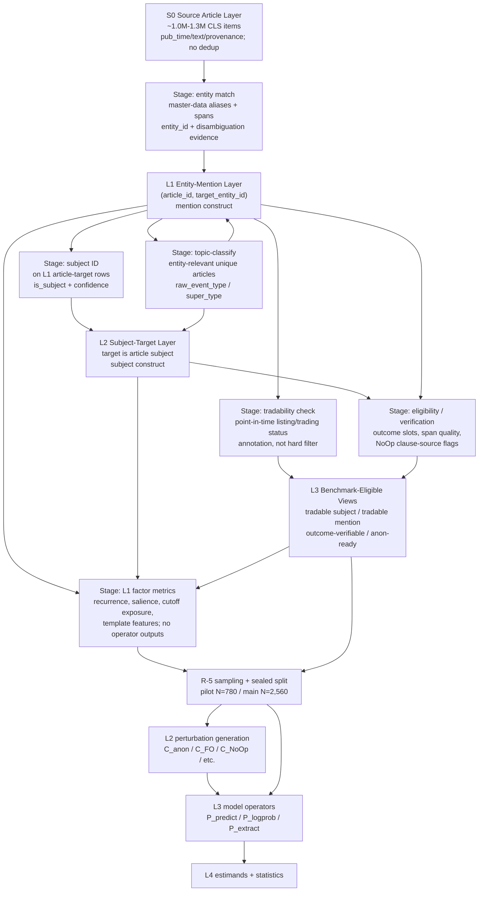

# R-0 Corpus Architecture whiteboard analysis

> Clean-room note: the Stage 1 section below was written before reading WS0.5 §5, the walkthrough §A notes, E-6, or Kong. It uses only the Stage 1 inputs plus the task prompt.

## 阶段 1 白板结论

### 1. CLS 语料分层模型

我的独立推荐是 **3 个工作层 + 1 个源层**。

这里的“层”只指会改变工作语料单位的稳定 row universe。不要把每一个有用字段都抬成一层。`event_type`、`event_super_type`、`tradable_at_event`、`outcome_verifiable`、`entity_span_quality` 更适合做列、flag 或视图；它们当然重要，但不是新的语料层。这样能给 R-1b/R-1c/R-5 留足选择空间，同时避免把架构做成一堆早期 prototype 名词。

#### S0 Source Article Layer: 原始电报源层

**单位**: 一条 CLS 电报。原报、转发、后续追踪都保留，不在源层去重。

**定义**: 只做 ingestion、字段规范化、文本清洗、发布时间标准化、基础质量字段。`event_date` 的默认来源是 CLS 发布时间；如果后续某个 factor 或扰动要用“文内事件日”，那是该 factor/扰动自己的派生字段，不替换源层发布时间。

**上游先决条件**:

- CLS raw dump 已导入。
- 时间字段、文本字段、source id、article id/hash 已稳定。
- 不要求 entity match、topic-classify、subject ID 或 tradability check。

**用途**:

- 全部下游层的 provenance。
- C_NoOp clause bank 的母体之一，但 clause bank 的抽取规则属于 R-2/WS3，不在 R-0 决定。
- 文本长度、重复/传播、模板特征等纯文本字段的来源。

#### L1 Entity-Mention Layer: 实体提及层

**单位**: `(article_id, target_entity_id)`。只要这条电报里提到一个可连到 A 股主数据的实体，就生成一行。多实体电报可以有多行。

**定义**: 这是最宽的 target-aware 工作层。它回答的是“这篇文章提到了哪个 A 股实体”，不要求该实体是文章主语，也不要求它当时可交易。

**上游先决条件**:

- S0 已完成。
- entity match 已完成: 别名识别、span 标注、entity id 归一、歧义处理、匹配证据保留。
- `tradable_at_event` 可以在本层附成列，但不是本层存在的先决条件。
- topic-classify 不是本层存在的先决条件；如果 R-1b 要按 event family 计数，则需要 topic labels 已 join 到 article 或 article-target row。

**用途**:

- R-1b/R-1c 的最宽 exposure construct: “target 被提到就算曝光”。
- C_anon 的最基本数据依赖: 实体 span 和 entity id。
- non-target salience、target scope、多实体复杂度等因子的母体。
- R-5 如果想要包含“被提到但不是主语”的 supporting/robustness pool，可以从这里抽。

#### L2 Subject-Target Layer: 主语/中心标的层

**单位**: `(article_id, target_entity_id)`，是 L1 的子集或带分数视图。这里 target 被判定为文章的主语、中心标的、或经济命题的主要承载者。

**定义**: 这是最自然的 benchmark case 层，因为 P_predict/P_logprob 要问的通常是“这篇电报对这个 target 的方向/情绪/alpha 含义是什么”。如果 target 只是顺带提及，答案会变得含混。

**上游先决条件**:

- L1 已完成。
- subject ID 已完成: 最好保留 `is_subject`、`subject_confidence`、`subject_rule_or_model_version`，而不是只留下硬过滤结果。
- topic labels 可在本层继承或 join；如果事件类型需要 target-conditioned label，则 target-conditioned classifier 至少应在 L2 上运行。
- tradability check 可在本层附成列。

**用途**:

- R-1b/R-1c 的 subject exposure construct: “target 是主语才算曝光”。
- R-5 的主要候选 pool 之一。
- C_FO、C_SR、C_ES 这类需要明确 target-event 关系的扰动更适合从 L2 或 L2 的视图抽。

#### L3 Benchmark-Eligible Views: 可交易/可扰动视图层

**单位**: 仍是 `(article_id, target_entity_id)`，不是新的文本单位。它是 L1/L2 上的一组标准视图，而不是一个单独硬编码的唯一 pool。

**定义**: L3 的核心是把“可以进入某类 benchmark 或扰动”的 row 标出来。最重要的视图包括:

- `L2 where tradable_at_event = true`: target 是主语，且发文时是可交易上市公司。
- `L1 where tradable_at_event = true`: target 被提到，且发文时可交易，但不一定是主语。
- `L2/L3 where outcome_verifiable = true`: 有可验证、可替换 outcome slot，供 C_FO 使用。
- `L1/L2 where entity_span_quality is sufficient`: 供 C_anon 使用。

**上游先决条件**:

- L1 或 L2 已完成。
- tradability check 已完成: 用发布时间、上市状态、交易日/停牌等主数据判断，不在此处丢弃 row。
- 对 outcome 视图: topic-classify + event-specific outcome extraction/verification 已完成。
- 对 C_anon 视图: entity span audit/quality flag 已完成。

**用途**:

- 给 R-5 暴露可交易主 pool、mention pool、outcome-verifiable subpool、实体匿名化 subpool。
- 给 R-1b/R-1c 暴露“上市/可交易曝光”这种 construct，但不强迫它们采用。
- 给 B-2 `run_inputs.per_task` 一个稳定引用对象: task 可以声明自己来自哪个 layer/view、依赖哪些 factor/eligibility 字段。

**为什么不把 event-classified、tradable、outcome-verifiable 各自做成独立层**:

- `event_type` 改变的是标签，不改变 row 单位。
- `tradable_at_event` 是 entity-time 属性，应该可在 mention/subject 两个 construct 上都过滤；单独做层会暗中偏向某一种 construct。
- `outcome_verifiable` 是 C_FO eligibility，不是全 benchmark 的基础语料定义。
- 把这些都升格为层，会让 R-1/R-2/R-5 误以为架构已经替它们拍了 construct。

### 2. 全局 pipeline 阶段顺序

#### 推荐顺序

1. **S0 ingestion / normalization**
2. **entity match first**
3. **tradability check immediately after entity match, as annotation not filter**
4. **topic-classify on entity-relevant unique articles**
5. **subject ID on entity rows**
6. **outcome verification / perturbation eligibility flags**
7. **factor metric computation + sampling pool materialization**
8. **R-5 sampling and sealed split**
9. **L2 perturbation generation**
10. **L3 operator runs**
11. **L4 estimands / statistical analysis**

The important order is not “topic before subject” or “subject before topic”; the important order is **entity before expensive LLM labeling**, and **factor/pool computation before any L3 model operator output exists**.

#### 为什么 entity match 要先跑

CLS 原始电报约 100 万+ 条。如果直接对全量跑 LLM topic classifier，会把大量没有 A 股 target 的材料也送进昂贵阶段。entity match 是相对便宜的结构化步骤，而且 C_anon、R-1b、R-1c、R-5 都需要它。先跑它能把后续工作语料从“所有新闻”缩到“至少有一个 A 股实体的新闻/row”。

#### 为什么 tradability check 不该早过滤

tradability 是重要属性，但不应该在早期把 non-tradable row 删除。原因有三个:

- R-1b/R-1c 可能要比较 “mention exposure” 和 “tradable exposure” 两种 construct。
- `recurrence_count = 0` 是合法值；早过滤容易让 0 recurrence 或边缘实体消失。
- R-5 需要 anti-survivorship 工具，不能只留下最容易交易、最常被报道的实体。

所以 tradability check 应尽早 join 成列，但不要作为全局 drop gate。真正是否只抽 tradable cases，由 R-5 在 pool 选择时决定。

#### topic-classify 与 subject ID 的相对位置

这两个阶段在 entity match 之后可以部分并行，也可以按实现便利交换。推荐约束是:

- topic-classify 不要跑在 raw 全量上，除非成本已经确认可接受。
- topic-classify 也不要只跑在 subject/tradable rows 上，除非 R-1b/R-1c 明确放弃 mention-level event-family construct。
- 最小稳妥方案是: 对“有 A 股实体的 unique articles”跑 article-level topic classifier，再把 label join 到 L1/L2。若多 target 电报里 event type 对 target 敏感，再在 L2 上加 target-conditioned refinement，而不是一开始全量 target-conditioned 分类。

subject ID 则必须跑在 L1 entity rows 上，因为它要回答的是 target 是否为主语。它可以利用 topic label，但不应依赖 topic label 才能存在。

#### 工作语料量级估算

这些是 order-of-magnitude 估算，最终应由 B-2/WS0.5 profiling 实测替换。

| 阶段 | 输入单位 | 估算条数 | 估算文本量 | 成本含义 |
|---|---:|---:|---:|---|
| S0 ingestion | article | 1.0M-1.3M | 150M-300M Chinese tokens/chars | 便宜；I/O 和清洗为主 |
| entity match | article → article-target row | 扫 1.0M-1.3M articles；产出约 0.4M-0.8M entity-relevant articles，0.6M-1.5M rows | 扫全文 150M-300M；row 展开后若重复计 text 约 100M-350M | 规则/索引/主数据成本，可接受 |
| tradability check | article-target row | 0.6M-1.5M rows | 近似 0 LLM token | 结构化 join，极便宜 |
| topic-classify | entity-relevant unique article | 0.4M-0.8M articles | article text 60M-180M；含 prompt 可能 200M-600M billed tokens | LLM 大头之一；先 entity filter 很关键 |
| subject ID | article-target row 或 grouped article+candidates | 0.6M-1.5M rows；若 grouped 则 0.4M-0.8M articles | row-wise 100M-350M；grouped 80M-220M | LLM/规则混合；应优先 grouped 或 cascade |
| outcome verification | event-eligible L2/L3 rows | 20k-150k rows | 5M-40M | 只给 C_FO 等用，不该全量跑 |
| factor metrics | materialized layers | 取决于窗口和 construct | 结构化聚合为主 | 必须在 L3 operators 之前冻结 |
| perturbations/operators | sampled N=780 / 2,560 | 小 N × variants × models | 小于 corpus tagging | 真正 benchmark 执行阶段 |

#### 可交换处和 trade-off

- **topic-classify vs subject ID**: 可交换或并行。若 topic classifier 是 article-level，先后无本质区别；若 classifier 是 target-conditioned，则 subject ID 先跑能降成本，但会牺牲 mention-level construct 的完整性。
- **tradability check before subject ID/topic**: 应该尽早做，因为便宜；但只作为 annotation，不作为 hard filter。
- **outcome verification**: 必须在 topic/event schema 之后。它不应进入全量主链路，只对可能有 outcome slot 的候选行运行。

### 3. benchmark 抽样 pool 候选集 + trade-off

R-0 不选 winner。它只需要让 R-5 能在下面这些候选里做设计。

#### Pool A: L2 subject-target pool

从 target 是主语的 cases 抽，不强制 tradable。

**优点**: target-event 关系清楚；P_predict/P_logprob 的问题定义干净；不会过早删除 pre-listing、停牌、非交易状态但文本上很重要的 cases。

**缺点**: 如果最终任务要强绑定 alpha/tradability，解释会弱一些；部分 outcome 或收益类 ground truth 不可用。

#### Pool B: L2 subject-target + tradable_at_event pool

从 target 是主语且发文时可交易的 cases 抽。

**优点**: 最贴近中文金融新闻 sentiment/alpha benchmark；case 可解释性强；R-6 如果要接真实收益或 outcome，工程阻力小。

**缺点**: 可能偏向持续上市、活跃交易、高媒体覆盖公司；会压缩 low-salience 和边缘实体空间；若作为唯一 pool，R-1c 的 Salience 分布可能被 sampling 先验扭曲。

#### Pool C: L1 mention-level pool

从所有 entity mentions 抽，target 不一定是主语。

**优点**: 最大保留真实媒体曝光结构；能研究 target scope/non-target salience；C_anon 和 entity-memory 问题更有空间。

**缺点**: target 只是顺带提及时，P_predict 的“对 target 的判断”可能不自然；需要 Target Scope/subject flag 进入设计，否则噪声大。

#### Pool D: L1 mention + tradable_at_event pool

从所有可交易 target mentions 抽，不要求主语。

**优点**: 比 Pool B 更宽，同时保持 alpha 解释所需的可交易属性；适合做 supporting/robustness 或 C_anon-rich pool。

**缺点**: 仍有 target 非中心的问题；比 Pool B 更容易混入“报道行业/同行/对手公司时提到 target”的复杂语境。

#### Pool E: outcome-verifiable subpool

从有可验证 outcome slot 的 L2/L3 cases 抽。

**优点**: C_FO 最干净；false outcome replacement 有明确可审计对象。

**缺点**: 不能代表全 benchmark；会强烈偏向财报、监管、公告、业绩预告等有结构化 outcome 的事件类型。

#### Pool F: mixed panel pool

主 panel 从 Pool B 或 Pool A 抽，另设 supporting panel 覆盖 Pool C/D/E 或 low-salience/zero-recurrence cases。

**优点**: 既保持主分析干净，又保留下游 factor/扰动需要的边界案例；能把 “main / supporting / robustness / appendix” 标签语言落到数据设计上。

**缺点**: N=780/2,560 会被拆分；统计和报告更复杂；R-5 必须明确哪些 panel 进入哪些 estimand。

#### Pool G: salience/recurrence stratified pool

不是新层，而是抽样分布策略。可在 Pool A-D 内按 Target Salience、Historical Recurrence、event_super_type、年份/cutoff 距离等分层。

**优点**: 给低曝光、低复现、0 recurrence cases 留位置；避免 row-random 抽样被高报道实体支配；便于 R-1b/R-1c 检验。

**缺点**: 会改变自然语料分布；需要报告 sampling weights 或至少清楚声明“这是 factor-balanced benchmark，不是自然频率估计”。

#### Pool H: entity-balanced / capped pool

同样是抽样分布策略。对单个 entity 设置上限，或按 entity 均衡抽。

**优点**: 最直接的 anti-survivorship 工具；防止贵州茅台、宁德时代这类高曝光公司占掉过多样本。

**缺点**: 会人为提高冷门实体权重；可能降低 Salience 的自然变异；极低曝光实体的文本质量或事件类型覆盖可能不足。

#### Pool I: cutoff-balanced temporal pool

按 case_event_date 与 fleet cutoff 的相对位置分层，或确保关键 cutoff 前后都有样本。

**优点**: Cutoff Exposure 是整个 temporal route 的物理基础；如果时间分布不平衡，case×model 暴露分析会弱。

**缺点**: 会进一步约束 event mix 和 entity mix；不能单独决定，必须和 R-1b/R-1c/R-5 的其他分层一起看。

## 阶段 2 对照

### A. 与 WS0.5 §3 / §3.4 的对照

**Verdict: 部分采纳，但把它降回“可复用算子/字段”，不接受它作为 R-0 架构定案。**

WS0.5 §3 的可取处是:

- T1 13-class topic classifier + 5 super-type collapse 是一个可复用的 event label 方案。
- §3.3 已经意识到“target assignment / case admissibility”和“Target Salience scorer”不能混在一起。
- §3.4 的 super-type 折叠可以继续作为 `event_super_type` 字段，为 R-1b 的 family 粒度提供候选。

但 WS0.5 §3 也把若干下游选择提前硬编码了:

- **Global central tradable prefilter 过早。** §3.3.1 要求每个 sampled case 都必须有 central、tradable target。这个可以作为 Pool B 的候选定义，但不该成为全局 corpus gate。R-0 必须保留 L1 mention、L2 subject、tradable views 三种空间，否则 R-1b/R-1c 不能选择 mention vs subject vs tradable exposure construct，R-5 也不能做 anti-survivorship sampling。
- **Target Salience 的具体 construct 不是 R-0 范围。** §3.3.2 把 Target Salience 锁成 earliest-cutoff 前全事件 mention count，并固定和 Recurrence 同窗口。这是 R-1c 的候选方案，不是 R-0 的架构结论。R-0 只能要求架构支持它，也支持 subject-count、tradable-count、complement-family count 等替代 construct。
- **event label 是列，不是层。** super_type 很重要，但它不改变 row unit。把 `event_super_type` 作为 L1/L2 可 join 字段即可。

明确 stance: WS0.5 §3 的 prompt/taxonomy 可以作为实现资产复用；§3.3.1 的 central-tradable prefilter 不应在 R-0 作为全局准入规则落定。

### B. 与 WS0.5 §5 Recurrence 现状管线的对照

**Verdict: full-CLS topic-first 不采纳；fixed window / mention construct / super_type construct 都降级为 R-1b 候选。**

WS0.5 §5 当前顺序是:

1. full CLS mirror topic classification;
2. build target alias table;
3. fixed-window candidate filter;
4. deterministic disambiguation;
5. per-case recurrence count.

这里有两类内容要分开看。

**可采纳的部分**:

- no-dedup count 的原则与阶段 1 一致。原报、转发、追踪都可以算 exposure；R-0 架构不能自动去重。
- `log1p(0)=0` 的处理与阶段 1 一致。0 recurrence 必须是合法值。
- entity alias table、effective date、type compatibility、precision-first disambiguation 的方向与 E-6 一致，应该保留。

**不采纳为 R-0 定案的部分**:

- **full CLS topic classification 成本太大，且不必要地先于 entity match。** R-0 推荐 entity match first，再对 entity-relevant unique articles 做 topic-classify。只有当后续 profiling 证明 full raw topic cost 可忽略，才值得考虑全量；否则这是旧方案惯性。
- **mention-based recurrence 不是唯一 construct。** §5 把 recurrence 定义成 mention density；walkthrough A.2 提出 subject density。R-0 不替 R-1b 选。架构必须同时支持 mention、subject、tradable mention、tradable subject。
- **fixed earliest-cutoff window 不是 R-0 范围。** 这可能是 R-1b 的好方案，但时间窗口明确属于 factor session。R-0 只保证每条 row 有发布时间、target id、event label、tradability 和 layer membership，能让 R-1b 查询任意合法窗口。
- **super_type family 粒度不是 R-0 范围。** R-0 只要求 `raw_event_type` 和 `event_super_type` 都可保留；R-1b 决定用 target-only、target × super_type、target × raw_event_type，或多档 robustness。

明确 stance: WS0.5 §5 是一个可运行的早期 data contract，但它把 R-1b construct、窗口和 pipeline cost 顺序绑得过紧。R-0 应改成 entity-first、construct-open 的架构容器。

### C. 与 WS0.5 §6 reproducibility 分家的对照

**Verdict: 路径分家方向采纳；artifact 内容要随 R-0 新管线重排。**

WS0.5 §6 的 Path A / Path B 分家是合理的:

- reviewer-facing Path A 走 hash + provenance + 小样本 raw responses，不要求重跑全 CLS LLM。
- author-internal Path B 走 full cache replay，用于作者审计和 bug fix。

R-0 对它的修正是:

- 如果 topic-classify 不再跑 full raw CLS，而是跑 entity-relevant unique articles，Tier B 的规模、备份理由和 `run_inputs.per_task` task topology 都要更新。
- reviewer-path 必须能验证 **layer/view hashes**，不只是 factor table hash。至少要能追到: S0 source hash、entity alias table hash、disambiguation rule hash、topic label table hash、subject ID output hash、tradability master snapshot hash、sampling manifest hash。
- 任何 LLM corpus annotation，例如 topic-classify、subject ID、LLM-assisted smoke，都应作为 frozen upstream artifact 进入 provenance。reviewer 不需要重跑；作者要能用 cache replay。
- deterministic joins，例如 tradability check、alias collision/risk rules、effective-date filtering，应版本化代码和主数据 snapshot。它们比 LLM 更适合进入 reproducible build path。

明确 stance: §6 的“两个 reproducibility path”保留；但 R-0 之后，`factor_provenance.run_inputs.per_task` 必须按实际 corpus stages 重写，不能继续默认 T1 full-CLS。

### D. 与 walkthrough §A.1 的对照: 4-layer corpus stratification

**Verdict: 大方向独立一致；我保留 3 个工作层 + 源层，不采纳硬 Layer 4。**

walkthrough A.1 提出:

1. full CLS raw;
2. articles containing an A-share entity;
3. articles where A-share entity is subject;
4. predictable articles / listed at publication.

这和阶段 1 独立结论高度接近。不同点在于:

- 我把 Layer 2 明确定义为 `(article_id, target_entity_id)` 的 **entity-mention rows**，不是只说“articles containing entity”。这是必要的，因为多实体电报不能只在 article 级别表达 target。
- 我把 Layer 3 定义为 subject-target rows，和 A.1 一致。
- 我不把 Layer 4 作为硬 nested layer，而是定义成 L3 benchmark-eligible views。`tradable_at_event` 可以过滤 L1 mention，也可以过滤 L2 subject；`outcome_verifiable` 也只是 C_FO eligibility。把它硬叫“predictable articles”会暗中替 R-5/R-6 选 pool。

明确 stance: walkthrough 的 4 层想法是对的直觉，但最小架构应是 source + L1 mention + L2 subject + L3 views。Layer 4 不应是唯一 benchmark pool。

### E. 与 walkthrough §A.2 的对照: pipeline reorder + subject-vs-mention construct shift

**Verdict: entity-first 独立得出并采纳；subject-only counting 不在 R-0 采纳；topic only Layer 3 过窄。**

A.2 的好点:

- entity match first 是正确方向。阶段 1 独立推出同一结论。
- subject ID 应该成为正式 stage，而不是用粗 centrality rule 偷代。
- subject-based recurrence 是合理候选，R-1b 必须有权选择。

A.2 的过度点:

- “topic classification only Layer 3”会让 mention-level event-family construct 消失。除非 R-1b 明确放弃 mention construct，否则不能这么做。
- “only at Layer 3 does topic have meaning for target”太强。article-level event type 对 mention rows 仍然有用；只是多 target / weak mention 场景里可能不够精细。最小稳妥方案是 article-level topic on entity-relevant unique articles，必要时在 L2 做 target-conditioned refinement。
- subject-vs-mention 是 factor construct 决策，不是 R-0 pipeline 决策。R-0 的职责是让两者都可算。

明确 stance: A.2 的 reorder 方向采纳；A.2 的 construct shift 不在 R-0 拍板。

### F. 与 walkthrough §A.5 和 E-6 entity-disambig audit 的对照

**Verdict: E-6 的 deterministic-first 主路径采纳；A.5 的 LLM risk tagging 不采纳为主路径。**

E-6 的核心判断非常适合 R-0:

- 本项目不是开放域 entity linking；它是金融 target/entity 计数，强依赖证券代码、官方简称、历史曾用名、指数/板块主数据。
- alias table 应从主数据和规则派生，记录 source、effective dates、risk、type。
- risk 应由 broader universe collision、短 alias、地名/行业词、跨 type 冲突等规则计算，不让 LLM 主观打 high/low。
- 高风险 alias 不自动计数；需要代码、全称、type/context cue，否则 unresolved/no-count。
- LLM 可以做高频 unmatched/unresolved 的离线建议和 smoke audit，但不进入 confirmatory count 主路径。

A.5 提到“高风险 alias 少于 10K，双 agent LLM 标 risk 可行”。我的 stance 是: 可行不等于必要。没有具体 false-low/false-high failure mode 前，把 LLM 放进 alias risk 主路径是过度结构。E-6 已经给出更便宜、更可复现、更可审计的方案。

需要补一句边界: E-6 的任务背景偏“已知 80-430 个 target 的计数”。R-0 的 L1 entity-mention layer 如果要覆盖全 A 股实体，工程上会比 E-6 更宽。但原则不变: 主数据 + deterministic disambiguation 优先，LLM 只做审计/补充。

### G. 与 Kong §2.2 / §3.3 的对照

**Verdict: Kong 支持 R-0 给 R-5 留 anti-survivorship 抽样工具；不支持把可交易 survivor-only pool 当唯一合法 pool。**

Kong §2.2 的警告与本项目直接相关，尤其是两点:

- 新闻量与公司活跃度、投资者注意力相关。按新闻 row 随机抽，会自然偏向高曝光、持续活跃、幸存的公司。
- evaluation universe 如果只由当前幸存/活跃实体构成，会低估失败、退市、沉默退出和 distress regime。

对 R-0 的影响:

- `tradable_at_event` 必须是 point-in-time 属性，不是 present-day listed 过滤。
- R-5 必须能做 entity-balanced、entity-capped、salience-stratified、recurrence-stratified、cutoff-balanced 抽样；不能只有 row-random。
- 如果 R-5 最终选 Pool B，即 subject + tradable_at_event，也要报告它的限制: 这是 alpha-task-clean pool，不是自然市场全宇宙。
- Target Salience 本身用 media coverage count 可以成立，但 sampling 不能又按 media coverage 被动加权到完全由高曝光实体支配。

Kong §3.3 的 entity substitution / negative controls 精神也支持 R-2 保留 C_ES/C_NoOp 的讨论空间。但这不要求 R-0 新增 corpus layer；它只要求 L1/L2 有稳定 target identity、entity spans、可替换/可插入文本资源。

明确 stance: Kong 不是让 R-0 放弃 tradability；它要求 tradability 必须 point-in-time，并且 R-5 要显式处理由新闻量和幸存状态带来的抽样偏差。

## 最终综合推荐

### 1. 分层定义清单

最终推荐仍是 **3 个工作层 + 1 个源层**:

| 层 | 单位 | 定义 | 必要先决条件 | 主要用途 |
|---|---|---|---|---|
| S0 Source Article Layer | `article_id` | 原始 CLS 电报源层；保留原报、转发、追踪；不去重 | ingestion / normalization | provenance、文本字段、C_NoOp clause bank 母体 |
| L1 Entity-Mention Layer | `(article_id, target_entity_id)` | 电报提到某 A 股/指数/板块 entity；多实体文章多行 | S0 + entity match/span/entity_id/disambig | mention exposure、C_anon、wide salience/recurrence |
| L2 Subject-Target Layer | `(article_id, target_entity_id)` | L1 中 target 是文章主语/中心标的的 rows | L1 + subject ID | subject exposure、主 benchmark case 候选、target-event 扰动 |
| L3 Benchmark-Eligible Views | 仍是 L1/L2 rows | 标准视图，不是新 row unit: tradable mention、tradable subject、outcome-verifiable、anon-ready 等 | L1/L2 + tradability/topic/outcome/span-quality flags | R-5 pool 候选、R-2 eligibility、B-2 schema 引用 |

关键设计原则:

- `topic-classify` 产出 `raw_event_type/event_super_type/host_category` 字段，不单独成为层。
- `tradable_at_event` 是 point-in-time entity-time 列，不是全局删除规则。
- `outcome_verifiable` 是 C_FO eligibility，不是全 benchmark 基础层。
- `recurrence_count = 0` 合法；任何层或 pool 都不能默认剔除 0 recurrence cases。
- no-dedup exposure count 合法；源层和工作层都应保留 repost/follow-up rows。

### 2. 推荐 pipeline 图

### 3. Pipeline 顺序的最终 stance

1. **entity match first**: 先把 raw CLS 缩到 target-aware universe，再跑贵的 LLM topic/subject stages。
2. **tradability early but non-destructive**: 越早 join 越好，但只是列，不是全局 filter。
3. **topic-classify after entity filter, not after subject-only gate**: 默认对 entity-relevant unique articles 跑。若 R-1b 以后选择 subject-only construct，R-1b 可以另行降成本；R-0 不把这条路锁死。
4. **subject ID on L1 rows**: 产出 L2 subject construct。实现可以是 deterministic cascade + LLM，也可以是 LLM grouped by article；这是 B-2/实现细节。
5. **outcome verification only on eligible candidates**: 不全量跑，避免 C_FO eligibility 把 corpus architecture 拖重。
6. **factor metrics before operators**: L1 factors 和 R-5 sampling 在 P_predict/P_logprob/P_extract 之前冻结，避免 L1↔L3 边界污染。

### 4. Pool 候选清单 + trade-off

R-0 暴露下面候选；R-5 之后选 primary/supporting/robustness 组合。

| Pool | 来源 | 适合什么 | 主要 trade-off |
|---|---|---|---|
| A. Subject-target | L2 | target-event 清楚、主任务自然 | 不强制可交易，alpha/收益解释较弱 |
| B. Subject + tradable_at_event | L3 view over L2 | 最干净的 alpha/sentiment benchmark 主 pool 候选 | 易偏向活跃/幸存/高覆盖公司 |
| C. Mention-level | L1 | 最宽 exposure、C_anon、target scope/non-target salience | target 可能不是文章中心，P_predict 噪声更大 |
| D. Mention + tradable_at_event | L3 view over L1 | 保留宽曝光同时具备可交易属性 | 仍有 target 非中心问题 |
| E. Outcome-verifiable | L3 view over L2/L3 | C_FO 最干净 | 强烈偏向有结构化 outcome 的事件类型 |
| F. Mixed panel | A/B 主 panel + C/D/E supporting panel | 主分析干净，同时覆盖边界案例 | N 被拆分，统计和报告更复杂 |
| G. Salience/recurrence-stratified | 任一 pool 内的分布策略 | 给 low-salience、low/zero-recurrence 留样本 | 扭曲自然频率，需要透明报告 |
| H. Entity-balanced/capped | 任一 pool 内的分布策略 | 直接回应 media coverage / survivorship 偏差 | 稀有实体被上采样，可能牺牲自然分布 |
| I. Cutoff-balanced | 任一 pool 内的分布策略 | 支撑 Cutoff Exposure case×model 分析 | 可能约束 event/entity mix |

不推荐的唯一禁止项: **只给 R-5 一个 row-random subject+tradable pool**。这会把 Kong §2.2 警告里的 media-coverage bias 写进 benchmark 结构。

## 对下游的约束 / 留下的选择空间

### R-1b Historical Family Recurrence

R-0 只要求 recurrence 能在以下 construct 空间里选:

- mention exposure: L1 count。
- subject exposure: L2 count。
- tradable mention: L1 where `tradable_at_event=true`。
- tradable subject: L2 where `tradable_at_event=true`。
- family 粒度: target-only、target × `event_super_type`、target × raw event type，或多档 robustness。
- window: corpus_start 到某 cutoff、case-relative window、model-specific window等，留 R-1b 决定。

已锁定的 no-dedup 和 `log1p(0)=0` 必须兼容。

### R-1c Target Salience

R-0 让 R-1c 可选:

- all-event mention count。
- all-event subject count。
- tradable-only count。
- pre-cutoff fixed count 或其他 R-1c 认为更合理的窗口。
- complement-family count 或外部 proxy，作为和 recurrence 去重的备选。

R-0 不替 R-1c 把 Target Salience 锁成 WS0.5 §3.3.2 的 earliest-cutoff mention count。

### R-1a Cutoff Exposure

R-1a 主要依赖 case event date + model cutoff manifest。R-0 的约束是:

- 每个 sampled case 必须能追到 `article_id`、`published_at/event_date`、`target_entity_id`、layer/view membership。
- 如果某 case 用文内事件日而不是发布时间，那必须是显式字段，不得覆盖 source pub time。

### R-2 perturbation 数据依赖

- C_anon: 至少需要 L1 entity spans、target/non-target ids、span quality flag。
- C_FO: 需要 topic/event label + outcome-verifiable flag + slot evidence；适合 L2/L3 views。
- C_NoOp: R-0 只保证 S0/L1 可暴露 clause-bank 母体；抽取规则留 R-2/WS3。
- C_ES: 若 R-2 采纳，需要 L2 target identity、替换 entity 候选、type/industry/scale matching metadata；不需要新 corpus layer。

### R-5 sampling

R-5 必须同时决定:

- primary pool 是 A/B/C/D/E/F 哪种组合。
- within-pool distribution 是 row-random、entity-capped、entity-balanced、salience-stratified、recurrence-stratified、cutoff-balanced，或组合。
- 哪些 pool 是 main/primary/supporting/robustness/appendix。
- 是否允许 non-tradable subject cases 进入 supporting/robustness，以检查 tradability hard filter 的偏差。

### WS0.5 §6 reproducibility / B-2 schema

B-2 `run_inputs.per_task` 至少要能引用:

- corpus layer/view id。
- source CLS snapshot hash。
- entity alias table hash、broader universe snapshot、disambiguation rule hash。
- topic-classifier prompt/model/cache hash。
- subject-ID prompt/model/cache hash 或 deterministic rule hash。
- tradability master snapshot hash and rule version。
- outcome-verification schema/prompt hash。
- factor metric definition hash。
- sampling manifest hash and pool definition。

reviewer-path 以 hash/provenance/小样本 inspection 为主；author-path 才需要 full cache replay。

## 留给用户拍板的开放点

R-0 本身不需要用户额外拍板才能成立。真正留给后续 session 的开放点是:

1. **R-1b**: recurrence 最终用 mention、subject、tradable mention 还是 tradable subject；family 粒度和时间窗口如何定。
2. **R-1c**: salience 用哪一层计数，是否与 recurrence 共窗口，是否需要 complement-family 或外部 proxy。
3. **R-5**: primary pool 选哪个，是否做 mixed panel，以及采用 entity-balanced / salience-stratified / cutoff-balanced 哪种抽样分布。
4. **R-2**: C_FO、C_anon、C_NoOp、C_ES 各自使用哪个 layer/view；outcome-verifiable subset 是否只做 supporting。
5. **实现层**: subject ID 是否用 LLM、是否 grouped by article；topic classifier 是否需要 L2 target-conditioned refinement。

我的建议是: 现在把 R-0 按本文的 3 工作层 + entity-first pipeline 锁为架构容器，然后让 R-1b/R-1c/R-5 在这个容器里做各自选择。不要再让 WS0.5 §5 的 early prototype 反向决定 factor construct。
