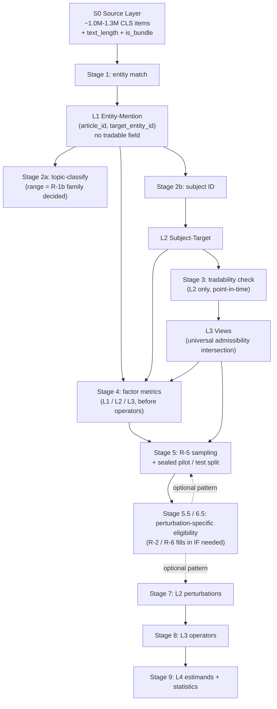

# Decision Memo — WS0.5 Thales Alignment & Auto-Tune Loop

## 1. Problem statement

WS0.5 has been a scope-deferred placeholder in `plans/phase7-pilot-implementation.md` §5.1A
across revisions v2.2 → v2.4. WS0.5 blocks:

- WS4 pilot manifest freeze (plan §6.3 factor quotas depend on a frozen factor schema)
- §14.4 sign-off checklist (gates §13 exit conditions)
- WS3 `C_FO` rule schema freeze (per plan §4: "reads event-type labels from WS0.5 before C_FO rule schema freeze")

WS0.5 closure requires answering three verification questions and producing a decision
memo that locks reuse-vs-rebuild for the four confirmatory factors and Bloc 3 factors.

| ID | Question (from plan §5.1A) |
|---|---|
| T1 | Has Thales's topic-classification pipeline (EventType taxonomy) already been executed against CLS v3, or does it need to be run on the R5A sample? |
| T2 | Does Thales provide (or can it easily derive) an `(entity, event_type, date_window)` frequency index suitable for `historical_family_recurrence`? |
| T3 | Does CLS raw data preserve publisher metadata at meaningful coverage, such that Bloc 3 Authority can be operationalized as a genuinely extra-corpus factor instead of text inference? |

## 2. Findings from 2026-05-18/19 investigation

### 2.1 T1 — Topic classification (Thales V3 13-class prompt)

**Status of the asset.** `D:\GitRepos\Thales\prompts\news_processing\topic_classification.py`
holds a 578-line `NewsTopicClassificationPrompt` v2.2.0. The production enum
`EventType` in `D:\GitRepos\Thales\contracts\news\_annotation.py` is the **V3 13-class
taxonomy**: POLICY, ENFORCEMENT, LEGAL, INDICATOR, EARNINGS, CORPORATE, PRODUCT,
PERSONNEL, TRADING, OWNERSHIP, INDUSTRY, GEOPOLITICS, OTHER. The earlier V6 10-class
result in the topic experiment log (`primary_accuracy=0.738` on a fresh 367-item
fixture, 2026-03-30) is **historical calibration evidence on a now-superseded
taxonomy**, not the schema to freeze for R5A.

> v0.1 mis-stated the production enum as 10-class V6. Corrected in v0.2 per Codex
> round-0 Issue #1 and direct repository inspection.

**Status against CLS.** Thales has run topic classification only against ~5000-item
quality universes and ~370-item fixtures, not against the full CLS corpus. Answer
to T1: **Thales has a battle-tested 13-class V3 prompt and calibrated fixtures, but
no persisted full-corpus EventType labels.** WS0.5 must run inference against the
R5A pilot cases plus a fixed pre-cutoff recurrence reference window — and as decided in
Issue #7, against the full CLS mirror.

**Test fixtures available for V4 Pro calibration:**
- `experiments/prompts/news_topic_classification/fixtures/quality_uniform.json` (~370 items, balanced ~25/type)
- `experiments/prompts/news_topic_classification/fixtures/quality_natural.json` (~600 items, natural distribution; held blind, will be re-sampled if any auto-tune patch touches it)
- `experiments/prompts/news_topic_classification/fixtures/boundary_decision_trees.md`

### 2.2 T2 — Entity extraction (Thales summary dual-agent labeling)

**Status of the asset.** The user's earlier Story 9.15 v2 R1 work built a dual-agent
entity labeling pipeline as part of the summary experiment:

- `D:\GitRepos\Thales\experiments\prompts\news_summary\fixtures\labeling_prompt_entity.md` (629-line 4-stage pipeline)
- `D:\GitRepos\Thales\experiments\prompts\news_summary\fixtures\quality_summary_pilot.json` (80-item adjudicated fixture)
- raw labels `raw_labels_claude_code_entity_batch*.json` and `raw_labels_codex_mcp_entity_batch*.json` (dual-agent independent labels)
- `validate_raw_labels.py` validator

**Output schema.** `RawSalienceLabel` carries per-entity `value` / `type` (closed
enum: person, institution, region, company, ...) / `salience` (`core | supporting`)
/ `reason`. The `salience` tier is reused as a *candidate signal* for Target
Salience (see §3.2), but **does not by itself define the factor**.

**Production entity-disambiguation pipeline.** Thales `pipeline/news_processing/entity_disambig.py`
is in active rework by the user; ETA incompatible with WS0.5 critical path. WS0.5
will reuse the summary-experiment dual-agent labeling prompt as the entity-extraction
starting point — not the production pipeline.

### 2.3 T3 — Authority + Modality (Thales signal_profile v5.5 two-pass)

**Status of the asset.** Current `D:\GitRepos\Thales\prompts\news_processing\signal_profile.py`
is a **v5.5 two-pass** design:

- `NewsSignalProfileModalityPrompt` (modality pass)
- `NewsSignalProfileAuthorityPrompt` (authority pass, conditioned on predicted modality)

> v0.1 mis-stated the production prompt as `NewsSignalProfilePrompt v3.0.0` (a single
> combined pass). Corrected in v0.2 per Codex round-0 Issue #6 and direct inspection.

**Calibration history.** The 2026-04-11 experiment log records on deepseek-chat
(N=200 training fixture):

| Architecture | Parse | Modality top-1 | Authority top-1 |
|---|---|---|---|
| Combined V2 (single-pass, retired) | 100% | **81.5%** | 76.0% |
| v5 Split-Independent (two-pass, no conditioning) | 100% | 79.5% | 72.5% |
| v5 Split-Conditioned (two-pass with modality→authority) | 100% | 80.5% | **79.0%** |

On Qwen 7B (SLM), split-conditioned is +23 percentage-points stronger on authority
than independent. On deepseek-chat (LLM closer to V4 Pro), the split-conditioned
advantage on authority is +3pp; combined V2 actually wins on modality by +1pp.
Thales chose v5.5 two-pass as production because it was the **global optimum across
both SLM and LLM**, not because single-pass was eliminated for LLMs.

**P1 implication.** Text-inferred Authority via either architecture is
**CLS-internal**, not extra-corpus. P1 (extra-corpus signal headroom) is **not**
restored by this WS0.5 closure regardless of which Authority architecture wins.

**CLS publisher metadata (Track B).** A 4-item spot check on `data/cls_telegraph_raw/2026-05-01.json`
shows each item carries an `author` field, but 2/4 are empty strings in the sample;
user has independently confirmed publisher metadata is "severely incomplete". A
formal coverage quantification is deferred to S1 (see §10 schedule).

**Authority status clarification (Issue #9).** Authority is handled in WS0.5
because plan §5.1A asks T3 explicitly, but it is **not** one of the four
confirmatory factors and is **not** listed in `R5A_FROZEN_SHORTLIST.md §8`
baseline Bloc 3 interaction menu. In this memo, **Authority is a candidate
Bloc 3 adjunct/covariate**, not a new confirmatory factor.

### 2.4 Mapping the 4 confirmatory factors to T1 / T2 / T3 dependencies

| Factor | Bloc | Type | Inputs needed | T1 / T2 / T3 dependency |
|---|---|---|---|---|
| Cutoff Exposure | 0 (temporal) | case × model continuous | `event_date` per case + `model_cutoff` | none — text-date + manifest |
| Historical Family Recurrence | 1 (repetition) | case-level continuous | recurrence count from CLS reference window | **T1 + T2** both required; see §5 contract |
| Target Salience | 2 (prominence) | case-level continuous | central tradable target (global pre-filter §3.3.1) + pre-cutoff CLS mention count | **T1 + T2** — reuses §5 recurrence pipeline; no market metadata |
| Template Rigidity | 1 (repetition) | case-level continuous | text-only boilerplate measure (shingling / template-bank overlap) | none — pure text feature |

**Bloc 3 factors covered by this memo (Disclosure Regime/Modality + candidate Authority):**
- Structured Event Type = T1 output (13-class) + Scheme A 5-super_type collapse
- Disclosure Regime / Modality = T3 modality output (confirmatory Bloc 3)
- Authority = T3 authority output (candidate adjunct/covariate, NOT confirmatory)
- Event Phase / Session Timing = pure timestamp features (deferred to closure addendum)

## 3. Reuse-vs-Rebuild Decisions

### 3.1 T1 — Topic classification: REUSE Thales V3 13-class prompt + Scheme A collapse

| Item | Decision |
|---|---|
| Prompt template | Reuse `NewsTopicClassificationPrompt` v2.2 (13-class V3) verbatim as V4 Pro starting point |
| Raw taxonomy | 13-class V3 enum from `_annotation.py` |
| **Super-type collapse (Scheme A, Codex-recommended)** | 5 active super-types per `refine-logs/reviews/WS0_5_DESIGN/ws0_5_supertype_analysis.md`: `authority_decision` [POLICY+ENFORCEMENT+LEGAL+GEOPOLITICS], `issuer_catalyst` [CORPORATE+PRODUCT+PERSONNEL], `issuer_quant` [EARNINGS+OWNERSHIP], `market_macro_print` [INDICATOR+TRADING], `sector_industry` [INDUSTRY]; OTHER → `exclude_from_pilot=true` |
| Host category collapse (4-class for C_NoOp) | `authority_decision → policy`, `issuer_catalyst → corporate`, `issuer_quant → corporate`, `market_macro_print → macro`, `sector_industry → industry` |
| Calibration target | DeepSeek V4 Pro |
| Calibration fixtures | `quality_uniform.json` (~370) for tuning; `quality_natural.json` (~600) blind validation (re-sample if any patch touches it) |
| Target threshold | `primary_accuracy ≥ 0.78` on the sealed `test` split (§4) (V6 SLM 0.738; V4 Pro expected exceed) |
| Tune scope | Boundary-rule additions and few-shot examples only; no taxonomy changes |
| Scheme B fallback (4 super-types) | Trigger: `sector_industry` cannot reach 12 verified+slotable C_FO cases OR `issuer_quant` < 12 after sampling. Bridge: `reported_numbers` [EARNINGS+INDICATOR+INDUSTRY], `market_security` [TRADING+OWNERSHIP] with class-conditional host bridge |

### 3.2 T2 — Entity extraction: REUSE Thales summary entity prompt, V4 Pro auto-tune

| Item | Decision |
|---|---|
| Prompt template | Reuse `labeling_prompt_entity.md` 4-stage pipeline verbatim |
| Output schema | `RawSalienceLabel` with `value` / `type` / `salience` / `reason` |
| Consumed downstream | `(value, type)` for recurrence (§5) and Target Salience (§3.3.2); `salience=core` as the candidate pool for the §3.3.1 admissibility pre-filter |
| Calibration fixture | `quality_summary_pilot.json` (80 adjudicated items) as starting fixture; expand to ~2000 via Claude+Codex dual-agent labeling (§4) |
| Target thresholds | core-entity precision ≥ 0.85, recall ≥ 0.85 |

### 3.3 Bloc 2 — Target Salience + Case Admissibility Pre-filter (Issue #2; §3.3 redesigned per C-1)

Target is a **manifest INPUT** to `P_predict`, not LLM-inferred at operator time
(per `R5A_OPERATOR_SCHEMA.md` line 81). WS0.5 must produce, at
sampling/manifest-freeze time, (a) a deterministic rule that admits a case and
fixes its target entity, and (b) a Target Salience score for that target.

> **§3.3 redesign (per C-1 + user review).** v0.2-v0.3 conflated a *filter*
> (is there a tradable entity this article is genuinely about?) with a *scorer*
> (how prominent is that target?). This redesign separates them. The admissibility test
> becomes a **global sampling pre-filter** (§3.3.1) applied to every case and
> every factor — not a Target-Salience-internal step. Target Salience (§3.3.2)
> then becomes a **pure scorer** over an already-clean population. The v0.3
> `context_gate` veto, the `static_reach` 1/2/3 ordinal, and the market-metadata
> snapshot are removed: `context_gate` collapsed into the pre-filter's
> centrality test (the same text-local signal was being used twice), and
> `static_reach` is replaced by a direct quantitative metric.

**Construct claim.** Target Salience is operationalized as the
**log corpus footprint of the target**: `log1p` of the count of CLS articles
mentioning the target before the earliest model cutoff, across all event types. It proxies
the target's general prominence — how much text about this target the model
plausibly saw during pretraining. Market capitalization / index membership are
explicitly **not** used: they measure firm size, not fame, and would
systematically misclassify small-but-heavily-covered targets (妖股, hot new
issues, scandal stocks) as low-salience. A corpus mention count, by contrast,
rises with actual news coverage regardless of market cap.

#### 3.3.1 Case Admissibility Pre-filter (GLOBAL — applies to every sampled case)

> **R-0 supersession note (2026-05-23 PM late)**: the central +
> tradable test described here is preserved as the universal R-5
> admissibility filter, but architecturally lifted to **the L3 base
> view from which R-5 samples** (see §4.5.A / §4.5.B / §4.5.C). The
> filter is no longer outside the layer model. The `admit_case()`
> pseudocode below remains illustrative of the centrality +
> tradability logic; R-1b / R-5 implementation reconfigures it as the
> L1 → L2 (subject ID) + L2 → L3 (view) composition. The
> non-tradable-rows handling rule also changes: R-0 keeps
> non-tradable rows in L1 / L2 (for Salience / Recurrence
> denominator) and filters at R-5 admissibility (P_predict subject
> validity); §3.3.1's "reject before any factor is computed" framing
> conflated these two roles.

This filter runs at sampling time on every candidate case — all four
confirmatory factors and the negative controls alike. A case is admitted only
if the article has a **central, tradable** target entity; otherwise it is
rejected before any factor is computed. The filter also outputs the single
target entity consumed by every downstream factor.

```python
def admit_case(article, salient_entities):
    # 1. Tradable candidate pool
    candidates = []
    for e in salient_entities:
        if e.salience != "core":                       continue  # core entities only
        if e.type not in {"company", "sector",
                          "index", "ETF", "commodity"}: continue  # tradable types only
        if e.type == "company" and not has_listed_ticker(e):
            continue                                             # unlisted firm: no price to predict
        if is_source_only_attribution(e):              continue  # 中信建投: (byline) → drop
        if is_pure_person_without_org(e):              continue  # standalone CEO → drop
        if is_one_char_region_alias(e):                continue  # 中/俄 if full alias exists
        candidates.append(e)

    if not candidates:
        return Reject("no_eligible_tradable_target")

    # 2. Pick the most central candidate
    selected = max(candidates, key=lambda c: (
        c.in_headline, -c.first_offset, c.mention_count, len(c.value),
    ))

    # 3. Centrality gate (absorbs the old context_gate): the article must
    #    actually be about the selected target.
    if not (selected.in_headline or selected.mention_count >= 2):
        return Reject("target_not_central_enough")

    return Target(
        target=selected.display_name,
        target_type=map_target_type(selected),          # ∈ {company, sector, index}
        target_ticker=selected.metadata.get("ticker"),  # listed company / tradable index
        target_source_entity=selected.value,
    )
```

The two rejection reasons are applied at sampling stage and never carried into
the factor table:

- `no_eligible_tradable_target` — no core entity has a tradable price. An
  unlisted company has no direction/alpha label to predict, so it is dropped
  here (the v0.2-v0.4 design wrongly let unlisted firms through and scored them
  `static_reach=1`). Macro/policy articles survive only when a tradable
  sector/index target is central; plan §6.3 host quota (`policy` ≥ 15,
  `macro` ≥ 15) is filled by sector/index targets under macro-themed articles,
  not by macro-target cases.
- `target_not_central_enough` — the most central tradable candidate is still
  only weakly present (not in the headline and mentioned at most once), so
  target assignment would be arbitrary. This replaces the v0.3
  `context_gate=0 → target_validity_low → NA` path: such a case is simply not
  sampled, so there is no validity flag and no NA value to carry downstream.

The exact centrality threshold (default: in-headline OR `mention_count ≥ 2`) is
finalized at S1 against pilot text and recorded in `factor_schema.yaml`.

#### 3.3.2 Target Salience metric

Target Salience is a property of the case's `target`:

```
target_salience[target_id] = log1p(cls_target_mention_count)

cls_target_mention_count =
    COUNT( CLS articles dated in [corpus_start, earliest_model_cutoff)
           whose confirmed salient entities include any alias in
           target_aliases[target_id] )
```

`earliest_model_cutoff` is the earliest training cutoff across the WS2 model
panel, so the window lies entirely inside every model's training data — the
count is a model-visible exposure proxy for all models. The window does **not**
follow the case date `T`: a target's pretraining footprint is fixed by the
training corpus, not by when a particular pilot case happened. (This mildly
*understates* exposure for later-cutoff models — a conservative, accepted
trade-off that keeps the factor a single case-level value, not case×model.)

Target Salience is a **continuous, target-level** factor, computed once per
target across **all event types**.

**Computed off the §5 recurrence pipeline — no new infrastructure.** Phase R1
already classifies the full CLS mirror; Phase R2 builds the pilot-target alias
table; Phase R3/R4 match and resolve those aliases against CLS articles. Target
Salience is the **same alias-match count with the `super_type` filter removed**
(all event types instead of one family). The master-data alias table
(`target_aliases.json`, §5.2 Phase R2) and the deterministic Phase-R4
disambiguation are reused unchanged. No market-metadata snapshot is needed.

**Relation to Historical Family Recurrence.** Target Salience and Historical
Family Recurrence (§5) use the **identical window** `[corpus_start,
earliest_model_cutoff)`. Their **only** difference is the event-family filter:
Target Salience counts all event types; Recurrence counts only the case's
`super_type`. Recurrence is thus the same-family slice of Target Salience —
correlated by construction (Recurrence's raw count is a sub-count of Target
Salience's). The pair is monitored in the §3.3.3 discriminant report (VIF +
correlation matrix). If their VIF / correlation exceeds the §3.3.3 threshold,
the registered fallback is either (i) redefining
Target Salience on the *complement* family-set (target mentions in event
families other than the case's `super_type`, making the two counts disjoint by
construction), or (ii) substituting a non-CLS prominence proxy (Baidu Baike
entry length). The choice is recorded in a v0.4-addendum decision.

#### 3.3.3 Construct validity & non-redundancy

- Target Salience proxies the target's **general corpus prominence** (plausible pretraining exposure to the target), measured directly as a log CLS mention count — not firm size, and not in-article centrality (centrality is the §3.3.1 pre-filter, not part of the score)
- Admissibility (a central, tradable target) is enforced once, globally, by the §3.3.1 pre-filter; Target Salience itself carries no gating, no validity flag, and no NA values
- Target Salience and Historical Family Recurrence both derive from CLS mention counts and are expected to correlate; they are kept distinct by measurement slice (§3.3.2) and their correlation is monitored — not assumed away — by the discriminant report below. This reverses the v0.2-v0.4 rule that forbade any CLS mention count in Target Salience; that rule dodged the overlap by substituting a worse proxy (market cap / index membership)
- Discriminant rule: no event_type and no month is encoded in Target Salience (those belong to Historical Family Recurrence §5)

**Discriminant check (v0.4 per S-6 — Codex literature review,
`refine-logs/reviews/WS0_5_DESIGN/collinearity_diagnostics_20260520.md`).** The pre-manifest-freeze
non-redundancy check is the field-standard minimal pair, not a five-diagnostic
suite:

1. **VIF** on the four confirmatory factors as they enter the analysis (the
   fixed-effect design matrix). GVIF is not needed — all four are 1-df
   continuous terms, for which GVIF = VIF.
2. A **4×4 Pearson correlation matrix** of the same model-entered (transformed)
   covariates — descriptive transparency on which pair overlaps. (Pearson, not
   Spearman: collinearity is a linear design-matrix property.)

Triggers are empirical guides, **not** significance tests:

| max VIF | reading | action |
|---|---|---|
| ≤ 5 | no severe fixed-effect collinearity | proceed |
| 5-10 | moderate collinearity | keep all four factors; pre-register a sensitivity analysis |
| ≥ 10, or rank deficiency, or pairwise `|r| ≥ 0.90` | the pilot cannot separate the four effects | revise the sampling support, or combine/redefine the colliding factors (e.g. the §3.3.2 Recurrence × Target Salience fallback), before the confirmatory analysis |

Dropped from the v0.3 suite (per S-6): condition number (a redundant global
collinearity measure once VIF is reported), partial/residual correlations (they
share VIF's information source), and the GVIF apparatus. Mixed-model
singular-fit / convergence is **not** a factor-non-redundancy diagnostic — it
is a model-fit / random-effects-structure check, reported separately at the
analysis stage, not in this discriminant report.

**Remedy discipline (per S-6).** A high VIF is not a licence to mechanically
drop a confirmatory factor. The continuous factors are not dichotomized
(settled in C-3) and are not residualized against each other (residualization
changes the estimand and depends on entry order). For an unfrozen pilot the
clean fix is design-side — adjust the sampling support without inspecting
outcomes; Cutoff Exposure is the special case (fixed by event dates, so its
remedy is date-stratified rebalancing, not free resampling).

**Timing.** The check runs after candidate sampling AND after factor-value
computation (S4), before pilot manifest freeze and before any main analysis.
The discriminant report is committed at `data/factors/ws0_5_discriminant_report.json`;
a `5-10` or `≥ 10` outcome is signed off in a v0.4-addendum decision before
sampling proceeds.

### 3.4 Bloc 3 — Disclosure Regime/Modality + Authority (T3 Track A — Issue #6 smoke comparison)

Because v0.1's "V2 single-pass / 0.815 modality" claim is stale (Issue #6), v0.2
does **not** prematurely lock a single starting prompt. Instead:

**Stage 1 (smoke comparison)**: On a 100-case stratified subset of the 2000-case
auto-tune fixture, run three architectures × 1 V4 Pro round:
- `signal_profile_v2_combined.yaml` (archived V2 single-pass, ported from Thales archive)
- `signal_profile_v55_twopass.yaml` (Thales v5.5 two-pass — modality pass, then authority pass *conditioned* on predicted modality)
- `signal_profile_independent_twopass.yaml` (two-pass — modality pass + authority pass predicted *independently* from the article, no conditioning; ported from Thales v5 Split-Independent; added per C-5 user review)

> **Why the independent arm (C-5).** Thales calibration shows the authority
> benefit of conditioning shrinks sharply as the model gets stronger: +23pp on
> Qwen 7B (SLM), only +6.5pp on deepseek-chat (LLM). V4 Pro is stronger still,
> so the independent variant may now be close. If it is, it is preferred — an
> independently-predicted Authority is a genuinely independent measurement,
> which removes the C-5 caveat entirely rather than documenting around it. The
> extra arm costs ~100 V4 Pro calls.

**Decision rule** (two steps, both simple):
- **Modality** (the confirmatory factor): if `modality_acc(v2_combined) ≥ modality_acc(two_pass) − 0.02` → pick V2 combined (single-pass is cheaper); otherwise pick the two-pass modality pass.
- **Authority** (only when a two-pass architecture was chosen for modality): default to the **independent** authority pass; fall back to the **conditioned** pass only if independent authority accuracy is materially worse (default margin 3pp). Authority is a non-confirmatory covariate, so a few points of accuracy is a worthwhile price for measurement independence.

**Stage 2 (auto-tune)**: Winner enters the §4 auto-tune loop with threshold `modality_top_1 ≥ 0.82` on the sealed `test` split.

**Authority handling (Issue #9)**:
- Authority is NOT a confirmatory factor; it is a Bloc 3 candidate adjunct/covariate
- Authority metric reported but does not gate auto-tune termination
- Opportunistic tuning: after modality auto-tune converges, if session time permits, run a short Authority-only auto-tune; otherwise ship Authority as-is (V2 baseline 0.76, expected V4 Pro improvement modest)

**Authority independence — contingent on the Stage-1 outcome (C-5).** The
smoke-comparison report records the selected architecture and Authority's
resulting independence status:
- **Independent two-pass selected** → Authority is predicted from the article
  alone, not from predicted Modality. It is a genuinely independent
  measurement; no conditioning caveat is needed, and Authority could later be
  elevated beyond a covariate without remeasurement.
- **v5.5 conditioned two-pass, or V2 combined, selected** → Authority is
  measured conditional on (or jointly with) Modality, not as an independently
  observed attribute. Paper language must then treat Authority as a descriptive
  covariate/adjunct, not a separately measured Bloc 3 dimension; any future
  elevation to a confirmatory or interaction role requires an independent
  operationalization (independent text inference, publisher metadata via
  Track B, or KG/Wikipedia lookup deferred to P1-expansion).

**Track B (publisher metadata)**: After S1 author-coverage probe, if non-empty rate ≥ 80% on post-2024 CLS slice, build `config/factors/author_authority_mapping.json` as partial extra-corpus cross-check. If < 80%, abandon Track B as documented limitation (does NOT block closure). P1 is not restored either way.

### 3.5 What we explicitly do NOT do in WS0.5

| Excluded | Reason |
|---|---|
| Wait for entity-pipeline rework | User time pressure; summary-experiment dual-agent prompt sufficient |
| KG-lookup / Wikipedia Authority (genuine extra-corpus) | Out of scope; deferred to P1-expansion track separately |
| Rewrite any of the three Thales prompts from scratch | All have calibration history; rewriting forfeits the trail |
| Build a new EventType taxonomy | V3 13-class is sufficient and battle-tested |
| Use FinMem 7-class collapse | Strictly worse; loses real V3 distinctions |
| Run any inference at the operator runtime with the OTHER class | OTHER → `exclude_from_pilot=true` per Codex Issue #1 |

## 4. Auto-Tune Loop — train / dev / test split (Issue #3)

WS0.5 adapts three Thales prompts (topic classification, entity extraction,
signal_profile) to DeepSeek V4 Pro. Each prompt is a **measurement instrument**,
not a research result. The per-round decision "is this candidate prompt better
than the current one" is an optimization step, not a scientific claim — it does
not need a formal hypothesis test.

The one thing that genuinely needs protecting is the **final reported accuracy**
of each frozen prompt. That is protected by a single sealed test set, evaluated
exactly once. Everything else is a plain "is the number bigger" comparison.

> Design history. v0.1 used a bootstrap-CI-non-overlap gate that is
> statistically wrong for paired data (Codex round-0). v0.2 / v0.3
> over-corrected with a heavy limited-exposure + alpha-spending + MDE-preflight
> framework ("Scheme Y"). v0.4 (user decision, 2026-05-20) removes that
> framework: it defended the per-round accept decision as if it were a
> confirmatory statistical test, which a measurement-instrument prompt does
> not require. The sealed-test-set protection — the only part that actually
> matters — is kept. v0.4 supersedes round-1 issues E-1, E-2, E-3, E-4, S-1,
> S-2, S-3, S-4, S-7, all of which patched machinery that no longer exists.

### 4.1 Loop algorithm

```
inputs:
  initial_prompt   ← Thales prompt verbatim (per §3.1 / §3.2 / §3.4 winner)
  fixture          ← per task, Claude + Codex dual-agent labeled,
                     user-adjudicated on the disagreements

fixture split (random seed pinned in §4.2 config; fixed once, never rotated):
  train   70%   — proposers see its errors
  dev     15%   — used each round to rank candidates and pick the incumbent
  test    15%   — SEALED; evaluated exactly once, at the very end

  All three splits are stratified random samples from the labeled fixture.
  If tuning reveals weak spots, label MORE items and append them to `train`
  only. `dev` and `test` are frozen at run start and never change.

per round:
  1. Claude and Codex each read the current prompt + a summary of its
     errors on `train`, and each propose one improved prompt. (Optionally a
     third "minimal-edit" candidate — a 1-2 line conservative tweak — as an
     anti-over-mutation baseline.)
  2. Score every candidate AND the current incumbent on `dev`.
  3. If the best candidate beats the incumbent on `dev` by at least
     `min_improvement` (default 0.01), it becomes the new incumbent.
     Otherwise the incumbent is kept.
  4. Log the round (candidate prompts, their dev scores, incumbent dev
     score, which was accepted)
     → `data/factors/tuning_logs/<task>_tuning_log.jsonl`.

stop when ANY of:
  - incumbent dev score ≥ target_threshold (§3.1 / §3.2 / §3.4), OR
  - dev score has not improved for `stop_on_plateau` rounds (default 2), OR
  - `max_rounds` reached (default 10).

final evaluation (exactly once):
  Run the final incumbent prompt on `test`.
  Report the test score + a simple standard error
  ( SE = sqrt(p·(1−p)/n_test) for an accuracy metric ).
  THIS test score is the official threshold result quoted downstream.
  If it falls short of target_threshold by a meaningful margin:
  documented limitation, not a closure blocker.

the one rule (anti-overfitting):
  `test` is never seen — not by a proposer, not by the dev-ranking step,
  not by the operator — until the single final evaluation. The stopping
  rule is committed in the §4.2 config BEFORE the loop starts, so there is
  no "just one more round" after a peek.
```

Why reusing `dev` across rounds is fine: the final incumbent will be mildly
overfit to `dev`, because it was chosen to win there. That is exactly why
`test` exists and stays sealed — `test` played no part in choosing the
prompt, so the `test` number is honest.

### 4.2 Pre-registration config

Before the loop runs, commit a short `config/factors/<task>_autotune_config.yaml`:

```yaml
factor_task: topic_classification     # or entity_extraction, signal_profile
fixture_seed: <pinned>
fixture_total: 2000                   # ≥ 2000 keeps test ≥ 300 for a usable SE
split: {train: 0.70, dev: 0.15, test: 0.15}
metric: primary_accuracy              # or core_entity_f1_micro, or modality_top1
target_threshold: 0.78                # 0.78 topic / 0.85 entity / 0.82 modality
min_improvement: 0.01                 # dev-set margin required to swap incumbent
max_rounds: 10
stop_on_plateau: 2                    # rounds without dev improvement → stop
proposers: [claude, codex]            # + optional minimal_edit
```

The git SHA of this config is recorded in the tuning log. The config is
committed before the loop and not edited mid-run; a needed change means a new
config file + a fresh run, not an in-place edit.

### 4.3 Fixture build cost

Per task: ~2000 items, dual-agent (Claude + Codex) labeled, user adjudicates
only the disagreements. Roughly ~$30-40 V4 Pro per task → ~$100-120 for the
three tasks. (Down from v0.3's 3000-item 7-way split — the simple 3-way split
needs less labeled data because there are no extra holdout layers.)

## 4.5 R-0 Corpus Architecture (closed 2026-05-23 PM late)

> **Reopen origin**: R-1b kickoff walk-through (2026-05-23 PM) surfaced
> that three sub-decisions originally framed as factor-specific —
> "4-layer corpus stratification", "pipeline reorder", and "benchmark
> sampling source layer" — are not factor-specific. They are
> upper-architectural decisions framing R-1b, R-1c, R-5, and R-2's data
> dependencies in a shared container. Promoted to R-0 (precedes any
> factor session).
>
> **Authority**: this section is R-0's lock-in. It supersedes portions
> of §3.3.1 / §5.2 / §6.2 prose where the prototype reflected a
> single-construct commitment. Downstream R-1b / R-1c / R-5 / R-2 / B-2
> sessions implement against this architecture; their session-specific
> choices sit *within* this container, not upstream of it.
>
> **Audit trail**: Codex Pass A whiteboard
> (`refine-logs/reviews/REOPEN_R1_R6/R0_corpus_arch/whiteboard_analysis.md`,
> 545 lines, 2026-05-23 19:13). User walk-through revisions tightened
> Codex's framing on (a) the non-tradable-rows handling, (b) the
> arch-vs-session scope separation (perturbation eligibility back to
> R-2 / R-6), and (c) sampling distribution strategy left fully open
> to R-5 (no mandate).

### 4.5.0 TL;DR

R-0 locks an architecture **container**, not a benchmark recipe. It locks:

- A four-layer model: **S0 source / L1 entity-mention / L2 subject-target
  / L3 benchmark-eligible views**. L1 and L2 are `(article_id,
  target_entity_id)` long-form rows; same article appearing multiple times
  in L1 (one row per target) is the expected shape.
- A six-stage pipeline: **entity match → topic-classify (range deferred to
  R-1b) / subject ID → tradability check (L2 only) → factor metrics → R-5
  sampling → perturbations → operators → estimands**.
- A universal admissibility set every benchmark P_predict subject must
  pass: **`tradable_at_event=true` ∧ `text_length ∈ [min, max]` ∧
  `is_bundle=false`**.
- One base sampling pool: **Pool B = L2 ∩ universal admissibility**;
  three optional distribution-strategy hooks (G / H / I) on top of B;
  architecture extension slots for Pool D / E / F reserved but not
  pre-built.

R-0 explicitly does **not** lock:

- Factor construct choices (mention vs subject vs tradable-subject vs
  tradable-mention; family granularity; lookup window). R-1b / R-1c
  decisions.
- Sampling distribution (row-random vs stratified vs entity-balanced;
  per-article dedupe rule; thresholds). R-5 decision.
- Perturbation-specific eligibility flags (`outcome_verifiable`,
  `text_reversibility`, `entity_span_quality`, etc.). R-2 / R-6
  decisions. R-0 only reserves two architecture hooks (pre-sampling
  subpool admissibility + post-sampling per-case eligibility) without
  predefining which perturbation uses which hook or what column names
  they take. (Memory: `feedback_arch_vs_session_scope`.)
- The count or identity of confirmatory factors / perturbations /
  estimands. R-4a already declined to lock these; R-0 inherits.

### 4.5.A Four-layer model

| Layer | Unit | Definition | Required columns | Optional columns (B-2 / downstream-session decided) |
|---|---|---|---|---|
| **S0** Source | `article_id` (one CLS item) | Raw source. Original posts, reposts, follow-ups preserved; no dedup at source. | `article_id`, `published_at`, `text`, `text_length`, `is_bundle` | Other source-level metadata |
| **L1** Entity-Mention | `(article_id, target_entity_id)` long-form row | One row per (article, A-share entity) pair the article mentions. Multi-entity articles produce multiple rows. **No `tradable_at_event` field at L1.** | `article_id`, `target_entity_id`, `mention_count_in_article`, `event_type` / `event_super_type` (if topic-classify has run) | `entity_span_quality` (R-2 may add) |
| **L2** Subject-Target | `(article_id, target_entity_id)` where `is_subject=true` | Subset of L1 where the target is the article's subject / central economic actor. | `is_subject`, `tradable_at_event` | `subject_confidence`, `subject_rule_or_model_version` (B-2 decides if produced; not required for L2 existence), `outcome_verifiable` (R-2 / R-6 may add), other perturbation-eligibility columns |
| **L3** Views | Same row unit as L2; not a new unit | Standard view combinations over L2. Base view = `L2 ∩ (tradable_at_event=true) ∩ (text_length ∈ [min, max]) ∩ (is_bundle=false)`. | — (derived) | Subpool views added when R-2 triggers them |

**Design principle**: only steps that change the *row unit* are promoted
to layers. Event type, tradability, outcome verifiability, span quality
are columns / flags / view filters. Promoting them to layers silently
commits R-1b / R-1c / R-5 to specific construct choices that R-0 declines
to make.

**Bundle articles** (一次性多条新闻播报 — CLS items packing multiple
flashes) are flagged at S0 (`is_bundle=true`), do not get promoted to L2
(default `is_subject=false`), but do contribute to L1 mention counts and
hence Salience / Recurrence denominators. The architecture supports an
S0-stage bundle splitter as a B-2 implementation option; current default
is flag-without-split.

**Non-tradable rows are kept** in L1 and L2 (as objects of factor
metric computation) but **filtered out at R-5 admissibility** (as
P_predict subjects). Asking the model to predict an entity that was not
tradable at the article's publication time is a prompt-level data
leakage entry point: the model can only retrieve memorized post-listing
information. This is distinct from survivorship bias (Kong 2026 §2.2):
anti-survivorship is about constructing the evaluation universe from
current-day perspective, addressed by R-5's sampling distribution
choice (Pool G / H), not by filtering by historical tradability.

### 4.5.B Pipeline order



**Six hard pipeline constraints**:

1. **Entity match first.** Precedes any LLM-based stage. Reason: the
   largest LLM cost (topic-classify on ~1M CLS items) drops 40-60% when
   first filtered to entity-relevant articles (~0.4M-0.8M). Supersedes
   §5.2 Phase R1 "full-CLS topic classification".
2. **Tradability check on L2 only, point-in-time, annotation not
   filter.** L1 has no `tradable_at_event` column. Tradability is a
   structured join evaluated at the article's `published_at`; added as
   an L2 column. Actual filtering happens at R-5 admissibility via the
   L3 base view.
3. **Topic-classify position locked, range deferred.** Stage 2a runs
   between entity match and factor metric computation. *Which* articles
   are classified depends on R-1b's family granularity choice and is
   R-1b's decision. R-0 does not lock the range.
4. **Subject ID on L1 rows.** Produces L2. Implementation
   (deterministic cascade / LLM grouped-by-article / LLM per-row) is a
   B-2 choice, not R-0. Bundle articles default `is_subject=false`.
5. **Factor metrics strictly before operators.** R-4a L1↔L3 boundary
   lock. No factor metric may depend on operator outputs (P_predict /
   P_logprob / P_extract). This is the R-1d cross-synth lesson:
   template rigidity cannot be defined as "P_predict output variance",
   or the cause-measurement loop closes on itself.
6. **Perturbation-specific eligibility stays in R-2 / R-6 territory.**
   R-0 reserves two architectural hooks (pre-sampling subpool
   admissibility for sparse-eligibility perturbations; post-sampling
   per-case eligibility for apply-where-possible perturbations) but
   does not define which perturbation uses which hook, what columns
   they add, or which stage they fit in. R-2 / R-6 sessions fill in.

### 4.5.C Sampling pool inventory

| Pool / Strategy | Status | Description |
|---|---|---|
| **Pool B** — L2 ∩ universal admissibility | ✅ Sole base pool currently supported | All R-5 sampling draws from here unless an extension is triggered. |
| Pool G — salience / recurrence stratified | ✅ Optional distribution strategy | Stack on Pool B. Balances low-salience / low-recurrence representation. |
| Pool H — entity-balanced / capped | ✅ Optional distribution strategy | Stack on Pool B. Anti-media-coverage-bias tool (Kong 2026 §2.2). |
| Pool I — cutoff-balanced | ✅ Optional distribution strategy | Stack on Pool B. Supports Cutoff Exposure case×model panel. |
| Pool D — mention + tradable (L1-tradable view) | ⚠️ Architecture extension required | Not currently supported (L1 has no tradable column). If R-5 or R-1b triggers a need for mention-construct benchmark cases with tradable validity, the architecture extends by adding `tradable_at_event` to a candidate subset of L1 rows. Tradability is a mechanical structured join, so the extension cost is bounded; B-2 schema reserves the slot. |
| Pool E — outcome-verifiable subpool | 🚫 R-2 / R-6 territory | C_FO eligibility; defined only when C_FO mechanism is locked. |
| Pool F — mixed panel | ⚠️ Conditional on D / E | Becomes meaningful when D or E is activated. |

**R-0 sampling rule**: distribution-strategy choice (row-random / G /
H / I / combination) is **not** locked. R-5 has full discretion. Kong
§2.2 survivorship warning is a sanity-check input, not a mandate.

### 4.5.D Cross-cutting principles

- **`recurrence_count = 0` is a legal value.** `log1p(0) = 0` enters
  the model directly; never treated as missing. No layer / pool /
  filter may delete 0-recurrence cases by default.
- **No-dedup exposure counting is legal.** Inter-article (same target
  in many articles) and intra-article (same target mentioned multiple
  times, recorded as `mention_count_in_article` attribute on a single
  L1 row) are both preserved. Whether to dedup in any specific factor
  metric is a downstream-session call.
- **Article cluster traceability is preserved.** L1 rows derived from
  the same article share `article_id`. R-5 sampling rules and R-4b
  mixed-model cluster-SE specifications consume this relationship.
  R-0 does not lock the cluster handling rule (per-article cap;
  random-effects clustering; mixed-panel design) — these are R-5 /
  R-4b calls.
- **Counts and identities not locked.** R-4a already declined to lock
  the number of confirmatory factors / perturbations / estimands. R-0
  inherits and reinforces this.

### 4.5.E Supersession of earlier memo prose

These prior sections retain audit value but are no longer authoritative
where they conflict with §4.5. Downstream sessions implement against
§4.5.

- **§3.3.1 Case Admissibility Pre-filter.** The central-tradable
  global pre-filter is **formally lifted to R-5 admissibility applied
  at the L3 base view**. Mechanism preserved (every sampled case must
  have a central, tradable target); architectural placement changes
  (no longer a §3 sampling-stage filter outside the layer model; now
  a property of the L3 base view from which R-5 samples). The
  `admit_case()` pseudocode remains illustrative of the centrality +
  tradability test; R-1b / R-5 implementation reconfigures it as the
  L1 → L2 subject ID + L2 → L3 view composition.
- **§3.3.2 Target Salience metric.** The
  `log1p(cls_target_mention_count)` formulation with shared
  earliest-cutoff window is **one R-1c candidate**, not the locked
  R-1c construct. R-1c session selects the construct (which layer
  counts; denominator unit — article vs L1 row; window; window-sharing
  with R-1b; complement-family handling). R-0 only guarantees
  architecture support for all candidate options.
- **§5.1 / §5.2 Recurrence pipeline.** The full-CLS-topic-first +
  mention-based recurrence + fixed-window choices in §5.2 represent
  the **pre-R-0 single-construct prototype**. R-1b session selects the
  construct (mention / subject / tradable-mention / tradable-subject;
  family grain; window). The §5.2 pipeline as written (Phase R1
  full-CLS topic-classify first) **is superseded by R-0's entity-first
  ordering**; R-1b session redesigns the actual Recurrence pipeline
  against R-0's layer / view container. The `no-dedup` and
  `log1p(0)=0` principles (§5.1) survive verbatim.
- **§6.2 `factor_provenance.json` `run_inputs`.** Schema continues
  illustrative pending B-2 finalization. R-0 adds these required
  provenance entries: S0 source snapshot hash, entity alias table
  hash, disambiguation rule hash, topic-classifier prompt / model /
  cache hash, subject-ID prompt / model / cache hash or rule hash,
  tradability master snapshot hash, sampling manifest hash, layer /
  view definition hash. B-2 finalizes concrete schema; reviewer-Path A
  must verify the layer / view hashes (not only the factor table
  hash).
- **§6.3 Two reproducibility paths.** Path A / Path B split is
  preserved. Tier B contents are recalibrated because entity-first
  removes the full-CLS topic-classify cost line (the dominant Path B
  re-call cost driver in v0.4 prose). B-2 updates Tier B backup
  rationale and scope accordingly.

### 4.5.F Downstream session input

| Session | R-0 constraint | Choice space (downstream decides) |
|---|---|---|
| R-1a Cutoff Exposure | Case traceable to article_id / published_at / target_entity_id / layer membership; metric independent of operator outputs | Case event date = `published_at` vs in-text event date; per-model cutoff manifest source |
| R-1b Historical Family Recurrence | No-dedup; `log1p(0)=0` legal; count from L1 / L2 / L3 not operators; topic-classify range follows family choice | **Construct**: mention (L1) / subject (L2) / tradable mention (L3 view over L1, triggers Pool D extension; tradability is mechanical so extension is bounded) / tradable subject (L3 view over L2); **family granularity**: target-only / target × event_super_type / target × raw event type / multi-grain robustness; **lookup window**: corpus_start → which cutoff; window-sharing with R-1c |
| R-1c Target Salience | Same L1↔L3 boundary as R-1b | **Construct**: same options as R-1b; **denominator**: article count vs L1 row count; **window**: pre-cutoff fixed / other; window-sharing with R-1b; complement-family count for cross-factor dedup |
| R-1d Template Rigidity | Pure text features only; can be computed on L1 or L2 | Full spec (factor designed from literature) |
| R-2 Perturbations | HOOK1 / HOOK2 placement reserved; no perturbation-specific column predefined; L1↔L3 boundary respected | Each perturbation's eligibility flag / column / view; HOOK pattern selection; primary / supporting / robustness status; C_FO mechanism (in-place replacement vs T+1/T+5 real return) — coupled with R-6 |
| R-5 Sampling | Base pool = Pool B; article_id traceable; non-tradable subjects excluded as P_predict subjects | Distribution strategy (row-random / G / H / I / combination — no mandate); per-article cap and dedupe rule; threshold values (text_length min/max; entity cap); whether to trigger Pool D / E / F extension |
| B-2 Implementation | Layer / view / provenance hash list per §4.5.E; HOOK schema slots reserved | `run_inputs.per_task` concrete schema; subject ID implementation; topic-classifier target-conditioned refinement; caching wrapper form; Tier B backup cadence; `provider_headers` storage form |

## 5. Historical Family Recurrence — data contract (Issue #7)

> **R-0 supersession note (2026-05-23 PM late)**: the pipeline and
> construct choices described in §5 below represent the pre-R-0
> single-construct prototype. R-1b session redesigns the actual
> Recurrence pipeline against R-0's container (§4.5). Specifically:
> §5.2 Phase R1 full-CLS topic-classify is superseded by §4.5's
> entity-first ordering; the mention-based count construct is one
> R-1b candidate among four (mention / subject / tradable-mention /
> tradable-subject); the fixed pre-cutoff window is one R-1b choice
> among several. Principles that survive R-0 verbatim: no-dedup
> exposure count (§5.1), `log1p(0)=0` legal value (§5.1), §5.3
> deterministic-first disambiguation. The text below is preserved for
> audit; downstream implementation follows §4.5 + R-1b session.

### 5.1 Construct

**Primary confirmatory variable.** `cls_family_recurrence`. For each pilot case
`(target, super_type)`, it is the count of CLS articles in the **fixed
pre-cutoff window** `[corpus_start, earliest_model_cutoff)` that match
`(target ∨ target aliases, super_type's constituent V3 event_types)` after
entity disambiguation. `earliest_model_cutoff` is the earliest training cutoff
across the WS2 model panel.

> **v0.4 window change (per C-2 + user review).** v0.2-v0.3 used a per-case
> window `[T − 24mo, T)` that followed each event. That was a construct error:
> a model's exposure to a `(target × event-family)` pattern is fixed by its
> training corpus and does not depend on when a particular pilot case happened.
> The window is now **fixed** and anchored before the earliest model cutoff, so
> it lies entirely inside every model's training data. This dissolves two
> round-1 issues at the source: C-2 (the censored `recurrence_count_visible_to_model`
> field is removed — the whole window is model-visible by construction) and E-5
> (recurrence is now computable for post-cutoff cases too — see below). Cost:
> the fixed window mildly *understates* exposure for later-cutoff models —
> accepted, conservative, and it keeps the factor a single case-level value
> rather than case×model. Target Salience (§3.3.2) uses the same fixed window.

**Construct interpretation.** `cls_family_recurrence` is a **CLS recurrence
density** measure, **proxying** model training-exposure intensity to the
`(target × event-family)` pattern. The fixed pre-cutoff window guarantees every
counted article was inside the training data of every model, so the C-2
"window includes items the model could not have seen" concern no longer
applies. It remains a *CLS-corpus* proxy, not the true pretraining corpus, so
paper language refers to it as "pre-cutoff CLS family recurrence density,
proxying training exposure," not as a directly observed training count.

**Recurrence for negative controls (E-5 — dissolved by the window change).**
Because the window no longer depends on the case date `T`, recurrence **is
computed for all 430 pilot cases**, post-cutoff negative controls included —
there is no `null` / `not_applicable_post_cutoff` value. For a post-cutoff
control, `cls_family_recurrence` measures the model's training-time familiarity
with that `(target × event-family)`; it is a covariate and a **placebo check**
(recurrence should not predict the outcome for events the model could not have
seen). The recurrence factor's confirmatory role and its plan §6.3 quota
remain scoped to the pre-cutoff cases (where leakage is possible); the
post-cutoff value is non-confirmatory.

**No deduplication — empirically justified (C-4).** The recurrence count is
no-dedup: every matched CLS item contributes one count. C-4 worried this could
be inflated by 财联社 intra-day repost-spam (the same flash re-issued by the
feed). This was tested, not assumed: `scripts/cls_dup_probe.py` scanned the
full 1.2M-item CLS archive (2316 daily files) for intra-day exact + near
(≥ 0.85 similarity) duplicates. Result (2026-05-20): **0.48%** of all items
(0.13% exact, 0.36% near) — and the near matches are mostly legitimate
intra-day rolling tickers (e.g. southbound-flow updates whose amount genuinely
changes), so true repost-spam is even lower; per-year rate 0.22%-1.07%.
Duplication is negligible, so the no-dedup count is used directly and **no
dedup sensitivity fields are kept** (the v0.3 `recurrence_count_clustered`,
`recurrence_count_first_per_day`, `duplicate_ratio` are dropped). The probe
result is the documented answer to any reviewer asking whether the measure
indexes editorial feed mechanics. Cross-source / cross-corpus duplication
remains out of scope for WS0.5.

### 5.2 Pipeline

```
Phase R1: Topic classification on FULL CLS mirror
  Input: data/cls_telegraph_raw/ (local, sha256-locked, 2317 daily files, 2020-now)
  Tool: frozen topic_classification_v4pro.yaml (output of Phase 1 auto-tune)
  Output: data/factors/cls_event_type_index.parquet
          (each CLS item → raw_event_type, super_type, host_category)
  Cost:   ~500K-1M items × $0.0004 ≈ $200-400

Phase R2: Build the target alias table — from AKShare master data (per E-6)
  Source: AKShare securities master data (free, reproducible — chosen over
  Tushare for zero-credit access):
    - A-share list: official short name, full name, securities code
    - historical former names: stock_info_change_name (Sina) +
      stock_info_sz_change_name (SZSE), each carrying its effective date range
    - index / SW-industry master data for index & sector targets
  The pulled data is snapshotted to data/factors/akshare_master_snapshot/
  with a pull-date stamp, so the alias table is fully reproducible.

  Output: data/factors/target_aliases.json — a TIERED alias table; per alias
  {alias, entity_id, type, tier, source, effective_start, effective_end, risk}:
    tier 0  code aliases          600519 / 600519.SH / SH600519
    tier 1  official names        current short name, full name, cnspell
    tier 2  deterministic-derived ST/*ST variants, legal-suffix-stripped
            forms (only when the result stays unique), small hand-kept
            index-name whitelist (沪深300 / 上证综指 / 创业板指 / ...)
    tier 3  LLM-suggested         admitted ONLY if the §5.3 smoke earns it,
                                  and only after per-alias user review

  risk is rule-computed (NOT an LLM tag), against a BROADER universe — all
  A-shares + major indices + common group names, not just the 80-430 targets:
    low   exact code; or an official name unique in the broader universe
    high  alias collides with >1 entity in the broader universe; a 1-2-char
          generic token; a common group / place / surname / industry word
  High-risk aliases never auto-count — they require Phase R4 evidence.
  Cost: $0 (deterministic; no LLM).

Phase R3: Fixed-window candidate filter (+ type & date compatibility, per E-6)
  Window is FIXED — [corpus_start, earliest_model_cutoff) — and does NOT
  follow the case date T (per the §5.1 window change).
  For each pilot target:
    Filter cls_event_type_index for:
      date ∈ [corpus_start, earliest_model_cutoff)
      an extracted entity surface (`value`, `type` from T2; no
        `salience=core` requirement here) whose normalized form matches
        a target alias (the §5.2 Phase R2 table)
      type compatibility: a company alias matches only company mentions,
        index↔index, sector↔sector
      effective-date check: a former name matched outside its alias
        effective range is downgraded to high-risk (needs R4 evidence)
    Optional recall booster: deterministic scan of raw CLS title/body for
      the target's securities code (catches mentions the entity extractor
      missed).
    Then split by event family:
      super_type == case.super_type  → candidate_pool[target, super_type]  (recurrence, §5)
      all event types                → candidate_pool[target]              (Target Salience, §3.3.2)
  No LLM cost. Rule-based.

Phase R4: Deterministic disambiguation (per E-6 — no LLM in the count path)
  Each candidate match is resolved by evidence tier, strongest first:
    1. exact securities / index code present in the article    → count
    2. official full name present                              → count
    3. low-risk alias, unique in the broader universe          → count
    4. high-risk alias + a disambiguating cue in the SAME       → count
       article (a matching code / full name, or type-consistent
       industry context for the intended entity)
    5. otherwise                                               → unresolved
                                                                 (NOT counted)
  Unresolved matches are logged (article_id, surface, candidate_ids, reason)
  for the §5.3 error audit. For a confirmatory factor a missed count is safer
  than a false count, so the rule is deliberately precision-first.
  No provider calls → no confirm-cache and no versioned-cache-key machinery
  (the v0.3 E-6 cache key is moot — there is nothing to cache).
  Cost: $0 (deterministic; no LLM).

Phase R5: Count compute — per C-3 + C-4 (C-2 dissolved by the §5.1 window change;
          E-7/S-5 dissolved — the C-3 continuous variable has no bin, hence no bin-flip)
  Per pilot case (ALL 430 cases — the fixed window makes recurrence
  computable for post-cutoff controls too, per §5.1):
    cls_family_recurrence[case_id]               = COUNT(confirmed_matches)
    log1p_recurrence_count[case_id]              = log1p(cls_family_recurrence)

  CONFIRMATORY analysis variable (v0.4 per C-3 — continuous log count,
  no percentile, no binary):
    log1p_recurrence_count[case_id]   # = log1p(cls_family_recurrence)
    # This is THE recurrence factor entering the analysis. It keeps the
    # absolute magnitude (the construct = "times the pattern was seen"),
    # on a diminishing-returns scale. The event-family base-rate confound
    # is handled by super_type already being a covariate in the analysis
    # model — no pre-residualizing percentile is needed.

  Sampling / n_eff bin (NOT confirmatory — v0.4 per C-3):
    recurrence_bin_within_supertype[case_id] =
      "high" if cls_family_recurrence >= median(cls_family_recurrence
               over cases of the SAME super_type in the eligible frame)
      else "low"
    # Used only for the plan §6.4 n_eff cell design and to drive
    # within-super_type stratified sampling: each super_type contributes
    # both high and low recurrence cases, so the sampled recurrence
    # variable is decorrelated from event type and the analysis can
    # cleanly separate the recurrence effect from the event-type effect.
    # A case flipping bins near the cutpoint only perturbs an n_eff cell
    # count by ±1; it does not touch the continuous confirmatory variable.
```

### 5.3 Smoke test — does LLM augmentation earn its place? (E-6 user review)

Phase R2-R4 above are fully deterministic. Before the main run a one-off smoke
checks whether an LLM still adds value, on a sample the user reviews by hand:

- **LLM alias generation.** On a stratified sample of ~30-50 targets, run an
  LLM alias-gen pass. The user manually reviews each LLM-proposed alias for
  correctness. Measure the **incremental recall** — how many additional true
  CLS mentions the LLM aliases catch over the master-data alias table — and the
  precision of those extra aliases.
- **LLM disambiguation.** On a sample of high-risk ambiguous matches, run an
  LLM yes/no pass alongside the deterministic Phase-R4 resolution. The user
  reviews ground truth; compare precision / recall.

**Decision rule.**
- If LLM aliases add material recall at acceptable precision → admit them as a
  human-reviewed **tier-3** in the alias table; each LLM alias is accepted only
  after user review (`source=llm_suggested_user_accepted`). Otherwise the
  master-data table is used alone and the LLM alias-gen prompt is not run in
  the main pipeline.
- LLM disambiguation stays a diagnostic smoke only in this design — it
  does not enter the per-match count path of the main pipeline (Phase R4
  is deterministic, per E-6 and the §5.2 Phase R4 spec). The smoke's role
  is to characterize what the deterministic R4 rule misses; the form of
  any subsequent refinement to the R4 rule table is decided after the
  smoke results are reviewed and is deferred to that follow-up work —
  not nailed down in this memo.

The smoke prompts (`ancillary/target_alias_gen_prompt.yaml`,
`ancillary/entity_confirm_prompt.yaml`) exist for this smoke only. The smoke
result + the decision are recorded at
`data/factors/ws0_5_alias_smoke_report.md` (Smoke A: LLM-proposed aliases +
per-alias user review + admit/reject decision; Smoke B: R4-miss
characterization on a high-risk ambiguous-match sample + "follow-up R4
rule refinement" notes, which may remain undecided in this report — that
follow-up is out of WS0.5 scope per the §5.3 decision rule).

### 5.4 Non-redundancy

- The confirmatory recurrence variable is `log1p_recurrence_count` (continuous, §5.2). Decorrelation from event type is handled two ways — within-super_type stratified sampling (the sampled recurrence variable is balanced within each super_type) and super_type as a covariate in the analysis model — not by pre-transforming recurrence into a percentile (per C-3)
- The no-dedup count is used directly; C-4 added no dedup sensitivity fields — an empirical probe found 0.48% intra-day CLS duplication (§5.1)
- Pre-manifest discriminant check is governed by §3.3.3 (per S-6): VIF on the four confirmatory factors + a 4×4 Pearson correlation matrix. `log1p_recurrence_count` × Target Salience is the pair most at risk (both are CLS counts of the target); a `max VIF ≥ 10` or `|r| ≥ 0.90` there triggers the §3.3.2 fallback

### 5.5 S4 discriminant check

The recurrence operationalization is settled: the confirmatory variable is the
continuous `log1p_recurrence_count` (per C-3). What remains for S4 is the
§3.3.3 discriminant report, run after pilot factor values are computed — it
checks `log1p_recurrence_count` against the other confirmatory factors. If
recurrence is too collinear with Target Salience (both are CLS counts of the
target; see §3.3.2), the registered §3.3.2 fallback applies (recompute Target
Salience on the complement family-set, or substitute a non-CLS proxy), recorded
in a v0.4-addendum decision.

### 5.6 CLS mirror provenance

```
cls_mirror_path: data/cls_telegraph_raw/  (this project, NOT D:\GitRepos\Thales\datasets\...)
cls_mirror_sha256: <computed from sorted-path concat of per-file sha256>
cls_mirror_snapshot_date: 2026-05-03 (per project memory)
cls_mirror_file_count: 2317
cls_mirror_size_bytes: 939_000_000 (approx; exact recorded at sha-compute time)
```

Locked in `factor_provenance.json` (§6).

## 6. Determinism via replay-from-cache (Issue #4)

`pilot_factor_values.parquet` is **NOT** assumed bit-stable across fresh V4 Pro
calls. v0.1's "deterministic given frozen prompts" is incorrect for closed-API
LLMs.

### 6.1 Replay-from-cache definition

Determinism is achieved by **caching every raw LLM response** and replaying the
deterministic post-processing (parse → collapse → count) over the cache.

**Two storage objects (v0.4 per E-8 + user review).** v0.2 estimated 12K
responses / 35-60 MB; but §5 Phase R1 runs topic classification over the full
CLS mirror (500K-1M calls). v0.3 sharded that into compressed JSONL plus a
separate `shard_index.parquet`, and leaned on E-10's `run_state.json` for
resume — three mechanisms doing one job. v0.4 collapses them into a single
**SQLite** database, which natively *is* the cache, the key index, and the
resume state:

```
data/factors/pilot_raw_responses.jsonl     # Tier A — committed (normal git)
data/cache/ws0_5_response_cache.sqlite     # Tier B — git-ignored, private Kaggle backup
```

- **Tier A — pilot raw responses** (`pilot_raw_responses.jsonl`): the 430
  pilot cases × 3 tasks ≈ 1290 records, ~5 MB. One JSONL, committed to
  **normal git** — not Git LFS (LFS is for large files; KB-scale records gain
  nothing from it). Tier A's role is **reviewer-facing evidence** — a
  sample-level inspection target so a reviewer can see real prompt /
  parser / labeling behavior on the pilot subset (5 MB is small enough
  to skim). It is also the author's audit / debug input for the pilot
  subset; full raw-response replay of `pilot_factor_values.parquet` is
  an **optional internal-audit path** (§6.3 Path B) that additionally
  needs Tier B restored from the private backup. The default reviewer
  reproducibility path (§6.3 Path A) is hash + provenance, not replay.
- **Tier B — full-CLS + auto-tune response cache**
  (`ws0_5_response_cache.sqlite`): 500K-1M+ records, ~1.5-5 GB. A SQLite DB
  (Python-stdlib `sqlite3` — no server, no dependency). The table *is* the
  cache, the key index, the resume state, and — post §7 token-meter
  teardown (2026-05-23 PM) — the **primary cost-protection mechanism
  during running** (the UNIQUE key prevents retry-bug / driver-bug
  duplicate API calls; see §7). Tier B's role during a run is therefore
  load-bearing; only **after** the run completes does it decompose into
  "author-internal Path B input + post-hoc compute disclosure data
  source" (§6.3 Path A still does not depend on it).

  The lookup / uniqueness key is the composite
  `(rendered_prompt_sha256, requested_model_slug, decoding_params_sha)` —
  `rendered_prompt_sha256` already encodes task + phase + item + template +
  input, so this three-field key uniquely identifies a call (single-column
  `cls_item_id` cannot: the same item appears under different task / prompt
  / model combinations). `task`, `phase`, `cls_item_id`, and
  `prompt_template_git_sha` are kept as indexed columns for resume queries
  (no `shard_index.parquet`); a `SELECT cls_item_id WHERE task=? AND
  prompt_template_git_sha=?` *is* the resume state (a re-run does
  insert-or-ignore on the composite key — no separate checkpoint file);
  WAL mode gives crash-safety. `data/cache/` is already git-ignored (the
  project's regenerable-API-cache directory) — no new ignore rule needed.

Per-record fields (11 columns, same content in either store):

| field | role |
|---|---|
| `id` | SQLite PK |
| `task` | T1 / T2 / T3 / smoke / auto-tune task identifier; resume + provenance slice |
| `phase` | within-task phase (R1 full-CLS, auto-tune round N, pilot-inference, etc.); resume filter |
| `cls_item_id` | nullable (auto-tune fixture rows use `fixture_item_id`); "is this CLS already processed?" resume query |
| `prompt_template_git_sha` | which prompt version (per task) |
| `rendered_prompt_sha256` | UNIQUE-key component; full rendered prompt content hash |
| `requested_model_slug` | UNIQUE-key component; `deepseek/v4-pro-<snap>` / `openrouter/anthropic/claude-opus-4.7-<snap>` / etc. — provider-agnostic |
| `decoding_params_sha` | UNIQUE-key component; sha of canonicalized `(temperature, top_p, max_tokens, thinking_effort, ...)` — raw dict lives once in `run_inputs` (§6.2), not per row |
| `response_text` | the core artifact |
| `response_id` | provider trace id (DeepSeek / OpenRouter console lookup, ~30-day retention) |
| `model_snapshot` | nullable; provider snapshot/fingerprint when exposed |
| `provider_headers` | nullable JSON; durable trace when `model_snapshot IS NULL` (provider headers outlive the 30-day console-history window) |
| `request_timestamp` | ISO8601; forensic + snapshot-unavailable fallback |

`UNIQUE(rendered_prompt_sha256, requested_model_slug, decoding_params_sha)`;
`INDEX(task, phase)`; `INDEX(task, prompt_template_git_sha, cls_item_id)`.

**No token columns.** `tokens_in` / `tokens_out` are removed per the §7
teardown — token counting is not strictly necessary for cost protection
(see §7 three-layer model) and not strictly necessary for paper compute
disclosure (post-hoc cache row count + DeepSeek monthly statement; §6.5
item 4). Per-task token decomposition, if ever needed, is derivable by
sampling 100 cached responses per task and multiplying by row count —
not worth storing per row.

**Dropped fields and why** (vs the pre-2026-05-23-PM schema): `prompt_template_path`
removed (redundant — `prompt_template_git_sha` plus the §6.2
`run_inputs.prompt_template_shas` task→sha map locates the file);
`input_sha256` removed (covered by `cls_item_id` + `prompt_template_git_sha`);
raw `decoding_params` dict removed (lives once in `run_inputs` as run-wide
constant — per-row `decoding_params_sha` is the cheap key part);
`model_snapshot_unavailable` removed (derivable as `model_snapshot IS NULL`).

Tier A additionally keeps the full `prompt_sent` text (pilot scale
only — that is the field a reviewer actually skims to see real prompt
behavior); for Tier B the prompt is recovered by re-rendering the template
against the canonical input fields and verified against
`rendered_prompt_sha256`. The size asymmetry (~5 MB Tier A vs ~1.5-5 GB
Tier B) is driven by `prompt_sent` text — a minimal-design trade-off:
Tier A optimizes for readability, Tier B optimizes for storage
(re-derivable from template + sha).

**`model_snapshot` nullability (per E-8).** Before S1, a provider smoke test
checks whether DeepSeek V4 Pro exposes a stable snapshot/fingerprint. If not,
`model_snapshot` is left null and traceability relies on `response_id` +
`provider_headers` + `request_timestamp`. Replay determinism is then
"same `response_text` for the same cache key," not "same snapshot across
runs."

### 6.2 factor_provenance.json (audit trail)

The provenance file has two layers — a top-level `run_inputs` block that
records run-wide artifact hashes **once** (these are shared by every cell, so
recording them per-cell would be redundant — minimal-design), and per-cell
records that reference `run_inputs` when a factor is derived from those
inputs:

```json
// Schema is ILLUSTRATIVE. The exact key set under `per_task` and the
// per-task / per-model sub-structure (model identity, decoding params,
// optional thinking_effort, dual-agent model lists for smoke tasks) is
// finalized at B-2 implementation start, once the actual task topology
// is settled (the pipeline runs multiple models — DeepSeek V4 Pro for
// T1, possibly V4 Flash for T2, Claude + Codex dual-agent for the §5.3
// alias-gen smoke, etc.; a single top-level `model_id` cannot represent
// this and would mis-state the provenance).
{
  "run_inputs": {
    "per_task": {
      "T1_topic_classification": {
        "model": "deepseek/v4-pro-<snapshot or month>",
        "decoding": {"temperature": 0, "top_p": 1.0, "max_tokens": "<n>"},
        "thinking_effort": null,
        "prompt_template_sha": "<git SHA of topic_classification_v4pro.yaml>"
      },
      "T2_entity_extraction": {
        "model": "<deepseek/v4-pro-... or deepseek/v4-flash-... per smoke outcome>",
        "decoding": {"temperature": 0, "top_p": 1.0, "max_tokens": "<n>"},
        "thinking_effort": null,
        "prompt_template_sha": "<git SHA of entity_extraction_v4pro.yaml>"
      },
      "T3_signal_profile": {
        "model": "deepseek/v4-pro-<snapshot or month>",
        "decoding": {"temperature": 0, "top_p": 1.0, "max_tokens": "<n>"},
        "thinking_effort": null,
        "prompt_template_sha": "<git SHA of signal_profile_v4pro.yaml>"
      },
      "alias_gen_smoke": {
        "models": ["anthropic/claude-opus-4-7", "openai/gpt-5-1-codex"],
        "decoding_per_model": {"<slug>": {"temperature": 0, "max_tokens": "<n>"}},
        "thinking_effort": "high",
        "prompt_template_sha": "<git SHA of ancillary/target_alias_gen_prompt.yaml>"
      }
      // ... other tasks as B-2 settles them
    },
    "api_call_date_window": ["<ISO start>", "<ISO end>"],
    "sampling_manifest_sha": "<sha256 of pilot_sampling_manifest.json>",
    "upstream_artifacts": {
      "cls_event_type_index_hash": "<sha256 of cls_event_type_index.parquet>",
      "target_aliases_hash":       "<sha256 of target_aliases.json>",
      "akshare_snapshot_hash":     "<sha256 of akshare_master_snapshot/>",
      "disambiguation_rule_sha":   "<git SHA of §5.2 Phase R4 rule code>"
    },
    "tier_b_cache_sha256": "<sha256 of ws0_5_response_cache.sqlite at backup time>"
  },
  "canonical_table_hash": "<sha256 over canonicalized pilot_factor_values.parquet (§6.3)>",
  "<case_id>": {
    "<factor_name>": {
      "value": "<computed value>",
      "source_raw_response": "pilot_raw_responses.jsonl#<id>  |  ws0_5_response_cache.sqlite:<rendered_prompt_sha256>  |  derived",
      "derived_from": "<\"run_inputs\" (for count-based factors)  |  upstream factor name (if any)>"
    }
  }
}
```

**Per-cell shape (R1 simplification, 2026-05-23 PM):** per-cell carries
only what is genuinely cell-specific — `value`, `source_raw_response`
(which raw response or `"derived"`), and `derived_from`. The pre-2026-05-23-PM
per-cell `prompt_sha` / `parser_version` / `transformation_sha` are removed:
`prompt_sha` is already in `run_inputs.per_task.<task>.prompt_template_sha`
(per task, run-wide); `parser_version` is run-wide for a confirmatory frozen
run (mixed parser versions are explicitly disallowed); `transformation_sha`
moves to `factor_schema.yaml` per factor (it varies by factor — collapse_map
vs scoring code — but not per cell within a factor). The result: per-cell
shrinks from 6 fields to 3, the file shrinks by roughly half on a 430-case ×
~4-factor table.

**`pricing_snapshot` removed (R2):** with no per-call cost tracking after
the §7 teardown, pricing is not load-bearing for any value in this file;
compute disclosure goes through §6.5 item 4 (post-hoc derivation), not
through a per-call ledger. Removing `pricing_snapshot` from `run_inputs`
keeps `factor_provenance.json` scoped to "what made these factor values"
rather than mixing in budget concerns.

For count-based factors (recurrence, Target Salience), `source_raw_response`
is `"derived"` and `derived_from` points to `"run_inputs"` — the actual
upstream artifact hashes are read off the top-level block, **not repeated in
every cell**. For LLM-cell factors, `source_raw_response` points to the
specific Tier-A line id or Tier-B composite cache key; the run-wide model
identity and decoding parameters live in `run_inputs.per_task` (run-wide
per task, not per cell).

### 6.3 Two reproducibility paths (v0.4 per E-8/E-9 calibration)

Reproducibility for `pilot_factor_values.parquet` has two distinct paths,
serving two distinct users — separating them is what stops design
ratcheting (a reviewer SLA being conflated with an internal audit tool).
The Codex repro-norms research
(`refine-logs/reviews/WS0_5_DESIGN/llm_reproducibility_norms_20260522.md`)
confirms this split matches NeurIPS / ICML / ICLR / ARR / ACL / EMNLP
norms for closed-API LLM experiments: venues require a path to verify,
not bit-identical replay; raw-response cache + hard-fail replay are
treated as author-internal artifacts, not public requirements.

**Path A — reviewer-facing default path (hash + provenance).** What
reviewers actually verify in a 1-3 hour review pass. Needs only the
repo; does **not** invoke replay; does **not** depend on Tier B.

1. **Integrity check.** `scripts/verify_canonical_hash.py
   data/factors/pilot_factor_values.parquet` recomputes the canonical
   row-content hash and compares it to `canonical_table_hash` in
   `factor_provenance.json` — proves the committed parquet is the one
   the paper references and has not silently drifted.
2. **Provenance check.** Reviewer reads the top-level `run_inputs`
   block (§6.2) and matches each field to the paper's method section
   **per task** (because `run_inputs.per_task` is per-task-keyed; see
   §6.2 schema note): per-task model identifier, per-task decoding
   params and optional `thinking_effort`, per-task frozen prompt
   template SHA, dual-agent model lists for any smoke tasks; plus the
   run-level fields — API call date window, sampling manifest SHA,
   upstream artifact hashes, Tier-B backup hash.
3. **Sample-level plausibility.** Reviewer skims 5-10 records from the
   committed Tier-A `pilot_raw_responses.jsonl` (~5 MB total) to see
   real T1 / T2 / T3 prompt → output behavior on representative cases.

The canonical row-content hash is computed format-agnostically (parquet
byte-identity is fragile across pyarrow / pandas / compression library
versions):

```python
canonical_table_hash = sha256(
    sort_rows(table, by=("case_id", "factor_name")),
    schema=frozen_schema,
    nulls_normalized=True,
    float_serialization="canonical"  # decimal repr, fixed precision
)
```

The `canonical_table_hash` **is** the reproducibility guarantee for Path
A — parquet byte-identity is not pursued (it would only add a brittle
library-version pin for no analytical benefit).

**Path B — author-internal audit / bug-fix path (optional replay).**
`scripts/replay_factor_values.py` reads the Tier-A pilot JSONL + the
Tier-B SQLite cache (restored from the private Kaggle backup) + frozen
prompt configs + `factor_schema.yaml`, and regenerates
`pilot_factor_values.parquet` + `factor_provenance.json` **without
re-calling V4 Pro**. This exists so the author can revise post-processing
code (parser / collapse_map / scoring) without paying ~$200-400 to
re-call the full-CLS phase, and so a specific cell can be traced back
to its raw response on demand. It is **not** a reviewer-facing SLA.

When Path B is invoked, it **hard-fails** on any missing, corrupt,
duplicate, or hash-mismatched raw response — across both stores. Tier
B's composite-key uniqueness (§6.1) prevents Tier-B duplicates; Tier A
is a plain committed JSONL **without a key constraint**, so the replay
script must validate Tier-A uniqueness over the same logical cache key
(the v0.3 claim that duplicates are "structurally impossible" was wrong
for Tier A). A separate diagnostic mode
`replay_factor_values.py --allow-missing` may write incomplete
artifacts for triage, but it **cannot overwrite** the committed
`pilot_factor_values.parquet`; it writes to
`pilot_factor_values.partial.parquet` with a separate provenance file.

If Tier B is unavailable (private backup lost), Path B is degraded or
unavailable; **Path A is unaffected** — the reviewer-facing
reproducibility claim does not depend on Tier B.

### 6.4 Storage & backup

- **Tier A** (`data/factors/pilot_raw_responses.jsonl`, ~5 MB) — committed to
  normal git. Small, so no Git LFS (LFS is for large files, not KB-scale
  records).
- **Tier B** (`data/cache/ws0_5_response_cache.sqlite`, ~1.5-5 GB) —
  git-ignored (the existing `data/cache/` rule already covers it).
  Tier B has two distinct roles depending on phase:
  - **During a run** (load-bearing — primary cost-protection, per §6.1
    Tier-B paragraph and §7): the UNIQUE-key cache lookup prevents
    retry-bug / driver-bug duplicate API calls. If Tier B is corrupt or
    absent mid-run, the cache UNIQUE protection is breached, and the
    only remaining halt is the §7 third layer (API-key prepaid balance
    cap returning 402 when exhausted).
  - **After the run** (author-internal): input to the optional Path-B
    replay (§6.3) — the means to revise post-processing code without
    paying ~$200-400 to re-call full-CLS, and to trace a specific cell
    back to its raw response on demand. It is **not** part of the
    reviewer-facing reproducibility path; if Tier B is lost
    post-run, the reviewer-facing Path A (hash + provenance + Tier-A
    sample) is unaffected.
  An uncompressed SQLite of ~1M text records is ~3-5 GB; either store
  `response_text` as a per-row zstd blob (~1.5 GB) or accept the larger
  file — a local choice, not load-bearing.
- **Backup.** Re-running the full-CLS phase costs ~$200-400, so the
  Tier-B SQLite is backed up to a **private** Kaggle dataset (the free
  tier comfortably holds a 1.5-5 GB private dataset; `kaggle datasets
  version` for updates). The backup must stay **private** — the cache
  embeds 财联社 article text, which is copyrighted. The backup's
  sha256 + upload date are recorded in
  `factor_provenance.tier_b_cache_sha256`. **Backup trigger** (minimum
  necessary): once after the full-CLS phase (§5 R1) completes
  successfully — that is the spend the backup actually protects;
  pilot-inference and auto-tune writes are smaller-stakes and may be
  rolled into the same versioned snapshot or batched. Exact triggering
  cadence is set at B-2 implementation.
- **Path B startup verification** (closes the §6.4 verify loop): when
  `replay_factor_values.py` is invoked, it first computes the sha256
  of the locally restored Tier B file and compares it to
  `factor_provenance.tier_b_cache_sha256` — mismatch halts before any
  replay work (the wrong backup version was pulled, or the local copy
  drifted). This is a stricter pre-check than the per-row
  hash-mismatch hard-fail in §6.3 (which catches per-record drift
  during replay); the sha256 pre-check catches "wrong backup file"
  outright.

No Git LFS is used anywhere in WS0.5: Tier A is small → normal git; Tier B is
git-ignored → private external backup. The v0.3 `ws0_5_storage_preflight.py`
LFS-quota preflight is **dropped** — there is no LFS quota to preflight.

### 6.5 Paper-level reproducibility disclosure (companion to Path A)

The artifacts in §6.1-6.4 only support reproducibility if the paper itself
discloses the matching information. The pilot paper / pre-registration
must include:

1. **Reproducibility statement / section** pointing to
   `factor_provenance.json`, `pilot_factor_values.parquet`,
   `canonical_table_hash`, the verifier script
   (`scripts/verify_canonical_hash.py`), and the Tier-A sample
   (`pilot_raw_responses.jsonl`).
2. **Method section** describing the §3-§5 pipeline (T1 / T2 / T3
   prompts, factor schema, sampling rules) such that every claim is
   matchable **per task** to a `run_inputs.per_task.<task>` entry or a
   committed config file: per-task model identifier (e.g. T1 used
   DeepSeek V4 Pro snapshot X; T2 may use V4 Flash; smoke tasks may use
   dual-agent Claude + Codex), per-task decoding params and optional
   `thinking_effort`, per-task prompt template SHA. Run-level claims
   (sampling, upstream artifacts) match the corresponding run-level
   `run_inputs` fields.
3. **Limitations** disclosing:
   ① DeepSeek V4 Pro and any other closed APIs used are vendor-managed;
      the exact snapshots may become inaccessible in the future.
   ② API non-determinism: the same prompt may yield slightly different
      responses across calls even at `temperature=0`; downstream factor
      values are computed off the cached responses in `factor_provenance`
      pointers, so the committed parquet is the authoritative artifact
      regardless of API non-determinism.
   ③ The Tier-B full response cache is privately archived (CLS
      source-text copyright) and not publicly redistributed but is
      available to verifiers on reasonable request; public reviewer
      verification (Path A) does not require it.
   ④ **Compute disclosure derived post-hoc, not from a per-call
      ledger.** Total API call count is obtained as
      `SELECT task, COUNT(*) FROM ws0_5_response_cache GROUP BY task`
      over the Tier-B SQLite; total spend is taken from the
      DeepSeek / OpenRouter monthly account statement(s) covering the
      WS0.5 call window. We report approximate figures (~N calls,
      ~$M total); per-task token breakdown is derivable on demand by
      sampling 100 cached responses per task and multiplying by row
      count, but is not maintained as a committed artifact. Rationale:
      WS0.5 uses three independent cost-protection layers (§7) and
      does not maintain an in-process token meter, so per-call token
      granularity has no live consumer; the post-hoc summary suffices
      for venue compute-disclosure norms.

These four items align with the NeurIPS / ARR / ICLR norm for
closed-API LLM experiments — a path to verify rather than bit-identical
replay (see
`refine-logs/reviews/WS0_5_DESIGN/llm_reproducibility_norms_20260522.md`).

## 7. Cost protection (post-teardown — 2026-05-23 PM)

v0.1's "$5/factor cap" → v0.2-v0.3 "ledger + buffered writer + estimator"
→ v0.4 "metered client with `tokens_in`/`tokens_out` + soft/hard rails +
pricing snapshot + per-round checkpoint with `meter_totals_by_task_phase`".
The 2026-05-23 PM final-pass first-principles audit removed this entire
subsystem: a token-counting meter, soft/hard multiplier rails, pricing
snapshot machinery, per-round meter checkpoint, and the `budget_summary.py`
artifact are all unnecessary for WS0.5's cost-protection needs. The
machinery was scar tissue from v0.1's "$5/factor cap" panic; the actual
failure modes are bounded and already covered by three simpler layers.

### 7.1 Three-layer cost protection

WS0.5 has no in-process token / budget meter. Runaway-spend protection is
the conjunction of three layers, each doing exactly its named function:

1. **§6.1 SQLite cache UNIQUE constraint** — the cache UNIQUE key
   `(rendered_prompt_sha256, requested_model_slug, decoding_params_sha)`
   is consulted before every API call; identical-prompt re-issues are
   served from cache and never hit the provider. This is the primary
   defense against retry-bug / batch-driver-bug / resume-replay
   duplicate-call runaway.

2. **§4 `max_rounds=10` + `stop_on_plateau=2`** — bounds the auto-tune
   loop. The auto-tune phase cannot exceed `max_rounds × candidates per
   round × dev evaluation calls`; the loop cannot "just keep going" if
   `dev` plateaus.

3. **Provider API-key prepaid balance cap** (operational, configured
   pre-run, not in code) — a hard ceiling. When the prepaid balance
   reaches zero the provider API returns 402 on every subsequent call,
   naturally halting the driver. Configure separate keys for DeepSeek
   and OpenRouter (if both are used by the caching wrapper); default
   cap ≤ $1000 per WS0.5 run. **This is the only layer that catches
   genuine new-prompt-burn runaway** (auto-tune generating distinct new
   prompts inside the `max_rounds` budget, or variable inputs that
   don't dedupe through the cache).

Failure-mode coverage: retry/duplicate → layer 1; loop-runaway → layer
2; new-prompt-burn → layer 3. No fourth failure mode exists for a
WS0.5-style bounded-input + capped-rounds run.

**No app-side soft/hard multiplier rails** (e.g. 2× expected USD warning
+ throttle, 5× expected USD halt). Each such rail would duplicate one
of the three layers above without catching a failure mode the layers
miss — a `feedback_minimal_design` violation. The pre-2026-05-23-PM
`soft_limit_factor: 2.0` / `hard_limit_factor: 5.0` constants were
CC-default carryover from v0.3 not load-bearing for any specific
failure they prevent that layer 3 doesn't also halt.

### 7.2 Caching wrapper (provider-agnostic)

All WS0.5 LLM calls route through a **caching wrapper**: on each call,
query Tier B (§6.1) by the composite UNIQUE key — cache hit returns
`response_text` and does **not** call the provider; cache miss issues
the provider call, writes the row to Tier B (and, for pilot-subset
calls, also appends to Tier A), returns the response. The wrapper is
**provider-agnostic** — the same logic applies to DeepSeek and
OpenRouter (the slug column `requested_model_slug` in §6.1 cache
already distinguishes providers); B-2 decides whether to implement as
a standalone module (`src/r5a/backends/caching_client.py`) or a
decorator over the existing provider clients. No meter, no rails, no
ledger, no pricing logic in the wrapper.

### 7.3 Resume

- **Auto-tune resume**: re-read `<task>_tuning_log.jsonl` (the final
  entry records the last accepted incumbent, round number, and dev
  score); resume from the next round. No separate per-round checkpoint
  file. Auto-tune state is at most one round of work to redo, which is
  bounded by `max_rounds × dev evaluation cost`.
- **Heavy-phase resume** (full-CLS R1, pilot inference): the §6.1
  SQLite cache is itself the resume state. A re-run does
  insert-or-ignore on the composite UNIQUE key — already-cached items
  return from cache, never re-call the provider. No checkpoint file.
  Tier B integrity at resume is the only precondition (Path B's
  startup sha256 check, §6.4, is the analogous verifier when restoring
  Tier B from backup).

### 7.4 Compute disclosure (paper-side)

The paper-side compute disclosure goes to §6.5 limitation item 4 —
post-hoc derivation from cache row count + DeepSeek / OpenRouter
monthly account statement(s). No `budget_summary.py` artifact, no
`budget_summary_report.md`, no per-call ledger committed.

## 8. Deliverables

```
docs/
  DECISION_20260518_ws0_5_thales_alignment.md   # this memo

config/factors/
  topic_classification_v4pro.yaml               # T1 frozen prompt + collapse_map + thresholds
  entity_extraction_v4pro.yaml                  # T2 frozen prompt + thresholds
  signal_profile_v4pro.yaml                     # T3 frozen (V2 combined OR v5.5 two-pass, decided post-smoke)
  ancillary/
    target_alias_gen_prompt.yaml                # §5.3 smoke only — NOT in the deterministic main pipeline
    entity_confirm_prompt.yaml                  # §5.3 smoke only — NOT in the deterministic main pipeline
  
  factor_schema.yaml                            # all factor names, dtypes, binning, collapse maps
  author_authority_mapping.json                 # T3 Track B (if author coverage ≥ 80%; else documented absence)
  
  topic_classification_autotune_config.yaml     # §4 auto-tune pre-reg config
  entity_extraction_autotune_config.yaml
  signal_profile_autotune_config.yaml

src/r5a/backends/
  # (conditional) caching_client.py             # §7.2 provider-agnostic caching wrapper for DeepSeek + OpenRouter calls;
  #                                             # B-2 may instead implement as a decorator over existing provider clients (no new file).
  #                                             # No meter, no rails, no ledger. Per §7 teardown 2026-05-23 PM.

scripts/
  ws0_5_cls_author_coverage.py                  # T3 Track B coverage probe
  build_target_alias_table.py                   # E-6; AKShare master data → tiered target_aliases.json
  ws0_5_auto_tune_loop.py                       # §4 train/dev/test auto-tune driver
  ws0_5_discriminant_report.py                  # S-6; VIF (4 factors) + 4×4 Pearson correlation matrix
  verify_canonical_hash.py                      # §6.3 Path A; reviewer integrity check — recomputes canonical_table_hash and compares to factor_provenance.json
  replay_factor_values.py                       # §6.3 Path B (author-internal); raw_responses → parquet, no API calls; hard-fails on missing/corrupt/duplicate cache; sha256-verifies Tier B against factor_provenance.tier_b_cache_sha256 at startup (§6.4)
  check_pilot_cells.py                          # WS0.5 spec stub (signature + IO schema + check-logic pseudocode in docstring); WS4 implements. NOT a closure gate post-2026-05-23-PM audit (R4 downgrade) — kept as deliverable for WS4 hand-off
  ws0_5_compute_pilot_factors.py                # orchestrator: pilot 430-case factor inference

data/factors/
  pilot_factor_values.parquet                   # final factor table for WS4/WS5
  factor_provenance.json                        # per-cell audit trail + canonical_table_hash + run_inputs (per-task, see §6.2 illustrative schema)
  ws0_5_quota_report.json                       # plan §6.3 + §6.4 quota check report
  ws0_5_discriminant_report.json                # S-6; VIF (4 factors) + 4×4 Pearson correlation matrix + verdict
  ws0_5_alias_smoke_report.md                   # §5.3 smoke; Smoke A (LLM alias-gen per-alias user review + admit/reject) + Smoke B (R4 disambiguation-miss characterization + follow-up notes); closes the §9 #3 artifact-path gap (M2)
  pilot_raw_responses.jsonl                     # E-8; Tier-A pilot raw responses (~5 MB, normal git)
  # Tier-B response cache lives OUTSIDE data/factors, git-ignored:
  #   data/cache/ws0_5_response_cache.sqlite — full-CLS + auto-tune raw responses
  #   (~1.5-5 GB; SQLite; private Kaggle dataset backup; sha in factor_provenance.tier_b_cache_sha256)
  
  cls_event_type_index.parquet                  # full-CLS event_type labels
  akshare_master_snapshot/                      # E-6; pull-date-stamped AKShare master data (alias-table source)
  target_aliases.json                           # E-6; tiered alias table built from AKShare master data (§5.2 R2)
  tuning_logs/
    <task>_tuning_log.jsonl                     # per-round auto-tune log (candidate prompts + dev scores + final test score); final entry serves as auto-tune resume state (§7.3 — no separate checkpoint file post-teardown)

# REMOVED 2026-05-23 PM (per §7 teardown):
#   src/r5a/backends/metered_deepseek_client.py  — no in-process meter
#   scripts/budget_summary.py                    — no budget report artifact
#   data/factors/budget_summary_report.md        — compute disclosure via §6.5 item 4
#   data/factors/tuning_logs/<task>_checkpoint.json — resume from tuning_log final entry

related papers/
  INDEX.md                                      # tracked paper index; per-direction synthesis notes in notes/
```

## 9. Closure conditions for WS0.5

WS0.5 closes when **ALL** of:

1. This memo signed (v0.2 → Codex round-1 → v0.3 → Codex round-2 → v0.4 §4 simplification → 14-issue round-1/2 review → B-3 infra-drift audit + §6 repro calibration → 2026-05-23 PM final-pass Codex audit + rubber-duck walk-through → user sign-off)
2. Three frozen prompt configs committed (T1 topic, T2 entity, T3 signal_profile)
3. Target alias table (`target_aliases.json`) built from the AKShare master snapshot committed; §5.3 LLM-augmentation smoke run and its admit/reject decision recorded at `data/factors/ws0_5_alias_smoke_report.md` (M2 — 2026-05-23 PM artifact-path gap fix)
4. T3 Track B coverage report committed; mapping table OR documented abandonment
5. For each of the 3 tasks: `<task>_autotune_config.yaml` committed; `<task>_tuning_log.jsonl` shows the loop terminated (dev score reached `target_threshold`, or plateau, or `max_rounds`) — its final entry is also the auto-tune resume anchor (§7.3); the final sealed-`test` score is recorded as the official threshold result (§4)
6. **Reviewer-facing reproducibility complete** (Path A, §6.3), absorbing old #6 + old #7 per R4 consolidation: `factor_schema.yaml` (containing factor names, dtypes, binning/collapse rules, EventType → super_type mapping, missing-value policy, perturbation-eligibility fields, the Target Salience field `target_salience` = `log1p` of pre-cutoff all-event-type CLS mention count [§3.3.2] + the §3.3.1 centrality-gate threshold, the recurrence confirmatory variable `log1p_recurrence_count` + its non-confirmatory within-super_type sampling bin [§5.2], and per-factor `transformation_sha` per R1 consolidation) + the three frozen prompt template yamls + `factor_provenance.json` (with the per-task `run_inputs` block per §6.2 + `canonical_table_hash`) + Tier-A `pilot_raw_responses.jsonl` all committed; `scripts/verify_canonical_hash.py` confirms the committed `pilot_factor_values.parquet` matches `canonical_table_hash`. Path-B internal-audit replay from Tier-A + Tier-B cache remains available (hard-fails on missing/corrupt/duplicate cache; Tier-B sha256 pre-check at startup per §6.4) but is **not** a reviewer SLA — if Tier B is lost, Path A is unaffected
7. **`data/factors/ws0_5_quota_report.json` committed** — plan §6.3 quotas + §6.4 n_eff target/min counts + C_FO funnel + C_NoOp host coverage + post-cutoff mix preservation (Issue #5)
8. **`data/factors/ws0_5_discriminant_report.json` committed** — VIF on the four confirmatory factors + a 4×4 Pearson correlation matrix + the max-VIF go / sensitivity / revise verdict (per S-6)
9. **Tier-B response cache (`data/cache/ws0_5_response_cache.sqlite`) built and backed up** to a private Kaggle dataset; its sha256 + the backup upload date recorded in `factor_provenance.tier_b_cache_sha256` (per E-8). **Plus operational sub-clause**: DeepSeek and (if used) OpenRouter API key prepaid balance caps configured pre-run as §7.1 layer-3 hard halt — documented as part of the closure checklist (not a code artifact)
10. Plan §5.1A WS0.5 section updated from "scope TBD" to one-paragraph pointer at this memo + factor_schema.yaml path
11. PENDING.md "WS0.5 — Thales alignment design" moved to Recently closed; plan §14.4 sign-off checklist WS0.5 row ticked ✓

**Closure conditions removed in the 2026-05-23 PM audit + walk-through**:
- *old #7* (factor_schema.yaml as independent condition) — merged into new #6 (R4 consolidation; schema is part of the reviewer-facing reproducibility surface)
- *old #9* (`check_pilot_cells.py` stub) — downgraded to §8 deliverable spec requirement; not a closure gate (R4 — a docstring stub does not validate any WS0.5 artifact)
- *old #13* (`metered_deepseek_client.py` + `budget_summary_report.md`) — removed by §7 teardown (no meter, no budget report artifact; compute disclosure goes through §6.5 item 4)

## 10. Schedule

| Session | Deliverables |
|---|---|
| **S0 (2026-05-18/20)** | v0.1 → Codex round-0 → 9-issue interactive review → v0.2 → Codex round-1 → v0.3 → Codex round-2 → **v0.4 (user simplification of §4)** |
| **S1** | T3 Track B author-coverage probe; T1 topic_classification auto-tune (§4 train/dev/test loop) |
| **S2** | T2 entity_extraction auto-tune (§4 loop) |
| **S3** | T3 Track A signal_profile: 3-arm smoke comparison (V2 combined / v5.5 conditioned / independent two-pass) → winner → auto-tune; opportunistic Authority tuning if session time |
| **S4** | Phase R1-R5 recurrence pipeline (full-CLS topic class + AKShare alias table + §5.3 LLM-augmentation smoke + entity matching + count compute); pilot 430-case factor inference; replay → parquet + provenance |
| **S5** | Plan §5.1A update + sign-off + §14.4 checklist tick + commit |

S1-S3 can overlap with V4 Pro concurrency parallelism. S4 strictly sequential
after S1-S3 prompts frozen.

## 11. Risks

| ID | Risk | Mitigation |
|---|---|---|
| R-W05-1 | V4 Pro behavior diverges materially from deepseek-chat → starting prompts regress | §4 auto-tune `dev`-set scoring catches it each round; if the round-1 `dev` score is far below `target_threshold`, halt and reconsider the starting prompt |
| R-W05-2 | Salience-tier output from heavy entity prompt fragile under V4 Pro | MVP entity output (value, type) sufficient; salience as bonus that fails open |
| R-W05-3 | Tuning overfits to the evaluation data → reported metric is inflated | §4 sealed `test` split, evaluated exactly once at the end; `dev` reuse only affects which prompt is chosen, never the reported number; stopping rule pre-committed in `<task>_autotune_config.yaml` |
| R-W05-4 | sector_industry < 12 verified+slotable for C_FO | Hard quota oversample at sampling; trigger Scheme B 4-super_type fallback if persists |
| R-W05-5 | Author coverage < 80% → Track B abandoned | Track A alone covers Authority operationalization; abandonment is documented limitation, not closure blocker |
| R-W05-6 | Recurrence reference window topic-classification cost overrun | Full-CLS cost ~$200-400 within token plan. Post 2026-05-23-PM §7 teardown, runaway protection is **three-layer**: (1) §6.1 SQLite cache UNIQUE constraint blocks retry-bug duplicate calls; (2) §4 `max_rounds=10` bounds the auto-tune loop; (3) DeepSeek (and OpenRouter, if used) API key prepaid balance cap configured pre-run halts at the cap (API returns 402). The three layers jointly cover retry / loop-runaway / new-prompt-burn failure modes. No app-side soft/hard multiplier rails. |
| R-W05-7 | Thales summary entity fixture too small (80) for V4 Pro calibration | Grow to ~2000 via Claude+Codex dual-agent labeling before the §4 loop runs |
| R-W05-8 | Recurrence operationalization (percentile-binary vs continuous count) contested | Resolved per C-3 — the confirmatory variable is the continuous `log1p_recurrence_count`; there is no binarization left to challenge |
| R-W05-9 | 3-arm signal_profile smoke (§3.4) ties within ±2% modality | Decision rule deterministic; document tie-breaking choice in memo addendum if triggered |
| R-W05-10 | Signal profile two-pass nominally selected but Authority post-tune doesn't gain | Authority opportunistic-tune; not a closure gate |

## 12. Open items / future-session pointers

- KG-lookup / Wikipedia Authority for true extra-corpus operationalization → P1-expansion track, separate memo
- Bloc 3 Event Phase / Session Timing operationalization → WS0.5 closure addendum after S4
- Production entity-pipeline rework integration → re-evaluate prompt swap for main run (NOT pilot)

## 13. Sign-off

- Author: Claude Code orchestrator, 2026-05-18 (v0.1) / 2026-05-19 (v0.2 + v0.3) / 2026-05-20 (v0.4 + 14-issue review), interactive review session with user
- v0.1 review: Codex round-0, MAJOR-REVISIONS-NEEDED, 9 issues identified
- v0.2 status: 9 round-0 issues resolved per user-Claude interactive decision
- v0.2 review: Codex round-1 (3 parallel reviewers, 2026-05-19) — ALL three returned MAJOR-REVISIONS-NEEDED:
  - ML Engineer (`refine-logs/reviews/WS0_5_DESIGN/ws0_5_round1_ml_engineer_review.md`, 10 critical issues E-1 to E-10)
  - Statistician (`refine-logs/reviews/WS0_5_DESIGN/ws0_5_round1_statistician_review.md`, 8 critical issues S-1 to S-8)
  - Measurement / Construct Validity (`refine-logs/reviews/WS0_5_DESIGN/ws0_5_round1_measurement_review.md`, 5 critical issues C-1 to C-5)
  - No cross-role conflict; patches complementary
- v0.3 status: all 23 round-1 critical issues patched (see frontmatter revision_basis); round-2 re-review completed 2026-05-19
- v0.3 review: Codex round-2 (3 parallel reviewers, 2026-05-19):
  - Measurement: APPROVE (clean)
  - ML Engineer: APPROVE-WITH-MINOR-PATCHES (2 narrow text patches — applied in-place: §4.1 MDE q-grid wording, §5.2 R4 cache lookup key)
  - Statistician: APPROVE-WITH-MINOR-PATCHES (1 patch, same root concern as ML-engineer's E-1 — resolved by the same in-place patch)
  - Per runbook §5: ≥2 APPROVE-WITH-MINOR-PATCHES → minor patches applied to v0.3, no round-3 needed
- v0.4 (2026-05-20): user-directed simplification of §4. The Codex reviewers (round-0 → round-2) progressively built a heavy "Scheme Y" auto-tune framework (limited-exposure Ladder gate, paired McNemar / permutation tests, cross-task alpha spending, MDE preflight, 7-way fixture split, manifest lock, run-state resume). The user judged this over-engineered: a prompt is a measurement instrument, and the per-round accept decision is an optimization step, not a confirmatory statistical claim. v0.4 replaces §4 with a plain train/dev/test split — tune on `train`, rank candidates on `dev`, evaluate the final prompt once on a sealed `test` split. This keeps the only protection that matters (sealed test set, used once) and drops the rest. v0.4 supersedes round-1 issues E-1, E-2, E-3, E-4, S-1, S-2, S-3, S-4, S-7 (all §4-machinery patches now moot). Round-1/round-2 issues outside §4 (recurrence pipeline, replay cache, budget, Target Salience / recurrence construct) are unaffected and remain in force.
- v0.4 NOT Codex-re-reviewed: the change removes machinery and adds no new claim; a train/dev/test split has minimal failure surface. User is the decision authority here.
- v0.4 continued review (2026-05-20): the 14 non-§4 round-1/2 issues (C-1..C-5, E-5..E-10, S-5/S-6/S-8) were reviewed with the user issue-by-issue. All 14 resolved — 10 produced memo edits (C-1..C-5, E-6, E-8, E-9, E-10, S-6), 3 dissolved as byproducts of the C-2/C-3 changes (E-5, E-7, S-5), 1 confirmed already-resolved (S-8). Two Codex literature reviews were commissioned (E-6 entity disambiguation, S-6 collinearity diagnostics; reports in `refine-logs/reviews/WS0_5_DESIGN/`, papers in `related papers/`). Every issue was confirmed or net-simplified — no reviewer-driven heavyweight mechanism survived. NOT Codex-re-reviewed: the review removed machinery and tightened construct claims, adding no new statistical claim. Per-issue detail in frontmatter `revision_basis` 'v0.4 cont.'.
- User sign-off: pending
- Plan §5.1A update: pending S5
