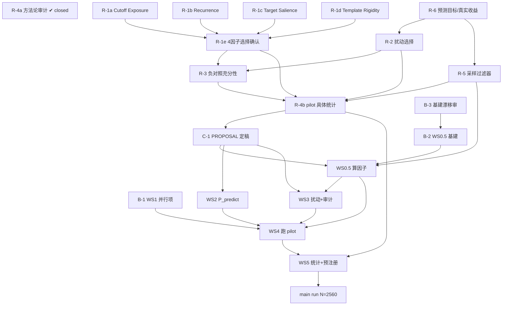

# 当前阶段工作表 (Worktable)

> **用途**:当前阶段(操作化层重开 → pilot)的行动规划工具 —— 回答「有哪些活、
> 谁挡着谁、现在能动什么」。
>
> **不在此处复述细节**(防 decision→text drift —— 见 memory `feedback_decision_text_drift`):
> - R-1…R-6 重开 scope 与每项细节 → `refine-logs/reviews/WALKTHROUGH_PASS1/pending_items.md`
> - 跨 session 待办 / 阻塞项的**状态唯一真相** → `PENDING.md`
> - Phase 7 各 WS 实施细节 → `plans/phase7-pilot-implementation.md`
> - 成文研究问题 → `docs/RESEARCH_PROPOSAL.md`
>
> **本表只维护「依赖」与「可动?」**(可动性由依赖推导,不单独维护一份会漂移的
> 状态字段)。已完成 / 进行中的事实另见 §1 与各行备注。
>
> **最后更新**:2026-05-23 PM(基建主题 final-pass 完成)

---

## 1. 阶段全景

四大块,大致顺序 **A → C → D → E**,**B 与 A 并行**:

| 块 | 内容 | 与其它块的关系 |
|---|---|---|
| **A** | 操作化层结构化重开 R-1…R-6(全程 **clean-room-first**) | 当前焦点;结论喂 C |
| **B** | 并行轨道:design-agnostic 基建 + WS1 | 与 A 同时跑;边界=建能力,**不锁定义、不签 WS0.5 memo** |
| **C** | 重开收尾:`RESEARCH_PROPOSAL.md` §4/§6 定稿 | A 全部完成后的**单点闸门**,gate 住 D |
| **D** | 实现工作流 WS0.5 / WS2 / WS3 / WS4 / WS5 | C 之后开工 |
| **E** | pilot N=780 → main run N=2,560 | D 的产物 + exit gate |

**既成事实**:WS0 基本完成;WS1 代码建好 + 全模型冒烟通过 + AutoDL 云开好 +
Path E 探针集建好(均不在重开区)。WS0.5 设计完成(memo v0.4 含 2026-05-23
B-3 校准 + 2026-05-23 PM final-pass:整体质量审 + walk-through →
§7 token-meter 整章删除 + §6.1 schema 收 11 列 + closure 14→11;
reviewer-vs-author 路径分家全部落定),代码未动、签字搁置。WS2–WS5 未开工。

**R-4a 方法论审计 2026-05-23 closed**(audit trail:
`refine-logs/reviews/REOPEN_R1_R6/R4_methodology_audit/whiteboard_analysis.md`
+ `subfield_lit_scan.md`)。锁住框架级 8 条(详见 `RESEARCH_PROPOSAL.md`
§4.4 + `pending_items.md` R-4a closed 块):无 family-wise multiplicity
correction / 标签语言改 main-primary-supporting-robustness-appendix /
「预注册」措辞改 design memo + sealed split + transparency artifact /
扰动质量 Gwet's AC1 取代 ≥85% pass-rate hard gate / 混合模型 per-estimand
分别建 / E_CMMD 重命名 Cross-Model Cutoff-Monotone Disagreement / etc.。
**不锁** estimand 清单 / family 大小 / 因子总数 —— 留给 R-1/R-2/R-6 实现
+ pilot 数据决定。R-6 因此解封。元层结论:**ratchet 论双源坐实**(A 的
clean-room 独立推出比 frozen 简单 + B 子领域实然比 A 更轻),应用 memory
`feedback_review_complexity` 解药生效。

---

## 2. 工作项表

### 块 A — 操作化层重开
方法:**clean-room-first**(先白板独立分析 → 再对照旧 reviewer 意见)。
原则:**实现设计先行,选择在后**。

| ID | 工作项 | 依赖(前置) | 可动? |
|---|---|---|---|
| **R-4a** | **方法论审计**:框架级 8 条(无 family correction / 标签词 / 「预注册」措辞改 design memo / Gwet's AC1 / etc.) | 无 | **✔ closed 2026-05-23**(audit `refine-logs/reviews/REOPEN_R1_R6/R4_methodology_audit/`) |
| R-6 | 预测目标 & 是否/如何用真实收益(含 parked C_FO/C_SR 漂移调查) | 无(R-4a 给的容量答案是"不锁数,加新 estimand 要替换或开新 design memo") | ✅ 可动(2026-05-23 解封) |
| R-1a | Cutoff Exposure:实现 + 选择确认 | 无(实现简单:日期+manifest) | ✅ 可动 |
| R-1b | Historical Family Recurrence:实现 | 无(有 WS0.5 §5 管线待 clean-room 复审;family 粒度未定) | ✅ 可动 |
| R-1c | Target Salience:实现 | 无(有 WS0.5 §3.3 待 clean-room 复审) | ✅ 可动 |
| R-1d | Template Rigidity:从零设计 | 无(**零 spec**,从文献起;用户视为重点因子) | ✅ 可动 |
| R-1e | 因子最终选择确认(R-4a 不锁数 → 选哪几个由实现+pilot 实证证据决定) | R-1a · R-1b · R-1c · R-1d(R-4a 依赖已解除) | ⛔ 待 R-1a-d |
| R-2 | 6 扰动实现构思 → 选保留几个进 primary(重审 C_NoOp;C_FO vs C_SR 漂移见 `.scratch/cfo_csr_history_findings.md`) | R-6(C_FO 机制选择,R-4a 依赖已解除) | ⛔ 待 R-6 |
| R-5 | 采样准入过滤器(可交易实体 / 新闻长度 / 反直觉案例) | R-6(反直觉案例需真实股价,R-4a 依赖已解除) | ⛔ 待 R-6 |
| R-3 | 负对照充分性 | R-1e · R-2(需知最终因子 / 扰动) | ⛔ 待上游 |
| R-4b | pilot 具体统计(power 计算 / n_eff 矩阵 / 混合模型规格落地 / bootstrap 实施)—— R-4a 已锁 TOST/SESOI、scenario-based MC power 等框架 | R-1e · R-2 · R-3 · R-5(操作化定了才能算 power;R-4a 框架已就位) | ⛔ 待上游 |

> **TODO[CROSS_SYNTH 🟡-3, approved 2026-05-23]** — R-2 重审范围新增候选扰动
> **C_ES (Entity Substitution / 实体替换)**:保留语义换实体身份(把"茅台"
> 换成"五粮液",文本其余字 — 含数字、方向、事件类型 — 不动),测原实体的
> 事实记忆能否漏出。与 C_anon(删信息→"某公司")、C_SR(翻语义不动实体)
> 都不同。对应 Kong 2026 §3.3 entity substitution test 精神(实体记忆 vs
> 文本事实冲突)。**用户保留态度**:替换标准模糊(同行业?同市值?随机?),
> R-2 session 最终可能不采纳,但需进入 inventory 讨论而非直接排除。
> 草稿与论证见 refine-logs/reviews/CROSS_SYNTH_20260523/synthesis_findings.md
> 与该 session 对话 🟡-3 修正版(撤销原 🟡-3 "Kong→R-1d 设计起点"的错配)。

> **TODO[CROSS_SYNTH 🟡-5, approved 2026-05-23]** — R-2 重审时,以下三条
> Kong + Mirzadeh derived inputs 进 kickoff:
> **Input 1 (C_SR / C_FO / C_ES 三者关系)**:概念上 C_FO 测 counterfactual
> reasoning(能否忽略文本里的反事实证据), C_SR 测 entity-memory anchoring
> (能否被实体记忆拉住), C_ES 测 entity-fact memory leakage(原实体事实记忆
> 是否漏出);三个 leakage 机制不同。Kong 2026 §3.3 entity substitution test
> 精神支持 C_SR / C_ES 应有独立位置而非简单合并入 C_FO。R-2 应明确决定三者
> 关系(都进 main / 选 1 进 main 其他 supporting / 合并)。但**注意**:
> `cfo_csr_history_findings.md` 已记 C_FO/C_SR 在"极性翻转值替换"最实用
> 形态上几乎重合,R-2 不要因为概念分得开就忽略实操重合证据。
> **Input 2 (C_NoOp 重审 — 同行 anchor 双源)**:用户已点名重审 C_NoOp。
> 外部同行 anchor 双源:
>   (a) **Mirzadeh et al. 2025 GSM-Symbolic** (`related papers/GSM-Symbolic
>       Understanding Reasoning Limits.pdf`)的 **GSM-NoOp 实验** — 给 GSM8K
>       数学题插一句 statistically irrelevant 但 contextually tempting 的
>       句子,准确率下降最多 65%。作者解读为模型在 pattern-match 训练集
>       reasoning trajectory 而非执行 symbolic logic。这是 C_NoOp 的 direct
>       mechanism anchor,与 R-4a subfield lit scan 引用一致。
>   (b) **Kong et al. 2026 §3.3** 末句 "negative controls should use
>       scrambled or irrelevant inputs to confirm that the system does not
>       produce detailed causal stories or confident trades" — framework 层
>       推荐,把无关输入负对照与 entity substitution test 并列为 Rationale
>       Robustness 的两个 minimum probes。
> 这两条 anchor 支持 C_NoOp **保留**(不要 demote),但同时支持当前
> worktable §7.2 把它定位为 **supporting** 而非 primary(Kong 把它当
> negative control,不是 main memorization signal;Mirzadeh 也用它做
> robustness 退化测试,不是 main accuracy metric)。
> **Input 3 (C_FO 不对应 Kong 不是 demote 理由)**:C_FO 是 counterfactual
> reasoning detection,同行 anchor 来自 Wu 2024 (Reasoning or Reciting?) +
> Mirzadeh 2025 (GSM-Symbolic main variant),不是 Kong。R-2 重审时不要因为
> C_FO 不在 Kong §3.3 列里就 demote。
> 草稿与论证见 refine-logs/reviews/CROSS_SYNTH_20260523/synthesis_findings.md
> 与该 session 对话 🟡-5。

> **TODO[CROSS_SYNTH 🟡-4, approved 2026-05-23]** — 两个落地点,同一 cross-synth
> 起点(Kong 2026 §2.2 Survivorship Bias Issue 1 警告:"media coverage
> inherently correlates with ongoing corporate activity and investor attention,
> firms that fail or quietly exit the market tend to be underrepresented")。
> **(a) R-1c kickoff sanity-check input**:R-1c 复审 Target Salience metric
> (log CLS mention count)时,把 Kong §2.2 作为**反向 sanity-check**(不是
> endorsement):审 factor metric 选择是否会与 sampling 层互动而间接复制
> Kong 警告的 media-coverage bias(例如:如果 Salience 极低的案例在 pilot
> 里很少,是不是 sampling 已经偏向高曝光实体)。
> **(b) R-5 scope 显式扩展**:当前 R-5 写"采样准入过滤器(可交易实体/
> 新闻长度/反直觉案例)"只覆盖**过滤**,不覆盖**抽样分布策略**。用户
> 2026-05-23 明确指出 scope gap:**需要专门讨论 sampling 策略如何从合法
> 语料里选 benchmark 数据 —— 是按案例随机抽?(会偏向高曝光实体,因高曝光
> 实体在语料里出现条数多)按实体均衡抽?(会破坏 Target Salience 自然
> 分布)按 Salience 分层抽?(合理但需明示)**。R-5 重开 scope 扩展为
> "准入过滤 + 抽样分布策略",并显式回应 Kong §2.2 警告。
> **(c) RESEARCH_PROPOSAL §4.7 同步加 TODO**:§4.7 当前 prose 只写
> "全局准入预过滤要求中心可交易标的",待 R-5 完成后在 §4.7 新增专门的
> sampling 策略讨论段。
> 草稿与论证见 refine-logs/reviews/CROSS_SYNTH_20260523/synthesis_findings.md
> 与该 session 对话 🟡-4 修正版(原 🟡-4 把 Kong §2.2 当 endorsement 是
> 错配方向,修正后改成 sanity-check + sampling scope 扩展)。

### 块 B — 并行轨道(与 A 同时)

| ID | 工作项 | 依赖(前置) | 可动? |
|---|---|---|---|
| B-3 | 基建主题 Pass-2 漂移审(E-6/E-8/E-9/E-10 memo 文字) | 无 | ✔ **完成**(2026-05-23):8 must-fix + 1 wording 落到 memo v0.4 cont.;附 §6 reproducibility 重心校准(reviewer-vs-author 路径分家);drift report `refine-logs/reviews/WS0_5_DESIGN/pass2_infra_drift_review.md` + repro-norms 调研 `.../llm_reproducibility_norms_20260522.md` |
| B-3+ | 基建主题 final-pass:整体质量审 + rubber-duck walk-through | B-3 ✔ | ✔ **完成**(2026-05-23 PM):Codex 整体质量审(3 must-fix / 4 recommend / 5 flag-only,`infra_quality_pass_20260523.md`)+ 用户 rubber-duck walk-through(§5/§6/§7/§8/§9);**§7 token-meter subsystem 整章删除**(用户 first-principles —— cache UNIQUE + max_rounds + 账户余额上限三层覆盖);§6.1 schema 收到 11 列;§6.2 `run_inputs` 改 per-task / per-model dict(schema 标"示意",B-2 finalize);§8 -3 文件 / +1 smoke 报告 / check_pilot_cells 降级;§9 closure 14→11;§11 R-W05-6 改写。基建主题与 reviewer-vs-author 路径分家**全部落定**;cross-boundary 提案 → `walkthrough_findings_20260523.md` 喂 R-1b/c/R-5 reopen |
| B-2 | WS0.5 design-agnostic 基建(实体管线 / replay 缓存 / 复现 / caching wrapper) | B-3 ✔ + B-3+ ✔ | ✅ 可动 —— 4 个基建模块按 memo 落地:provider-agnostic caching wrapper(DeepSeek + OpenRouter) / SQLite cache(11 列 schema)/ Tier-A JSONL / `verify_canonical_hash.py` + `replay_factor_values.py`(含 Tier-B sha256 startup verify);**B-2 启动第一件事 = finalize `run_inputs.per_task` 具体 schema**(memo §6.2 标"示意"待 B-2 落) |
| B-1 | WS1 云上可并行项(Stage 2.7 hidden states 等) | 无(WS1 已建好+冒烟) | ✅ 可动;pilot 正式跑见 WS4 |

### 块 C / D / E

| ID | 工作项 | 依赖(前置) | 可动? |
|---|---|---|---|
| C-1 | `RESEARCH_PROPOSAL.md` §4/§6 定稿(+ CLAUDE.md / memory 同步) | R-1…R-6 全部 | ⛔ 待 A |
| WS0.5 | 算因子管线实现(事件分类 / 实体抽取 / 复现计数 / 显著度) | C-1 · B-2 · R-1 · R-5 | ⛔ |
| WS2 | P_predict 管线 | C-1 · R-2 · R-6 (· WS0 ✔) | ⛔ |
| WS3 | 扰动构造 + 人工审计(C_FO / C_NoOp) | C-1 · R-2 · WS0.5(读事件类型标签) | ⛔ |
| WS4 | 跑 pilot(冻结清单,跑算子,产结果表) | WS0.5 · WS1 · WS2 · WS3 · OPEN-4 | ⛔ |
| WS5 | pilot 统计 + 预注册 | WS4 · R-4 | ⛔ |
| E-main | main run N=2,560 | WS5 · pilot exit gate(G3) | ⛔ |

---

## 3. 依赖图

> 图中 `R-4b → C-1` 是简写:C-1 需要 **R-1…R-6 全部**完成,R-4b 是块 A 的
> 终端节点(R-6 经 R-2/R-5 间接汇入 R-4b),用它代表「A 收口」。**R-4a**
> 已 closed(2026-05-23,框架级 8 条锁定;不锁 component-level 清单);其
> 节点保留作里程碑,外延依赖箭头已移除。

---

## 4. 现在能动的(2026-05-23 PM,R-4a closed 后)

无前置、立即可启动:

- **R-1d Template Rigidity 设计** —— **零 spec、用户视为重点因子**,是
  R-1 系列里最实打实的起点。建议走 clean-room codex(模板参照
  `.scratch/codex_prompt_r4a_whiteboard.md`)。
- **R-1a / R-1b / R-1c** —— 3 个因子各自的实现设计。R-1b Recurrence(用户
  点名作下一步实验管线搭建)、R-1c Salience 各有 WS0.5 §5 / §3.3 现成管线
  待 clean-room 复审;R-1a Cutoff Exposure 实现简单。
- **R-6 预测目标 & 真实收益**(2026-05-23 解封)。可接 parked C_FO/C_SR 漂移
  调查(`refine-logs/reviews/REOPEN_R1_R6/cfo_csr_history_findings.md`);
  kickoff 已写好 `.scratch/session_kickoff_r6.md`。
- **B-2** WS0.5 design-agnostic 基建(B-3 + B-3+ 全部解锁)。memo 文字与
  reviewer-aligned 设计 + §7 teardown 后的精简设计**全部对齐**,可照 memo 实现
  4 个基建模块:**provider-agnostic caching wrapper**(DeepSeek + OpenRouter 共用)
  / SQLite cache(11 列 schema)/ Tier-A JSONL / `verify_canonical_hash.py` +
  `replay_factor_values.py`(含 Tier-B sha256 startup verify)。**第一件事**:
  finalize `run_inputs.per_task` 具体 schema(memo §6.2 标"示意",B-2 落)。
  **不实现**(已删):metered client / budget_summary / per-round checkpoint。
- **B-1** WS1 云上可并行项。

> R-1a-d 各自实现细节独立,可并行。**R-1e 选因子由 R-1a-d 实现 + pilot 实证
> 决定**(R-4a 不锁因子数,把"哪几个进 primary"留给数据)。R-2 与 R-5 仍待
> R-6(C_FO 机制选择 / 反直觉案例需真实股价)。

> **实现价值清单**(operator / perturbation / factor 三轴,哪些去实现 /
> 简版 / 暂缓 / 不做):见 §7。

---

## 5. 闸门 (Gates)

| 闸门 | 位置 | 状态 |
|---|---|---|
| G1 | ML-Engineer 可行性闸门 · WS0 之后 | ✔ 已过(WS0 基本完成) |
| G2 | ML-Engineer 可行性闸门 · WS1–3 冒烟之后 | 待 |
| G3 | pilot exit gate · main run 之前(`phase7` plan Section 13 十条件) | 待 |

---

## 6. 跨阶段挂账

状态以 `PENDING.md` 为准(它是这些项的状态唯一真相);此处只标它们卡在哪。

| 项 | 关系 |
|---|---|
| OPEN-4 Phase 7 审计人手 | 阻塞 **WS4**;owner=用户;WS4 manifest 冻结前需解决 |
| Phase 8 MC 仿真功效校准 | post-pilot;阻塞 PREREG_STAGE1 功效声明 |
| WS6 机制分析 | dormant,待 WS1 Stage 2.7 hidden states 落地后 scope |
| Kong 2026 references mining | 非阻塞 enrichment;Kong (arXiv:2602.14233) 参考文献列表(12 页)尚未系统过,可能含 finance-LLM bias 相关未读论文;**安排一次专门 session** 把 Kong references 过一遍、把相关条目加入 `related papers/` + INDEX。也记于 memory `lit_landscape.md`。来源 [CROSS_SYNTH 🟡-6, 2026-05-23] |

---

## 7. 实现价值清单(2026-05-23 R-4a 后)

> R-4a 决定后梳理 —— 哪些 operator / perturbation / factor 现在去实现、
> 哪些做简版等 pilot 看、哪些暂缓 / 不做。
>
> **清单不是 primary family 清单** —— primary 进哪些等实现 + pilot 数据
> 决定(R-1e / R-2 / R-6 的范围)。本清单是"哪些值得花工程资源建出来"。

### 7.1 Operators

| 组件 | 现状 | 价值 | 推荐 |
|---|---|---|---|
| P_logprob | WS1 已建 + 冒烟通过 + AutoDL 开好 | **核心** —— logprob 路线物理基础 | ✅ 已实现 |
| P_predict | WS2 未开工 | **核心** —— 所有行为类信号 | ✅ 实现 minimal schema = direction + confidence;memory_flag / evidence 留 optional 字段(不进主张),等 pilot 看是否有信息 |
| P_extract | Path E 探针集已建(reuse) | 中 —— Path E 经验探针 load-bearing | ✅ 已实现,保留 |
| P_schema | 未实现 | 边缘(已划 follow-up paper) | ❌ **不做** |

### 7.2 Perturbations

| 组件 | 现状 | 价值 | 推荐 |
|---|---|---|---|
| C_FO | 机制未定(parked R-2+R-6 漂移) | **主路径** —— counterfactual 信号子领域同行(Wu 2024 / Mirzadeh 2025)用法 | ✅ **先做"就地换值"最小版**;pilot 后由 R-6 决定是否升级 T+1/T+5 真实收益版 |
| C_NoOp | WS3 未开工(用户点名重审) | 中(robustness / brittleness 信号,非直接 memorization) | ✅ 实现,定位 supporting |
| C_SR | 与 C_FO 实操几乎重合(parked) | 中 —— secondary to C_FO within counterfactual family | ⏸ **先不单独做**;等 C_FO + pilot,如 C_FO 不足且 C_SR 有区分性再说 |
| C_anon | exploratory(E_EAD_t / E_EAD_nt);依赖 WS0.5 entity 管线 | 中 —— identity-keyed memory probe | ⚖️ **先做 L0 vs L4 binary**,不做 L0-L4 dose 梯度 |
| C_temporal | exploratory | 边缘 —— Cutoff Exposure 因子已直接 measure | ❌ **先不做**;pilot 看 E_CMMD 强度后再说 |
| C_ADG | reserve(只改 system prompt) | 边缘但成本极低 | ✅ **做 D4b primary**(no text cues),备用 |

### 7.3 Factors

| 组件 | 现状 | 价值 | 推荐 |
|---|---|---|---|
| Cutoff Exposure | 实现简单(日期 + manifest);Path E 验证 | **核心** —— 整个 temporal route 物理基础 | ✅ **必实现** |
| Historical Family Recurrence | WS0.5 §5 管线待 clean-room 复审;family 粒度未定 | **主候选** —— 对应 repetition memorization(Carlini 2023 数据点) | ✅ **实现**(用户点名 R-1b);family 粒度先选 粗(标的级)/ 细(标的×event_super_type)两档,lookup 窗口 90/365 天两档,在 pilot 看哪档有信号,不预设阈值 |
| Target Salience | WS0.5 §3.3 待 clean-room 复审 | **主候选** —— prominence-mediated memorization | ✅ 实现 |
| Template Rigidity | **零 spec**(用户视为重点) | **主候选** —— 中文金融新闻强模板化(财报 / 监管公告) | ✅ **先做 R-1d 设计**(用户点名下一步),再实现 |
| Bloc 3 标注(事件类型 / 披露 / 阶段 / 时段) | WS0.5 管线本就标注 | exploratory stratification | ✅ 沿用,不单独实现 |

### 7.4 总账

- ✅ **实现**:P_predict、C_FO(简版)、C_NoOp、C_ADG、Cutoff Exposure、
  Recurrence、Salience、Template Rigidity
- ⚖️ **实现简版**:C_anon(L0 vs L4)、P_predict schema 留扩展位
- ⏸ **暂缓**:C_SR、C_temporal(等 pilot 数据再说)
- ❌ **不做**:P_schema(follow-up paper)

### 7.5 与块 A 工作项的对应

| 实现价值清单条 | 对应 worktable §2 工作项 |
|---|---|
| Template Rigidity(✅ 设计) | R-1d |
| Recurrence(✅ 实现) | R-1b |
| Salience(✅ 实现) | R-1c |
| Cutoff Exposure(✅ 实现) | R-1a |
| C_FO 机制(简版 → R-6 后升级) | R-2 + R-6 交叉项 |
| C_NoOp(supporting) | R-2 |
| C_SR / C_temporal(暂缓) | R-2(裁剪后) |
| C_anon binary | R-2 |
| P_predict schema | R-6 + WS2 |
| 反直觉案例过滤 | R-5(R-6 后) |
