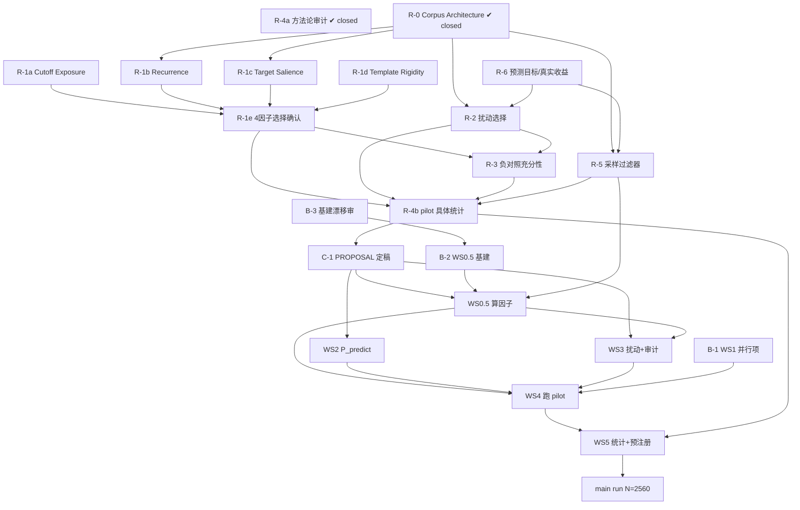

# 当前阶段工作表 (Worktable)

> **用途**:当前阶段(操作化层重开 → pilot)的行动规划工具 —— 回答「有哪些活、
> 谁挡着谁、现在能动什么」。
>
> **不在此处复述细节**(防 decision→text drift —— 见 memory `feedback_decision_text_drift`):
> - R-1…R-6 重开 scope 与每项细节 → `refine-logs/reviews/WALKTHROUGH_PASS1/pending_items.md`
> - 跨 session 待办 / 阻塞项的**状态唯一真相** → `PENDING.md`
> - Phase 7 各 WS 实施细节 → `plans/phase7-pilot-implementation.md`
> - 成文研究问题 → `docs/RESEARCH_PROPOSAL.md`
>
> **本表只维护「依赖」与「可动?」**(可动性由依赖推导,不单独维护一份会漂移的
> 状态字段)。已完成 / 进行中的事实另见 §1 与各行备注。
>
> **最后更新**:2026-06-07(**R-1 因子层全 closed** + **R-6 closed 2026-06-06**(解锁 R-2);R-1e 待 pilot;R-2 / R-5 / B-2 可动)

---

## 1. 阶段全景

四大块,大致顺序 **A → C → D → E**,**B 与 A 并行**:

| 块 | 内容 | 与其它块的关系 |
|---|---|---|
| **A** | 操作化层结构化重开 R-0 corpus 架构 + R-1…R-6(全程 **clean-room-first**) | 当前焦点;结论喂 C |
| **B** | 并行轨道:design-agnostic 基建 + WS1 | 与 A 同时跑;边界=建能力,**不锁定义、不签 WS0.5 memo** |
| **C** | 重开收尾:`RESEARCH_PROPOSAL.md` §4/§6 定稿 | A 全部完成后的**单点闸门**,gate 住 D |
| **D** | 实现工作流 WS0.5 / WS2 / WS3 / WS4 / WS5 | C 之后开工 |
| **E** | pilot N=780 → main run N=2,560 | D 的产物 + exit gate |

**既成事实**:WS0 基本完成;WS1 代码建好 + 全模型冒烟通过 + AutoDL 云开好 +
Path E 探针集建好(均不在重开区)。WS0.5 设计 content-complete(canonical =
`docs/DECISION_20260518_ws0_5_thales_alignment.md`),代码未动、**签字搁置**。
WS2–WS5 未开工。

**R-4a 方法论审计 2026-05-23 closed** → canonical lock-in =
`refine-logs/reviews/REOPEN_R1_R6/R4_methodology_audit/R4a_DECISIONS.md`
(time-static 决策清单;methodology highlights 见 `pending_items.md`
R-4a closed 块)。下游解锁 R-6(✔ closed 2026-06-06:C_FO 删);R-4b 仍 open。

**R-0 Corpus Architecture 2026-05-23 PM late closed** → canonical lock-in =
`refine-logs/reviews/REOPEN_R1_R6/R0_corpus_arch/R0_DECISIONS.md`
(time-static 决策清单;methodology highlights 见 `pending_items.md`
R-0 closed 块)。下游解锁 R-1b(2026-05-24 ✔ closed)/ R-1c(2026-05-25 ✔ closed)
/ R-5 / B-2 `run_inputs.per_task` schema finalize。

**R-1c Target Salience 2026-05-25 closed** → canonical lock-in =
`refine-logs/reviews/REOPEN_R1_R6/R1c_target_salience/R1c_DECISIONS.md`
(time-static 决策清单;methodology highlights 见 `pending_items.md`
R-1c closed 块)。下游解锁:R-1e 因子最终选择路径(Option C 显式把 Salience
降级路径交 R-1e);R-5 Pool G 可切到 R-1c metric 分层;B-2 `target_salience`
schema 字段;R-4b 追加 R-1b retrospective tail-leverage check。

**R-1a Cutoff Exposure 2026-05-27 机制 closed** → canonical lock-in =
`refine-logs/reviews/REOPEN_R1_R6/R1a_cutoff_exposure/R1a_DECISIONS.md`
(机制 time-static 锁定;**cutoff 中心值 provisional 待探针验证**;methodology
highlights 见 `pending_items.md` R-1a closed 块)。锁定 metric =
tanh((published−cutoff signed 连续月)/w),w=2 月主 + 1/3/6 稳健性。下游解锁:
R-1e(Cutoff Exposure 作 β1 载体);R-5 Pool I(cutoff-balanced);R-4b(case×model
进混合模型 + cutoff 误分类模拟)。**cutoff 验证探针**(黑白盒通用 dated-fact QA +
白盒 Path-E)协议已设计(`R1a_cutoff_exposure/cutoff_probe_protocol_codex.md`),
建+跑排进 fleet 部署。

**R-1d Template Rigidity 2026-06-02 closed + 因子候选池 review R-1g…R-1x 2026-06-05 全 closed**
→ **因子层(机制 + 候选池准入)整层落定**。canonical = 各 `REOPEN_R1_R6/R1*_DECISIONS.md`;
汇总索引(单一真相)= `REOPEN_R1_R6/R4_methodology_audit/four_layer_candidate_pools.md` §1。
R-1 因子层对 **R-1e** 的依赖已清空、**只剩 pilot 数据**(选 / 降级)。

---

## 2. 工作项表

### 块 A — 操作化层重开
方法:**clean-room-first**(先白板独立分析 → 再对照旧 reviewer 意见)。
原则:**实现设计先行,选择在后**。

| ID | 工作项 | 依赖(前置) | 可动? |
|---|---|---|---|
| **R-4a** | **方法论审计** | 无 | **✔ closed 2026-05-23** → `refine-logs/reviews/REOPEN_R1_R6/R4_methodology_audit/R4a_DECISIONS.md` |
| **R-0** | **Corpus Architecture** | 无 | **✔ closed 2026-05-23 PM late** → `refine-logs/reviews/REOPEN_R1_R6/R0_corpus_arch/R0_DECISIONS.md` |
| R-6 | 预测目标 & 真实收益用法 + C_FO 去留 | — | **✔ closed 2026-06-06** → `refine-logs/reviews/REOPEN_R1_R6/R6_pred_target_cfo/R6_DECISIONS.md`:**C_FO 删**;P_predict 输出形式待算子分析;**会有一个涉及真实收益的记忆 estimand**(待 estimand 分析)。解锁 R-2 |
| R-1a | Cutoff Exposure:实现 + 选择确认 | 无 | **✔ 机制 closed 2026-05-27** → `refine-logs/reviews/REOPEN_R1_R6/R1a_cutoff_exposure/R1a_DECISIONS.md`;cutoff 中心值 provisional 待探针;R-1e / R-5 Pool I / R-4b 误分类模拟解锁 |
| R-1b | Historical Family Recurrence:实现 + lock-in | R-0 已 closed | **✔ closed 2026-05-24** → `refine-logs/reviews/REOPEN_R1_R6/R1b_recurrence/R1b_DECISIONS.md`;R-1c / R-1e / R-5 Pool G / B-2 schema 解锁 |
| R-1c | Target Salience:实现 + lock-in | R-0 已 closed | **✔ closed 2026-05-25** → `refine-logs/reviews/REOPEN_R1_R6/R1c_target_salience/R1c_DECISIONS.md`;R-1e / R-5 Pool G / B-2 schema / R-4b 追加 retrospective tail-leverage 解锁 |
| R-1d | Template Rigidity:从零设计 | 无 | **✔ closed 2026-06-02** → `R1d_template_rigidity/R1d_DECISIONS.md`;进 R-1e 候选池(操作化 open items 待 pilot 前用户审计) |
| R-1g…x | 因子候选池快速评审(f/g/h/i/k/l/m/u/v/w/x 进池 · j/n/o/p/q/r/s/t DROP) | R-0 / R-4(已解锁) | **✔ closed 2026-06-05** → 汇总索引 `R4_methodology_audit/four_layer_candidate_pools.md` §1;逐因子 `R1*_DECISIONS.md` |
| R-1e | 因子最终选择确认(从候选池选 / 降级,数 power-bounded) | 因子层已全 closed · **pilot 数据** | ⛔ **待 pilot**(因子层依赖已清,选 / 降级靠实证) |
| R-2 | 反事实扰动家族设计 → 选保留几个进 primary(重审 C_NoOp;**C_FO 已删** 见 R6_DECISIONS;主 backbone 选择);perturbation-specific eligibility flag 在 R-0 HOOK1/HOOK2 占位落地 | R-6 已 closed · R-0 已 closed | ✅ **可动**(R-6 已解锁) |
| R-5 | 采样:R-0 expose 的 Pool B + G/H/I + D/E/F 扩展位;within-pool 分布(R-0 不强制叠加 G/H/I,row-random 合法)+ 准入过滤器 + per-article cap/dedupe 规则;反直觉案例过滤仍需 R-6 真实股价 | R-0 已 closed + R-6 已 closed(反直觉案例) | ✅ **可动**(within-pool 分布 + dedupe 规则 + 反直觉案例段均已解锁)|
| R-3 | 负对照充分性 | R-1e · R-2(需知最终因子 / 扰动) | ⛔ 待上游 |
| R-4b | pilot 具体统计(power 计算 / n_eff 矩阵 / 混合模型规格落地 / bootstrap 实施)—— R-4a 已锁 TOST/SESOI、scenario-based MC power 等框架 | R-1e · R-2 · R-3 · R-5(操作化定了才能算 power;R-4a 框架已就位) | ⛔ 待上游 |

> **TODO[CROSS_SYNTH 🟡-3] → R-2 kickoff** — 候选扰动 C_ES(Entity Substitution /
> 实体替换:保留语义换实体身份,测原实体事实记忆能否漏出;用户保留态度,替换标准
> 待 R-2 inventory 讨论)。论证见 `archive/r4_r5a_lineage/refine-logs/reviews/CROSS_SYNTH_20260523/synthesis_findings.md`。

> **TODO[CROSS_SYNTH 🟡-5] → R-2 kickoff** — C_SR / C_ES 关系裁决(都进 main / 选 1 /
> 合并;注意 `cfo_csr_history_findings.md` 记的实操重合证据)+ C_NoOp 重审(同行 anchor:
> Mirzadeh 2025 GSM-NoOp + Kong 2026 §3.3 negative controls;两源支持 C_NoOp 保留但定位
> supporting,见 §7.2)。论证见 `archive/r4_r5a_lineage/refine-logs/reviews/CROSS_SYNTH_20260523/synthesis_findings.md`。

> **TODO[CROSS_SYNTH 🟡-4] → R-1c / R-5 / PROPOSAL §4.7** — Kong 2026 §2.2 survivorship
> bias 警告(媒体曝光偏向存续公司)落地三点:(a) R-1c metric 选择反向 sanity-check;
> (b) R-5 scope 扩为"准入过滤 + 抽样分布策略"(随机 / 实体均衡 / Salience 分层抽);
> (c) PROPOSAL §4.7 待 R-5 后加专门 sampling 策略段。论证见
> `archive/r4_r5a_lineage/refine-logs/reviews/CROSS_SYNTH_20260523/synthesis_findings.md`。

### 块 B — 并行轨道(与 A 同时)

| ID | 工作项 | 依赖(前置) | 可动? |
|---|---|---|---|
| B-3 / B-3+ | WS0.5 基建主题 design pass(Pass-2 漂移审 + final-pass 质量审 + walk-through) | 无 | ✔ **done**:设计落定到 WS0.5 memo;canonical = `docs/DECISION_20260518_ws0_5_thales_alignment.md`(reviewer-vs-author 路径分家、§7 token-meter 删除、schema 11 列、closure 11 步等已落 memo);cross-boundary 提案喂 R-1b/c/R-5 reopen |
| B-2 | WS0.5 design-agnostic 基建(实体管线 / replay 缓存 / 复现 / caching wrapper) | B-3 ✔ + B-3+ ✔ | ✅ 可动 —— 4 个基建模块按 memo 落地:provider-agnostic caching wrapper(DeepSeek + OpenRouter) / SQLite cache(11 列 schema)/ Tier-A JSONL / `verify_canonical_hash.py` + `replay_factor_values.py`(含 Tier-B sha256 startup verify);**B-2 启动第一件事 = finalize `run_inputs.per_task` 具体 schema**(memo §6.2 标"示意"待 B-2 落) |
| B-1 | WS1 云上可并行项(Stage 2.7 hidden states 等) | 无(WS1 已建好+冒烟) | ✅ 可动;pilot 正式跑见 WS4 |

### 块 C / D / E

| ID | 工作项 | 依赖(前置) | 可动? |
|---|---|---|---|
| C-1 | `RESEARCH_PROPOSAL.md` §4/§6 定稿(+ CLAUDE.md / memory 同步) | R-1…R-6 全部 | ⛔ 待 A |
| WS0.5 | 算因子管线实现(事件分类 / 实体抽取 / 复现计数 / 显著度) | C-1 · B-2 · R-1 · R-5 | ⛔ |
| WS2 | P_predict 管线 | C-1 · R-2 · R-6 (· WS0 ✔) | ⛔ |
| WS3 | 扰动构造 + 人工审计(C_NoOp + R-2 选定的反事实扰动;C_FO 已删 R-6) | C-1 · R-2 · WS0.5(读事件类型标签) | ⛔ |
| WS4 | 跑 pilot(冻结清单,跑算子,产结果表) | WS0.5 · WS1 · WS2 · WS3 · OPEN-4 | ⛔ |
| WS5 | pilot 统计 + 预注册 | WS4 · R-4 | ⛔ |
| E-main | main run N=2,560 | WS5 · pilot exit gate(G3) | ⛔ |

---

## 3. 依赖图

> 图中 `R-4b → C-1` 是简写:C-1 需要 **R-1…R-6 全部**完成,R-4b 是块 A 的
> 终端节点(R-6 经 R-2/R-5 间接汇入 R-4b),用它代表「A 收口」。**R-4a**
> 已 closed(2026-05-23,框架级 8 条锁定;不锁 component-level 清单);其
> 节点保留作里程碑,外延依赖箭头已移除。

---

## 4. 现在能动的(2026-06-07,R-1 因子层全 closed + R-6 closed 后)

**新解锁**(R-1c closure 2026-05-25):

- **B-2 `run_inputs.per_task.target_salience` schema** —— R-1c 完整字段需求 +
  provenance hashes + 必报告 A/B count delta 见 `R1c_DECISIONS.md §9`;字段名 /
  风格留 B-2 整体 session。
- **R-5 Pool G 分层依据切换** —— 若 R-5 启用 Pool G 且 salience-stratified,
  用 R-1c `log1p_target_salience`(R1c_DECISIONS.md §8.5);若 recurrence-
  stratified 仍用 R-1b。R-5 全权决定是否启用 Pool G + 用哪个 metric。
- **R-4b retrospective tail-leverage hook** —— R-1c 引入 pre-commit tail-
  leverage appendix(winsorize / percentile),R-4b 在 pilot 后**追加** R-1b
  retrospective tail-leverage check(同形式),维持 paper §robustness 段
  一致性。不算 R-1b 重开。
- **R-1e Salience 降级路径** —— R-1c Option C 显式把 "discriminant trigger
  时 Salience 是否进 primary" 留给 R-1e + pilot 数据决定。R-1e 决策空间已含
  "R-1c 降级到 supporting / exploratory" 路径。

**仍可动**(R-1c 之外,前已立即可启动):

- **R-5 Sampling**(前半:within-pool 分布 + per-article cap / dedupe 规则)
- **R-1 因子层(R-1a-d/f + 候选池 g…x)** —— **全 closed 2026-06-05**;对 R-1e 只剩 pilot
  依赖。cutoff 验证探针(`R1a_cutoff_exposure/cutoff_probe_protocol_codex.md`)downstream、排进 fleet。
- **R-2 反事实扰动家族设计** —— **新解锁**(R-6 closed 2026-06-06:C_FO 删,目标由反事实扰动 ×
  cutoff 前后 × 显著度承接,主 backbone 选择留 R-2)。重审 C_NoOp;canonical 上游 =
  `refine-logs/reviews/REOPEN_R1_R6/R6_pred_target_cfo/R6_DECISIONS.md`。
- **B-2 其它 4 个模块**(provider-agnostic caching wrapper / SQLite cache
  11 列 schema / Tier-A JSONL / `verify_canonical_hash.py` +
  `replay_factor_values.py` 含 Tier-B sha256 startup verify)。
- **B-1** WS1 云上可并行项。

**仍卡上游**:

- **R-1e**(因子最终选择)仍卡 **pilot 数据**(因子层 R-1a-d/f + 候选池 g…x 已全 closed;
  选哪几个进 primary / 哪些降级,由 pilot 实证决定)

> **Factor pool 重审:已完(R-1g…R-1x,2026-06-05 closed)**:全部候选 confirmatory
> 因子过完,每个定候选池准入结局(进候选池 / DROP)。原则:**confirmatory 数 power-bounded
> (不预设魔数,由 pilot+R-4b 定)、候选池可 >4、pilot 后只选/降级、不追加池外新因子**
> (sealed split 防 selection 污染)。**汇总索引(单一真相)** =
> `refine-logs/reviews/REOPEN_R1_R6/R4_methodology_audit/four_layer_candidate_pools.md` §1;
> **逐因子 canonical** = 各 `REOPEN_R1_R6/R1*_DECISIONS.md`。概念工具(Type1/2 判据、粒度轴、
> 泄露机制链 6 环节、directional-label 红线、A vs B)+ 被埋/被拒候选历史见
> `REOPEN_R1_R6/_archive/factor_pool_brainstorm.md`(archived)。下一步:**R-1e** 在 pilot 后选/降级。
- **R-3 / R-4b** 仍卡上游(R-1e / R-2 / R-3 / R-5 全部落定后)

> **实现价值清单**(operator / perturbation / factor 三轴,哪些去实现 /
> 简版 / 暂缓 / 不做):见 §7。

---

## 5. 闸门 (Gates)

| 闸门 | 位置 | 状态 |
|---|---|---|
| G1 | ML-Engineer 可行性闸门 · WS0 之后 | ✔ 已过(WS0 基本完成) |
| G2 | ML-Engineer 可行性闸门 · WS1–3 冒烟之后 | 待 |
| G3 | pilot exit gate · main run 之前(`phase7` plan Section 13 十条件) | 待 |

---

## 6. 跨阶段挂账

状态以 `PENDING.md` 为准(它是这些项的状态唯一真相);此处只标它们卡在哪。

| 项 | 关系 |
|---|---|
| OPEN-4 Phase 7 审计人手 | 阻塞 **WS4**;owner=用户;WS4 manifest 冻结前需解决 |
| Phase 8 MC 仿真功效校准 | post-pilot;阻塞 PREREG_STAGE1 功效声明 |
| WS6 机制分析 | dormant,待 WS1 Stage 2.7 hidden states 落地后 scope |
| Kong 2026 references mining | 非阻塞 enrichment;Kong (arXiv:2602.14233) 参考文献列表(12 页)尚未系统过,可能含 finance-LLM bias 相关未读论文;**安排一次专门 session** 把 Kong references 过一遍、把相关条目加入 `related papers/` + INDEX。也记于 memory `lit_landscape.md`。来源 [CROSS_SYNTH 🟡-6, 2026-05-23] |

---

## 7. 实现价值清单(2026-05-23 R-4a 后)

> R-4a 决定后梳理 —— 哪些 operator / perturbation / factor 现在去实现、
> 哪些做简版等 pilot 看、哪些暂缓 / 不做。
>
> **清单不是 primary family 清单** —— primary 进哪些等实现 + pilot 数据
> 决定(R-1e / R-2 / R-6 的范围)。本清单是"哪些值得花工程资源建出来"。

### 7.1 Operators

| 组件 | 现状 | 价值 | 推荐 |
|---|---|---|---|
| P_logprob | WS1 已建 + 冒烟通过 + AutoDL 开好 | **核心** —— logprob 路线物理基础 | ✅ 已实现 |
| P_predict | WS2 未开工 | **核心** —— 所有行为类信号 | ⏳ 输出 schema **待算子逐个分析**(本次文献倾向方向分类 + 信心仅诊断 + 不裸吐数值);R-6 只确立「做行为判断」|
| P_extract | Path E 探针集已建(reuse) | 中 —— Path E 经验探针 load-bearing | ✅ 已实现,保留 |
| P_schema | 未实现 | 边缘(已划 follow-up paper) | ❌ **不做** |

### 7.2 Perturbations

| 组件 | 现状 | 价值 | 推荐 |
|---|---|---|---|
| C_FO 删 (R-6) | 删 2026-06-06 | — | ❌ **删**(与 C_SR 实操重合 + 适用窄 + 伪迹);目标由反事实扰动 × cutoff 前后 × 显著度承接,见 R6_DECISIONS |
| C_NoOp | WS3 未开工(用户点名重审) | 中(robustness / brittleness 信号,非直接 memorization) | ✅ 实现,定位 supporting |
| C_SR | 反事实扰动候选(C_FO 已删) | 中 —— 反事实信号 | ⏳ 角色 / 是否 primary / 进不进 confirmatory 留 R-2(本文不预设扰动名单) |
| C_anon | exploratory(E_EAD_t / E_EAD_nt);依赖 WS0.5 entity 管线 | 中 —— identity-keyed memory probe | ⚖️ **先做 L0 vs L4 binary**,不做 L0-L4 dose 梯度 |
| C_temporal | exploratory | 边缘 —— Cutoff Exposure 因子已直接 measure | ❌ **先不做**;等 pilot 数据再说 |
| C_ADG | reserve(只改 system prompt) | 边缘但成本极低 | ✅ **做 D4b primary**(no text cues),备用 |

### 7.3 Factors

| 组件 | 现状 | 价值 | 推荐 |
|---|---|---|---|
| Cutoff Exposure | **R-1a ✔ 机制 closed 2026-05-27** → `refine-logs/reviews/REOPEN_R1_R6/R1a_cutoff_exposure/R1a_DECISIONS.md`(tanh,w=2月;cutoff 中心值待探针)| **核心** —— 整个 temporal route 物理基础 | ✅ **必实现** |
| Historical Family Recurrence | **R-1b ✔ closed 2026-05-24** → `refine-logs/reviews/REOPEN_R1_R6/R1b_recurrence/R1b_DECISIONS.md` | **主候选** —— outcome-leakage proxy(关联记忆) | ✅ **lock-in 见 DECISIONS.md** |
| Target Salience | WS0.5 §3.3 待 clean-room 复审 | **主候选** —— prominence-mediated memorization | ✅ 实现 |
| Template Rigidity | **零 spec**(用户视为重点) | **主候选** —— 中文金融新闻强模板化(财报 / 监管公告) | ✅ **先做 R-1d 设计**(用户点名下一步),再实现 |
| Bloc 3 标注(事件类型 / 披露 / 阶段 / 时段) | WS0.5 管线本就标注 | exploratory stratification | ✅ 沿用,不单独实现 |

### 7.4 总账

- ✅ **实现**:P_predict、C_NoOp、C_ADG、Cutoff Exposure、
  Recurrence、Salience、Template Rigidity
- ⚖️ **实现简版**:C_anon(L0 vs L4)、P_predict schema 留扩展位
- ⏸ **暂缓**:C_SR、C_temporal(等 pilot 数据再说)
- ❌ **不做**:P_schema(follow-up paper)

### 7.5 与块 A 工作项的对应

| 实现价值清单条 | 对应 worktable §2 工作项 |
|---|---|
| Template Rigidity(✅ 设计) | R-1d |
| Recurrence(✅ 实现) | R-1b |
| Salience(✅ 实现) | R-1c |
| Cutoff Exposure(✅ 实现) | R-1a |
| C_FO 删 (R-6) | — |
| C_NoOp(supporting) | R-2 |
| C_SR / C_temporal(暂缓) | R-2(裁剪后) |
| C_anon binary | R-2 |
| P_predict 输出形式 | 算子逐个分析 + WS2 |
| 反直觉案例过滤 | R-5(R-6 后) |
