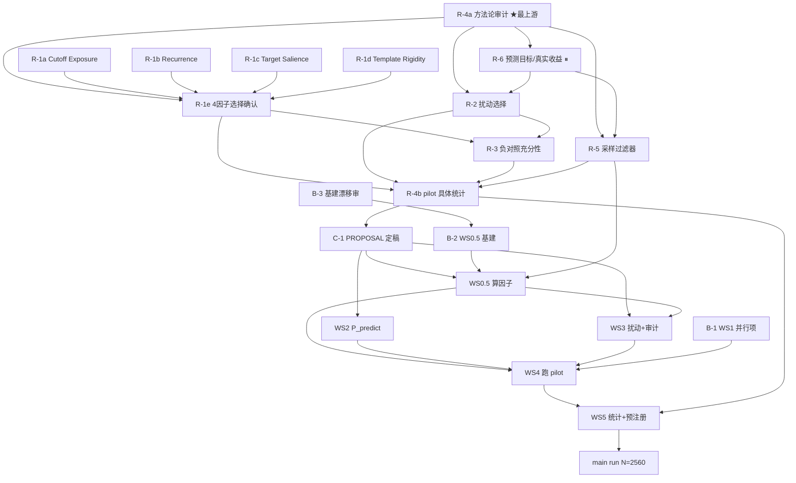

# 当前阶段工作表 (Worktable)

> **用途**:当前阶段(操作化层重开 → pilot)的行动规划工具 —— 回答「有哪些活、
> 谁挡着谁、现在能动什么」。
>
> **不在此处复述细节**(防 decision→text drift —— 见 memory `feedback_decision_text_drift`):
> - R-1…R-6 重开 scope 与每项细节 → `refine-logs/reviews/WALKTHROUGH_PASS1/pending_items.md`
> - 跨 session 待办 / 阻塞项的**状态唯一真相** → `PENDING.md`
> - Phase 7 各 WS 实施细节 → `plans/phase7-pilot-implementation.md`
> - 成文研究问题 → `docs/RESEARCH_PROPOSAL.md`
>
> **本表只维护「依赖」与「可动?」**(可动性由依赖推导,不单独维护一份会漂移的
> 状态字段)。已完成 / 进行中的事实另见 §1 与各行备注。
>
> **最后更新**:2026-05-23 PM(基建主题 final-pass 完成)

---

## 1. 阶段全景

四大块,大致顺序 **A → C → D → E**,**B 与 A 并行**:

| 块 | 内容 | 与其它块的关系 |
|---|---|---|
| **A** | 操作化层结构化重开 R-1…R-6(全程 **clean-room-first**) | 当前焦点;结论喂 C |
| **B** | 并行轨道:design-agnostic 基建 + WS1 | 与 A 同时跑;边界=建能力,**不锁定义、不签 WS0.5 memo** |
| **C** | 重开收尾:`RESEARCH_PROPOSAL.md` §4/§6 定稿 | A 全部完成后的**单点闸门**,gate 住 D |
| **D** | 实现工作流 WS0.5 / WS2 / WS3 / WS4 / WS5 | C 之后开工 |
| **E** | pilot N=780 → main run N=2,560 | D 的产物 + exit gate |

**既成事实**:WS0 基本完成;WS1 代码建好 + 全模型冒烟通过 + AutoDL 云开好 +
Path E 探针集建好(均不在重开区)。WS0.5 设计完成(memo v0.4 含 2026-05-23
B-3 校准 + 2026-05-23 PM final-pass:整体质量审 + walk-through →
§7 token-meter 整章删除 + §6.1 schema 收 11 列 + closure 14→11;
reviewer-vs-author 路径分家全部落定),代码未动、签字搁置。WS2–WS5 未开工。

---

## 2. 工作项表

### 块 A — 操作化层重开
方法:**clean-room-first**(先白板独立分析 → 再对照旧 reviewer 意见)。
原则:**实现设计先行,选择在后**。

| ID | 工作项 | 依赖(前置) | 可动? |
|---|---|---|---|
| **R-4a** | **方法论审计**:confirmatory/exploratory 划分、两阶段预注册、multiplicity 校正级别、E_CMMD 防御充分性 —— **单开 session(2026-05-23 起)** | **无(最上游 — family 大小决定下游能容多少因子×扰动)** | **✅ 可动(下一步)** |
| R-6 | 预测目标 & 是否/如何用真实收益 | R-4a(family 容量限定 R-6 能否加新 estimand) | ⏸ **暂停**(待 R-4a;kickoff 已写好) |
| R-1a | Cutoff Exposure:实现 + 选择确认 | 无(实现简单:日期+manifest) | ✅ 可动 |
| R-1b | Historical Family Recurrence:实现 | 无(有 WS0.5 §5 管线待 clean-room 复审;family 粒度未定) | ✅ 可动 |
| R-1c | Target Salience:实现 | 无(有 WS0.5 §3.3 待 clean-room 复审) | ✅ 可动 |
| R-1d | Template Rigidity:从零设计 | 无(**零 spec**,从文献起;用户视为重点因子) | ✅ 可动 |
| R-1e | 4 因子选择确认 | R-1a · R-1b · R-1c · R-1d · **R-4a**(family 容量) | ⛔ 待上游 |
| R-2 | 6 扰动实现构思 → 选保留几个进 confirmatory(重审 C_NoOp;C_FO vs C_SR 漂移见 `.scratch/cfo_csr_history_findings.md`) | R-4a · R-6(C_FO 靠事件结果) | ⛔ 待上游 |
| R-5 | 采样准入过滤器(可交易实体 / 新闻长度 / 反直觉案例) | R-4a · R-6(反直觉案例需真实股价) | ⛔ 待上游 |
| R-3 | 负对照充分性 | R-1e · R-2(需知最终因子 / 扰动) | ⛔ 待上游 |
| R-4b | pilot 具体统计(power 计算 / n_eff 矩阵 / 混合模型规格落地 / TOST / bootstrap 实施) | R-4a · R-1e · R-2 · R-3 · R-5(操作化定了才能算 power) | ⛔ 待上游 |

### 块 B — 并行轨道(与 A 同时)

| ID | 工作项 | 依赖(前置) | 可动? |
|---|---|---|---|
| B-3 | 基建主题 Pass-2 漂移审(E-6/E-8/E-9/E-10 memo 文字) | 无 | ✔ **完成**(2026-05-23):8 must-fix + 1 wording 落到 memo v0.4 cont.;附 §6 reproducibility 重心校准(reviewer-vs-author 路径分家);drift report `refine-logs/reviews/WS0_5_DESIGN/pass2_infra_drift_review.md` + repro-norms 调研 `.../llm_reproducibility_norms_20260522.md` |
| B-3+ | 基建主题 final-pass:整体质量审 + rubber-duck walk-through | B-3 ✔ | ✔ **完成**(2026-05-23 PM):Codex 整体质量审(3 must-fix / 4 recommend / 5 flag-only,`infra_quality_pass_20260523.md`)+ 用户 rubber-duck walk-through(§5/§6/§7/§8/§9);**§7 token-meter subsystem 整章删除**(用户 first-principles —— cache UNIQUE + max_rounds + 账户余额上限三层覆盖);§6.1 schema 收到 11 列;§6.2 `run_inputs` 改 per-task / per-model dict(schema 标"示意",B-2 finalize);§8 -3 文件 / +1 smoke 报告 / check_pilot_cells 降级;§9 closure 14→11;§11 R-W05-6 改写。基建主题与 reviewer-vs-author 路径分家**全部落定**;cross-boundary 提案 → `walkthrough_findings_20260523.md` 喂 R-1b/c/R-5 reopen |
| B-2 | WS0.5 design-agnostic 基建(实体管线 / replay 缓存 / 复现 / caching wrapper) | B-3 ✔ + B-3+ ✔ | ✅ 可动 —— 4 个基建模块按 memo 落地:provider-agnostic caching wrapper(DeepSeek + OpenRouter) / SQLite cache(11 列 schema)/ Tier-A JSONL / `verify_canonical_hash.py` + `replay_factor_values.py`(含 Tier-B sha256 startup verify);**B-2 启动第一件事 = finalize `run_inputs.per_task` 具体 schema**(memo §6.2 标"示意"待 B-2 落) |
| B-1 | WS1 云上可并行项(Stage 2.7 hidden states 等) | 无(WS1 已建好+冒烟) | ✅ 可动;pilot 正式跑见 WS4 |

### 块 C / D / E

| ID | 工作项 | 依赖(前置) | 可动? |
|---|---|---|---|
| C-1 | `RESEARCH_PROPOSAL.md` §4/§6 定稿(+ CLAUDE.md / memory 同步) | R-1…R-6 全部 | ⛔ 待 A |
| WS0.5 | 算因子管线实现(事件分类 / 实体抽取 / 复现计数 / 显著度) | C-1 · B-2 · R-1 · R-5 | ⛔ |
| WS2 | P_predict 管线 | C-1 · R-2 · R-6 (· WS0 ✔) | ⛔ |
| WS3 | 扰动构造 + 人工审计(C_FO / C_NoOp) | C-1 · R-2 · WS0.5(读事件类型标签) | ⛔ |
| WS4 | 跑 pilot(冻结清单,跑算子,产结果表) | WS0.5 · WS1 · WS2 · WS3 · OPEN-4 | ⛔ |
| WS5 | pilot 统计 + 预注册 | WS4 · R-4 | ⛔ |
| E-main | main run N=2,560 | WS5 · pilot exit gate(G3) | ⛔ |

---

## 3. 依赖图

> 图中 `R-4b → C-1` 是简写:C-1 需要 **R-1…R-6 全部**完成,R-4b 是块 A 的
> 终端节点(R-6 经 R-2/R-5 间接汇入 R-4b),用它代表「A 收口」。**R-4a**
> 反方向位于最上游 —— 整套严谨度机器决定下游能容多少因子×扰动 / estimand。

---

## 4. 现在能动的(2026-05-23)

无前置、立即可启动:

- **R-4a 方法论审计** —— **下一步**(新 session,kickoff =
  `.scratch/session_kickoff_r4.md`)。最上游,落了才能定下游 family 容量、
  multiplicity、预注册结构。R-6 已暂停等它。
- **R-1a / R-1b / R-1c / R-1d** —— 4 个因子各自的实现设计。可与 R-4a 并行
  (各因子的实现细节不取决于 multiplicity 规模);其中 **R-1d Template
  Rigidity 零 spec、用户视为重点因子**,是最实打实的起点。
- **B-2** WS0.5 design-agnostic 基建(B-3 + B-3+ 全部解锁)。现在 memo 文字与
  reviewer-aligned 设计 + §7 teardown 后的精简设计**全部对齐**,可照 memo 实现
  4 个基建模块:**provider-agnostic caching wrapper**(DeepSeek + OpenRouter 共用)
  / SQLite cache(11 列 schema)/ Tier-A JSONL / `verify_canonical_hash.py` +
  `replay_factor_values.py`(含 Tier-B sha256 startup verify)。**第一件事**:
  finalize `run_inputs.per_task` 具体 schema(memo §6.2 标"示意",B-2 落)。
  **不实现**(已删):metered client / budget_summary / per-round checkpoint。
- **B-1** WS1 云上可并行项。

> R-1a-d 与 R-4a 互不依赖,可并行。R-1e 因为「选哪几个进 confirmatory」会
> 受 R-4a family 容量约束,放到 R-4a 之后。R-6 暂停(它需要 R-4a 给出
> family 还能否加新 estimand 的答案)。

---

## 5. 闸门 (Gates)

| 闸门 | 位置 | 状态 |
|---|---|---|
| G1 | ML-Engineer 可行性闸门 · WS0 之后 | ✔ 已过(WS0 基本完成) |
| G2 | ML-Engineer 可行性闸门 · WS1–3 冒烟之后 | 待 |
| G3 | pilot exit gate · main run 之前(`phase7` plan Section 13 十条件) | 待 |

---

## 6. 跨阶段挂账

状态以 `PENDING.md` 为准(它是这些项的状态唯一真相);此处只标它们卡在哪。

| 项 | 关系 |
|---|---|
| OPEN-4 Phase 7 审计人手 | 阻塞 **WS4**;owner=用户;WS4 manifest 冻结前需解决 |
| Phase 8 MC 仿真功效校准 | post-pilot;阻塞 PREREG_STAGE1 功效声明 |
| WS6 机制分析 | dormant,待 WS1 Stage 2.7 hidden states 落地后 scope |
