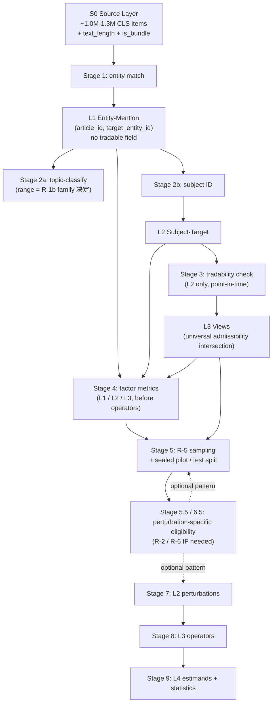

# R-0 Corpus Architecture — final decisions

**Status**: LOCKED 2026-05-23 PM late
**Audit trail**(下游 agent 不需要读;只在需要 debate / 看推导过程时翻):
- `archive/r4_r5a_lineage/refine-logs/reviews/REOPEN_R1_R6/R0_corpus_arch/whiteboard_analysis.md` —— Codex Pass A 白板独立分析 + 用户 7 段切片走查 deltas

---

## 1. Four-layer model

| Layer | Unit | Definition | Required columns | Optional columns (B-2 / downstream-session decided) |
|---|---|---|---|---|
| **S0** Source | `article_id`(一条 CLS 电报) | 源层。原报 / 转发 / 后续追踪保留,源层不去重。 | `article_id`, `published_at`, `text`, `text_length`, `is_bundle` | Other source-level metadata |
| **L1** Entity-Mention | `(article_id, target_entity_id)` long-form row | 文章 × 实体一行;多实体文章产生多行。**L1 不带 `tradable_at_event` 字段。** | `article_id`, `target_entity_id`, `mention_count_in_article`, `event_type` / `event_super_type`(若 topic-classify 已跑) | `entity_span_quality`(R-2 可加) |
| **L2** Subject-Target | `(article_id, target_entity_id)` where `is_subject=true` | L1 的子集,target 被判为文章主语 / 中心经济主体。 | `is_subject`, `tradable_at_event` | `subject_confidence`, `subject_rule_or_model_version`(B-2 决定是否产出;L2 存在不要求);`outcome_verifiable`(R-2 / R-6 可加);其它 perturbation-eligibility 列 |
| **L3** Views | 与 L2 同 row unit | L2 上的标准视图组合。Base view = `L2 ∩ (tradable_at_event=true) ∩ (text_length ∈ [min, max]) ∩ (is_bundle=false)`。 | —(派生) | R-2 触发的 subpool views |

**层归属判定法**:只有改变 *row unit* 的步骤升格为层。`event_type` / `tradable_at_event` / `outcome_verifiable` / `entity_span_quality` 都是列 / flag / view filter。

**Bundle articles**(一次性多条新闻播报)在 S0 标 `is_bundle=true`,默认 `is_subject=false`(不进 L2),但贡献 L1 mention count(进 Salience / Recurrence 分母)。S0-stage bundle splitter 是 B-2 实现选项;默认 flag-without-split。

**Non-tradable rows 客体 vs 主体区分**:
- L1 / L2 **保留** non-tradable rows(作 Salience / Recurrence 分母客体)。
- L3 base view **过滤** non-tradable rows(作 P_predict 主体硬约束)。

理由:让模型预测发文时不可交易的实体 → 模型只能调用 post-listing 记忆 → prompt-level 数据泄露入口。此过滤与 Kong 2026 §2.2 anti-survivorship 是不同问题;survivorship 通过 R-5 抽样分布(Pool G / H)处理,不通过历史 tradable 过滤。

---

## 2. Pipeline order



**Six hard pipeline constraints**:

1. **Entity match 在任何 LLM 阶段之前。** Topic-classify 在 ~1M CLS items 上跑之前先 entity-filter,把范围从 ~1M 收到 ~0.4M–0.8M;LLM 成本节约 40-60%。
2. **Tradability check 仅在 L2、point-in-time、annotation 不是 filter。** L1 不带 `tradable_at_event` 列。Tradability 是按 `published_at` 的结构化 join,加成 L2 列;实际过滤发生在 R-5 admissibility(L3 base view)。
3. **Topic-classify 位置锁、范围不锁。** Stage 2a 落在 entity match 与 factor metric 之间。哪些文章被 classify 由 R-1b family 粒度决定。
4. **Subject ID 在 L1 rows 上做,产 L2。** 实现方式(deterministic cascade / LLM grouped-by-article / LLM per-row)是 B-2 选择。Bundle articles 默认 `is_subject=false`。
5. **Factor metrics 严格在 operators 之前。** R-4a L1↔L3 边界锁。任何 factor metric 不得依赖 operator(P_predict / P_logprob / P_extract)输出,否则 cause-measurement loop 自闭(R-1d cross-synth lesson:template rigidity 若定义为 "P_predict output variance" 即落入此陷阱)。
6. **Perturbation-specific eligibility 留 R-2 / R-6。** R-0 只预留两个架构 hook(HOOK1 = pre-sampling subpool admissibility,for sparse-eligibility 扰动如 C_FO;HOOK2 = post-sampling per-case eligibility,for apply-where-possible 扰动如 C_anon),不预定义哪个扰动用哪个 hook、加什么列、落在哪一 stage。

---

## 3. Universal admissibility

每个进入 benchmark 的 P_predict 主体必过:

```
tradable_at_event = true
  ∧ text_length ∈ [min, max]
  ∧ is_bundle = false
```

`tradable_at_event` 是 entity-time 属性,按 entity 上市状态 + 发文时间 + 交易日 / 停牌 join 得出。`[min, max]` 阈值 与 `is_bundle` 拆分策略由 R-5 / B-2 在 pilot 看数据后定。

所有过滤逻辑在 L3 base view 上一次性物化,R-5 抽样从 L3 base view(或在 base 上叠 G/H/I 分布策略)开始。

---

## 4. Sampling pool inventory

| Pool / Strategy | Status | Description |
|---|---|---|
| **Pool B** = L2 ∩ universal admissibility | ✅ Sole base pool | R-5 默认从这里抽,除非扩展位激活。 |
| Pool G — salience / recurrence stratified | ✅ Optional distribution strategy | Stack on Pool B。平衡低 salience / 低 recurrence 案例。 |
| Pool H — entity-balanced / capped | ✅ Optional distribution strategy | Stack on Pool B。anti-media-coverage-bias 工具(Kong 2026 §2.2)。 |
| Pool I — cutoff-balanced | ✅ Optional distribution strategy | Stack on Pool B。支撑 Cutoff Exposure case×model panel。 |
| Pool D — mention + tradable(L1-tradable view)| ⚠️ Architecture extension required | 当前不支持(L1 不带 tradable 列)。若 R-5 / R-1b 触发 mention-construct + tradable 需求,扩展 = 给 L1 candidate subset 加 `tradable_at_event`。Tradability 是机械结构化 join,扩展成本有界。B-2 schema 预留扩展槽。 |
| Pool E — outcome-verifiable subpool | 🚫 R-2 / R-6 territory | C_FO eligibility;C_FO 机制锁后定义。 |
| Pool F — mixed panel | ⚠️ Conditional on D / E | D 或 E 激活后才有内容。 |

**R-0 sampling rule**:分布策略选择(row-random / G / H / I / 组合)**不锁**,R-5 全权。Kong §2.2 survivorship 警告是 sanity-check input,不是 mandate。

---

## 5. Cross-cutting principles

- **`recurrence_count = 0` 是合法值。** `log1p(0) = 0` 直接进模型,从不当 missing 处理。任何 layer / pool / filter 不得按 0-recurrence 默认删 row。
- **No-dedup exposure counting 合法。**
  - Inter-article(同 target 在多 articles 中)— 多行保留。
  - Intra-article(同 target 在一篇文章里多次提及)— 记 `mention_count_in_article` 属性在单一 L1 row 上,不产生多行。
  - 任何具体 factor metric 是否去重是下游 session 调用。
- **Article cluster traceability**:同 article 派生的 L1 rows 共享 `article_id`,R-5 抽样规则 / R-4b mixed-model cluster-SE 消费此关系。具体 cluster handling rule(per-article cap / random-effects clustering / mixed-panel design)由 R-5 / R-4b 决定。
- **Counts and identities not locked**:confirmatory 因子 / 扰动 / estimand 的**数量**与**身份**由 R-1e / R-2 / R-6 + pilot 数据决定;R-0 / R-4a 都不预承诺。

---

## 6. R-0 scope boundary

R-0 锁的是**架构容器**,不替下游 session 拍 construct。R-0 **不**锁以下项目:

| 项目 | Decided by |
|---|---|
| Factor construct(mention / subject / tradable-mention / tradable-subject)| R-1b / R-1c |
| Family 粒度 / 折叠规则 | R-1b / R-1c |
| Lookup window 起止 / 共享方式 | R-1b / R-1c |
| Sampling distribution strategy(row-random / G / H / I / 组合)| R-5 |
| Per-article cap / dedup rule / threshold values(text_length / entity cap)| R-5 |
| Perturbation-specific eligibility flag 字段名 + view + status | R-2 / R-6 |
| C_FO 机制(in-place value replacement vs T+1/T+5 real return)| R-2 + R-6 |
| Confirmatory family 数量 + 具体 estimand / factor / perturbation 身份 | R-1e / R-2 / R-6 + pilot 数据 |

**Arch-vs-session 锁原则**(memory `feedback_arch_vs_session_scope`):R-0 / framework-level 决定只锁 universal admissibility。Perturbation / factor / operator-specific eligibility 都留对应 session,即使 Codex whiteboard 写完整也剥离,架构只留两个 hook(HOOK1 / HOOK2,见 §2 约束 6)。

---

## 7. Downstream session input

| Session | R-0 constraint | Choice space (downstream decides) |
|---|---|---|
| **R-1a Cutoff Exposure** | **✔ closed 2026-05-27**(机制锁;cutoff 中心值 provisional 待探针验证)→ `../R1a_cutoff_exposure/R1a_DECISIONS.md` | — |
| **R-1b Historical Family Recurrence** | **✔ closed 2026-05-24** → `../R1b_recurrence/R1b_DECISIONS.md`(canonical lock-in) | — |
| R-1c Target Salience | L1↔L3 边界同 R-1b;no-dedup 合法;`log1p(0)=0` 合法 | Construct(mention L1 / subject L2 / tradable variants);denominator(article count vs L1 row count);window(pre-cutoff 固定 / 其它);与 R-1b 共享窗口或独立;complement-family 处理 |
| R-1d Template Rigidity | 纯文本特征;可在 L1 或 L2 上算;不得依赖 operator 输出 | Full spec(从文献起设计) |
| R-2 Perturbations | HOOK1 / HOOK2 占位预留;无 perturbation-specific 列预定义;L1↔L3 边界守住 | 每个扰动 eligibility flag / 列 / view;HOOK 模式选择;primary / supporting / robustness 定位;C_FO 机制 — 与 R-6 耦合 |
| R-5 Sampling | Base pool = Pool B;article_id 可追溯;non-tradable 主体作 P_predict 主体强制过滤 | 分布策略(row-random / G / H / I / 组合,R-0 不强制);per-article cap + dedup rule;阈值;是否触发 Pool D / E / F 扩展 |
| B-2 Implementation | Layer / view / provenance hash list 必含(§9);HOOK schema 槽预留 | `run_inputs.per_task` 具体 schema;subject ID 实现;topic-classifier target-conditioned refinement;caching wrapper 形式;Tier B 备份节奏;`provider_headers` 存储形式 |

---

## 8. R-1c session anchor

R-1c session 起跑时,R-0 给的接口说明(沿用 R1b_DECISIONS.md §5 的两档制 pattern)。

### 8.1 R-1c **必须遵守**(R-0 锁)
- 4-layer container(§1)
- Entity-first pipeline 与 6 hard constraints(§2)
- Universal admissibility 与 non-tradable rows 客体保留 / 主体过滤(§3 + §1)
- Pool B sole base;分布策略 R-5 全权(§4)
- Cross-cutting principles(§5)— `log1p(0)=0` legal / no-dedup legal / article cluster traceability

R-4a 框架约束并行 apply,详见 `../R4_methodology_audit/R4a_DECISIONS.md` §6 R-1c 行。

### 8.2 R-1c 选择空间(R-0 不锁)
见 §7 downstream session input table — R-1c 行。R-1b 给的具体选择(`../R1b_recurrence/R1b_DECISIONS.md` §1-§4 / §6.1)对 R-1c 是 **参考**、**非强制继承**。R-1c 自决:construct / family 粒度 / window / 分母 / 是否加 tradable filter / 是否 complement-family 去重。

### 8.3 R-1c **必须做**的 discriminant check(WS0.5 §3.3.3 / §5.4 standing routine,接口由 R-1b 给)
- 输入口径:R-1b `log1p_recurrence_count`(`../R1b_recurrence/R1b_DECISIONS.md` §4 main variable formula,tradable-filtered)
- 检查:VIF + correlation,R-1c 候选 metric vs R-1b metric
- 触发阈值:VIF ≥ 10 或 |r| ≥ 0.90 → complement-family fallback

---

## 9. B-2 provenance hash requirements (R-0 originated)

`factor_provenance.json` `run_inputs` 必含 R-0 引入的 hashes(B-2 finalize 字段名 / 结构):

- S0 source snapshot hash
- entity alias table hash
- disambiguation rule hash
- topic-classifier prompt / model / cache hash
- subject-ID prompt / model / cache hash 或 deterministic rule hash
- layer / view definition hash
- tradability master snapshot hash
- sampling manifest hash

**Path A reviewer reproducibility 必须 verify layer / view hashes**(不仅 factor table hash)。

---

## 10. Downstream notes

### B-2
- `run_inputs.per_task` schema 在 R-0 解锁的 4 个 session(R-1b ✔ closed / R-1c / R-5 / R-2)落定后 finalize。R-0 只锁 hash 清单与 layer / view 边界,不锁字段名 / 风格 / 与其它 R-X session 输出的整合方式。
- L3 base view 必须把 universal admissibility 物化(`tradable_at_event=true ∧ text_length ∈ [min, max] ∧ ¬is_bundle` 已在视图内)。Path B 复现(replay)从 L3 base view 出发。
- Entity-first ordering 移除了 §4.5.E 提到的 §5.2 Phase R1 full-CLS topic-classify 成本驱动 → Tier B 备份内容相应重新校准。

### R-2(扰动)
- HOOK1 / HOOK2 架构槽预留(见 §2 约束 6);R-2 决定每个扰动用哪个 hook + 加什么列。
- C_FO eligibility(outcome verifiable)对应 Pool E,R-2 + R-6 锁机制后激活。
- 整个 R-0 容器不预定义任何 perturbation 特定列 / view。

### R-5(采样)
- 抽样从 L3 base view(= Pool B)起跑;分布策略 R-5 全权(no mandate)。
- 若启用 Pool G(salience / recurrence 分层),R-1b 阶段分层依据 = `log1p_recurrence_count`;R-1c 落定后切换或并存。
- Pool D / E / F 扩展位激活由 R-5 / R-2 / R-6 实操确认必要时触发,B-2 schema 预留槽。

### R-4b(power / 统计)
- mixed-model cluster-SE 在 R-0 `article_id` 共享关系上做;具体 cluster handling rule 由 R-4b 落定。
